#   Redis

## 1.Redis简单介绍

Redis是一种键值型的NoSql数据库，这里有两个关键字：

- 键值型
- NoSql

其中**键值型**，是指Redis中存储的数据都是以key.value对的形式存储，而value的形式多种多样，可以是字符串.数值.甚至json：

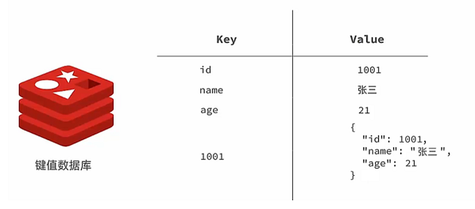

而NoSql则是相对于传统关系型数据库而言，有很大差异的一种数据库。

对于存储的数据，没有类似Mysql那么严格的约束，比如唯一性，是否可以为null等等，所以我们把这种松散结构的数据库，称之为NoSQL数据库。

### 1.1 认识NoSQL

**NoSql**可以翻译做Not Only Sql（不仅仅是SQL），或者是No Sql（非Sql的）数据库。是相对于传统关系型数据库而言，有很大差异的一种特殊的数据库，因此也称之为**非关系型数据库**。

**结构化与非结构化**

传统关系型数据库是结构化数据，每一张表都有严格的约束信息：字段名.字段数据类型.字段约束等等信息，插入的数据必须遵守这些约束：

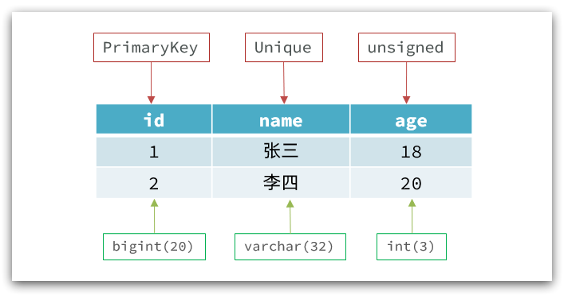

而NoSql则对数据库格式没有严格约束，往往形式松散，自由。

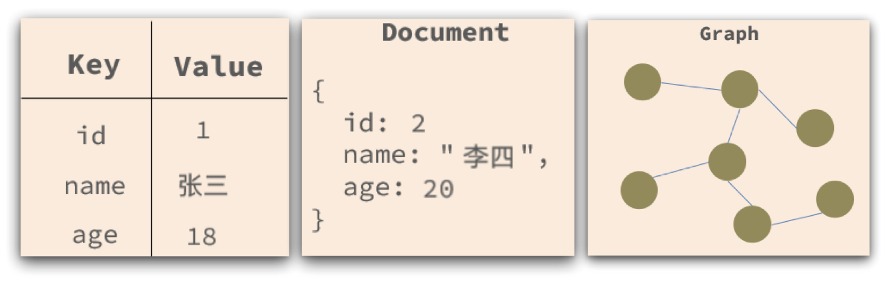

**关联和非关联**

传统数据库的表与表之间往往存在关联，例如外键：

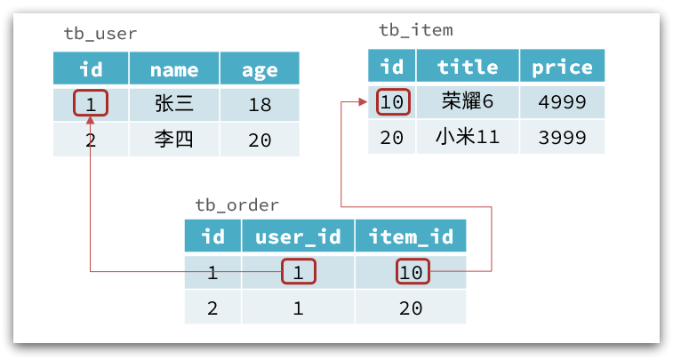

而非关系型数据库不存在关联关系，要维护关系要么靠代码中的业务逻辑，要么靠数据之间的耦合：

 ```json
 {
   id: 1,
   name: "张三",
   orders: [
     {
        id: 1,
        item: {
 	 id: 10, title: "荣耀6", price: 4999
        }
     },
     {
        id: 2,
        item: {
 	 id: 20, title: "小米11", price: 3999
        }
     }
   ]
 }
 ```

此处要维护“张三”的订单与商品“荣耀”和“小米11”的关系，不得不冗余的将这两个商品保存在张三的订单文档中，不够优雅。还是建议用业务来维护关联关系。

**查询方式**

传统关系型数据库会基于Sql语句做查询，语法有统一标准；而不同的非关系数据库查询语法差异极大，五花八门各种各样。

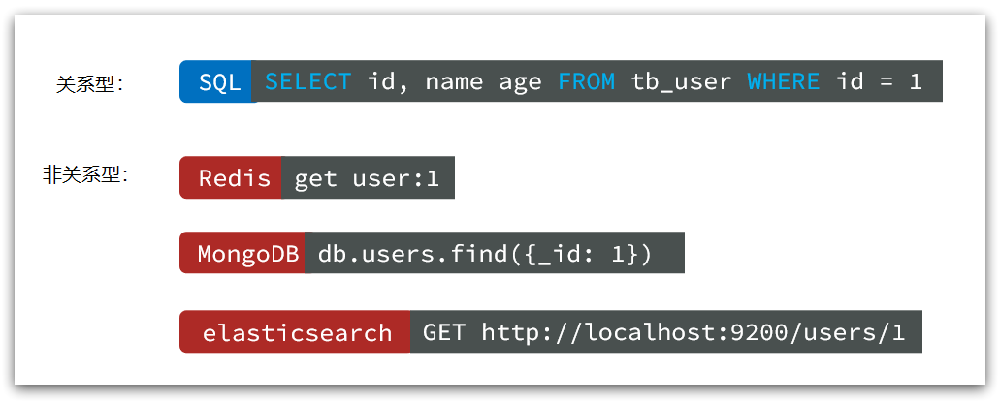

**事务特性**

传统关系型数据库能满足事务ACID的原则；

而非关系型数据库往往不支持事务，或者不能严格保证ACID的特性，只能实现基本的一致性。

**总结**

除了上述四点以外，在存储方式.扩展性.查询性能上关系型与非关系型也都有着显著差异，总结如下：

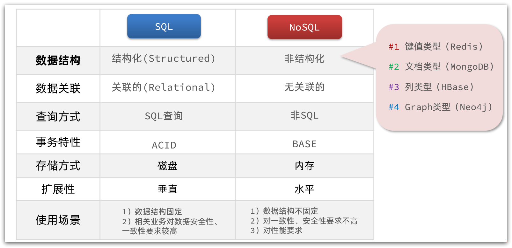

- 存储方式
  - 关系型数据库基于磁盘进行存储，会有大量的磁盘IO，对性能有一定影响；
  - 非关系型数据库，他们的操作更多的是依赖于内存来操作，内存的读写速度会非常快，性能会好一些。

* 扩展性
  * 关系型数据库集群模式一般是主从，主从数据一致，起到数据备份的作用，称为垂直扩展；
  * 非关系型数据库可以将数据拆分，存储在不同机器上，可以保存海量数据，解决内存大小有限的问题。称为水平扩展；
  * 关系型数据库因为表之间存在关联关系，如果做水平扩展会给数据查询带来很多麻烦。

### 1.2 Redis介绍

Redis诞生于2009年全称是**Re**mote  **D**ictionary **S**erver 远程词典服务器，是一个基于内存的键值型NoSQL数据库。

**特征**：

- 键值（key-value）型，value支持多种不同数据结构，功能丰富
- 单线程，每个命令具备原子性
- 低延迟，速度快（基于内存.IO多路复用.良好的编码）。
- 支持数据持久化
- 支持主从集群.分片集群
- 支持多语言客户端

> **作者**：Antirez

> Redis的官方网站地址：https://redis.io/

> Redis中文网：https://www.redis.net.cn
>
> 命令可以参考：https://redis.io/commands

#### 1.2.1 数据结构

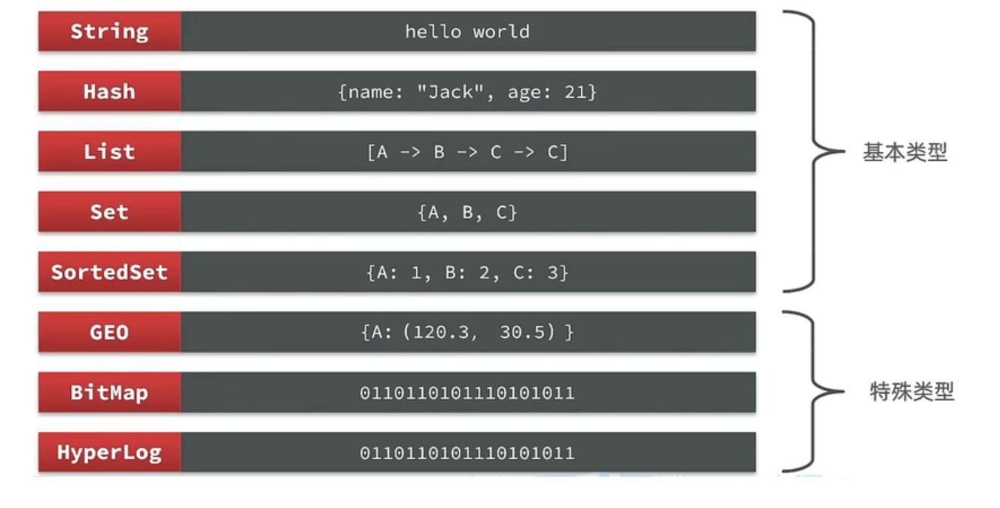

### 1.3 Redis安装

#### 1.3.1 源码编译安装

略

#### 1.3.2 使用Docker安装

构建docker compose

docker-compose.yml 配置如下：

```yaml
# docker-compose.yml
version: "3.8"

services:
  redis:
    # 指定版本
  	# image: redis:latest
    image: redis:6.2.6
    container_name: redis-6.2.6
    # requirepass：密码
    command: ["redis-server", "--appendonly", "yes", "--requirepass", "123456"]
    #  挂载路径
    volumes:
      - ./redis-data:/data
      - ./redis.conf:/usr/local/etc/redis/redis.conf:ro
		#  映射端口
    ports:
      - "6388:6379"
    restart: unless-stopped
    # 如果你在 Apple Silicon/M1 且遇到兼容问题，可取消下一行注释强制架构
    # platform: linux/amd64
```

使用步骤

```bash
# 1) 创建数据目录（可选，Compose 会自动创建）
mkdir -p ./redis-data

# 2) 启动
docker compose up -d

# 3) 查看日志确认已启动
docker compose logs -f redis

# 4) 本机测试连接（如果装了 redis-cli）
redis-cli -a 123456 ping
# 预期返回：PONG
```

#### 1.3.3 GUI桌面客户端

**RedisDesktopManager**

开源的Redis的图形化桌面客户端，地址：https://github.com/uglide/RedisDesktopManager

**RedisInsight**

官网Redis的图形化桌面客户端，地址：https://github.com/RedisInsight/RedisInsight

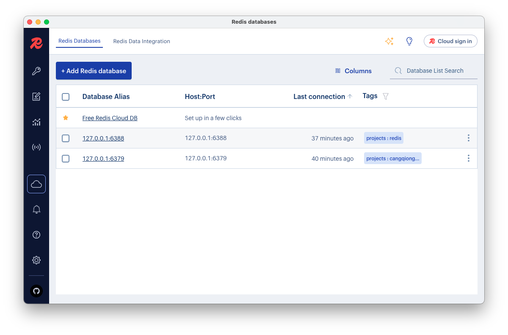

## 2. Redis数据类型

各数据类型特点：


**解释说明：**

- 字符串(string)：普通字符串，Redis中最简单的数据类型
- 哈希(hash)：也叫散列，类似于Java中的HashMap结构
- 列表(list)：按照插入顺序排序，可以有重复元素，类似于Java中的LinkedList
- 集合(set)：无序集合，没有重复元素，类似于Java中的HashSet
- 有序集合(sorted set/zset)：集合中每个元素关联一个分数(score)，根据分数升序排序，没有重复元素

### 2.1 Redis通用命令

通用指令是部分数据类型的，都可以使用的指令，常见的有：

- KEYS：查看符合模板的所有key
- DEL：删除一个指定的key
- EXISTS：判断key是否存在
- EXPIRE：给一个key设置有效期，有效期到期时该key会被自动删除
- TTL：查看一个KEY的剩余有效期
- FLUSHDB：清空当前数据库
- FLUSHALL：清空所有数据库
- redis-cli KEYS "prefix:*" | xargs redis-cli DEL ：使用通配符删除指定前缀的 Key
- redis-cli --scan --pattern "prefix:*" | xargs redis-cli DEL：使用 SCAN + DEL（推荐大数据量时）

通过help [command] 可以查看一个命令的具体用法，示例：

```bash
> Keys *
(empty list or set)

> SETEX user 10 admin
"OK"

> TTL user
(integer) 2
```

### 2.2 Key的层级结构

Redis没有类似MySQL中的Table的概念，那如何区分不同类型的key呢？

> 例如，需要存储用户.商品信息到redis，有一个用户id是1，有一个商品id恰好也是1，此时如果使用id作为key，洒就会冲突了，该怎么办

通过给key添加前缀加以区分，前缀通常有一定的规范，例如项目名称叫 heima，有user和product两种不同类型的数据，可以这样定义key：

- user相关的key：**heima:user:1**

- product相关的key：**heima:product:1**

| **KEY**         | **VALUE**                                 |
| --------------- | ----------------------------------------- |
| heima:user:1    | {"id":1, "name": "Jack", "age": 21}       |
| heima:product:1 | {"id":1, "name": "小米11", "price": 4999} |

redis采用这样的方式存储，那在可视化界面中，redis会以层级结构来进行存储，形成类似于这样的结构，更加方便Redis获取数据

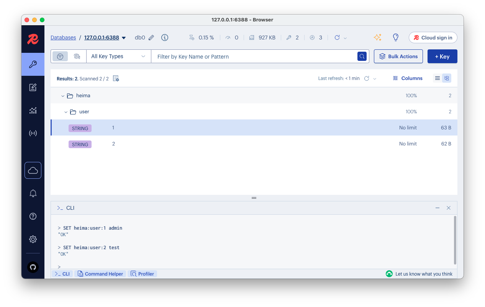

### 2.3 String

String类型，即字符串类型，是Redis中最简单的存储类型。其value是字符串，不过根据字符串的格式不同，又分为3类：

* string：普通字符串
* int：整数类型，可以做自增.自减操作
* float：浮点类型，可以做自增.自减操作

常见命令：

* SET：添加或者修改已经存在的一个String类型的键值对
* GET：根据key获取String类型的value
* MSET：批量添加多个String类型的键值对
* MGET：根据多个key获取多个String类型的value
* INCR：让一个整型的key自增1
* INCRBY:让一个整型的key自增并指定步长，例如：incrby num 2 让num值自增2
* INCRBYFLOAT：让一个浮点类型的数字自增并指定步长
* SETNX：添加一个String类型的键值对，前提是这个key不存在，否则不执行
* SETEX：添加一个String类型的键值对，并且指定有效期

#### 2.31 BitMap

Redis中是利用string类型数据结构实现BitMap，因此最大上限是512M，转换为bit则是 2^32个bit位。BitMap的操作命令有：

* SETBIT：向指定位置（offset）存入一个0或1
* GETBIT ：获取指定位置（offset）的bit值
* BITCOUNT ：统计BitMap中值为1的bit位的数量
* BITFIELD ：操作（查询、修改、自增）BitMap中bit数组中的指定位置（offset）的值
* BITFIELD_RO ：获取BitMap中bit数组，并以十进制形式返回
* BITOP ：将多个BitMap的结果做位运算（与 、或、异或）
* BITPOS ：查找bit数组中指定范围内第一个0或1出现的位置

#### 2.32 HyperLoglog

Hyperloglog(HLL)是从Loglog算法派生的概率算法，用于确定非常大的集合的基数，而不需要存储其所有值。相关算法原理可以参考：https://juejin.cn/post/6844903785744056333#heading-0

Redis中的HLL是基于string结构实现的，单个HLL的内存**永远小于16kb**，**内存占用低**的令人发指！作为代价，其测量结果是概率性的，**有小于0.81％的误差**。不过对于UV统计来说，这完全可以忽略。

常用场景：UV统计

### 2.4 Hash

Hash类型，也叫散列，其value是一个无序字典，类似于Java中的HashMap结构。

String结构是将对象序列化为JSON字符串后存储，当需要修改对象某个字段时很不方便：

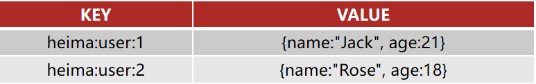

Hash结构可以将对象中的每个字段独立存储，可以针对单个字段做CRUD：

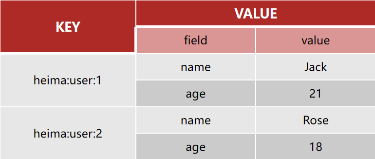

**Hash类型的常见命令**

- HSET key field value：添加或者修改hash类型key的field的值

- HGET key field：获取一个hash类型key的field的值

- HMSET：批量添加多个hash类型key的field的值**（已废弃）**

- HMGET：批量获取多个hash类型key的field的值

- HGETALL：获取一个hash类型的key中的所有的field和value
- HKEYS：获取一个hash类型的key中的所有的field
- HINCRBY:让一个hash类型key的字段值自增并指定步长
- HSETNX：添加一个hash类型的key的field值，前提是这个field不存在，否则不执行

### 2.5 List

Redis中的List类型与Java中的LinkedList类似，可以看做是一个双向链表结构。既可以支持正向检索和也可以支持反向检索。

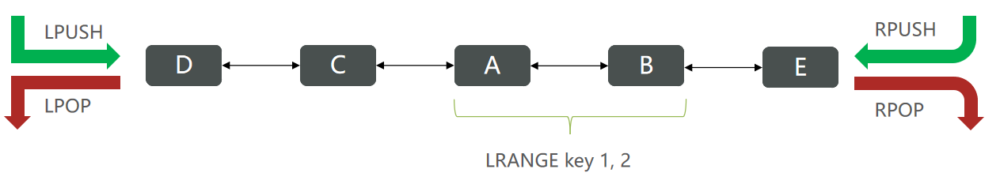

特征也与LinkedList类似：

* 有序
* 元素可以重复
* 插入和删除快
* 查询速度一般

常用来存储一个有序数据，例如：朋友圈点赞列表，评论列表等。

常见命令：

- LPUSH key element ... ：向列表左侧插入一个或多个元素
- LPOP key：移除并返回列表左侧的第一个元素，没有则返回nil
- RPUSH key element ... ：向列表右侧插入一个或多个元素
- RPOP key：移除并返回列表右侧的第一个元素
- LRANGE key star end：返回一段角标范围内的所有元素
- BLPOP和BRPOP：与LPOP和RPOP类似，只不过在没有元素时等待指定时间，而不是直接返回nil

### 2.6 Set

Redis的Set结构与Java中的HashSet类似，可以看做是一个value为null的HashMap。因为也是一个hash表，因此具备与HashSet类似的特征：

* 无序
* 元素不可重复
* 查找快
* 支持交集.并集.差集等功能

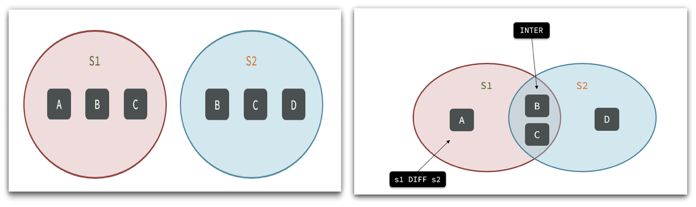

**Set类型的常见命令**

* SADD key member ... ：向set中添加一个或多个元素
* SREM key member ... : 移除set中的指定元素
* SCARD key： 返回set中元素的个数
* SISMEMBER key member：判断一个元素是否存在于set中
* SMEMBERS：获取set中的所有元素
* SINTER key1 key2 ... ：求key1与key2的交集
* SDIFF key1 key2 ... ：求key1与key2的差集
* SUNION key1 key2 ..：求key1和key2的并集

**练习**

```bash
# 将下列数据用Redis的Set集合来存储：
# 张三的好友有：李四.王五.赵六
> SADD user:zhangsan lisi wangwu zhangliu
(integer) 3
# 李四的好友有：王五.麻子.二狗
> SADD user:lisi wangwu mazi ergou
(integer) 3
# 利用Set的命令实现下列功能
# 计算张三的好友有几人
SCARD user:zhangsan
(integer) 3
# 计算张三和李四有哪些共同好友
> SINTER user:zhangsan user:lisi
1) "wangwu"
# 查询哪些人是张三的好友却不是李四的好友
> SDIFF user:zhangsan user:lisi
1) "zhangliu"
2) "lisi"
# 查询张三和李四的好友总共有哪些人
> SUNION user:zhangsan user:lisi
1) "lisi"
2) "wangwu"
3) "zhangliu"
4) "mazi"
5) "ergou"
# 判断李四是否是张三的好友
> SISMEMBER user:zhangsan lisi
(integer) 1
# 判断张三是否是李四的好友
> SISMEMBER user:lisi zhangsan
(integer) 0
# 将李四从张三的好友列表中移除

```

### 2.7 SortedSet

Redis的SortedSet是一个可排序的set集合，与Java中的TreeSet有些类似，但底层数据结构却差别很大。SortedSet中的每一个元素都带有一个score属性，可以基于score属性对元素排序，底层的实现是一个跳表（SkipList）加 hash表。

SortedSet具备下列特性：

- 可排序
- 元素不重复
- 查询速度快

因为SortedSet的可排序特性，经常被用来实现排行榜这样的功能。

常见命令：

- ZADD key score member：添加一个或多个元素到sorted set ，如果已经存在则更新其score值
- ZREM key member：删除sorted set中的一个指定元素
- ZSCORE key member : 获取sorted set中的指定元素的score值
- ZRANK key member：获取sorted set 中的指定元素的排名
- ZCARD key：获取sorted set中的元素个数
- ZCOUNT key min max：统计score值在给定范围内的所有元素的个数
- ZINCRBY key increment member：让sorted set中的指定元素自增，步长为指定的increment值
- ZRANGE key min max：按照score排序后，获取指定排名范围内的元素
- ZRANGEBYSCORE key min max：按照score排序后，获取指定score范围内的元素
- ZDIFF.ZINTER.ZUNION：求差集.交集.并集

> 注意：所有的排名默认都是升序，如果要降序则在命令的Z后面添加REV即可，例如：
>
> ​	升序获取sorted set 中的指定元素的排名：ZRANK key member
>
> ​	降序获取sorted set 中的指定元素的排名：ZREVRANK key memeber

#### 2.71 GEO

GEO就是Geolocation的简写形式，代表地理坐标。Redis在3.2版本中加入了对GEO的支持，允许存储地理坐标信息，帮助我们根据经纬度来检索数据。

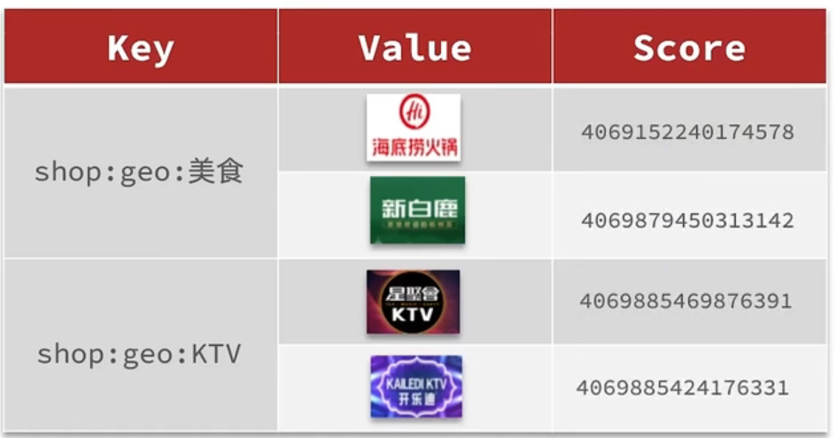

常见的命令有：

* GEOADD：添加一个地理空间信息，包含：经度（longitude）、纬度（latitude）、值（member）
* GEODIST：计算指定的两个点之间的距离并返回
* GEOHASH：将指定member的坐标转为hash字符串形式并返回
* GEOPOS：返回指定member的坐标
* GEORADIUS：指定圆心、半径，找到该圆内包含的所有member，并按照与圆心之间的距离排序后返回。6.以后已废弃
* GEOSEARCH：在指定范围内搜索member，并按照与指定点之间的距离排序后返回。范围可以是圆形或矩形。6.2.新功能
* GEOSEARCHSTORE：与GEOSEARCH功能一致，不过可以把结果存储到一个指定的key。 6.2.新功能

## 3.在Java中操作Redis

### 3.1 Redis客户端

java程序中应该如何操作Redis呢？这就需要使用Redis的Java客户端，就如同JDBC操作MySQL数据库一样。

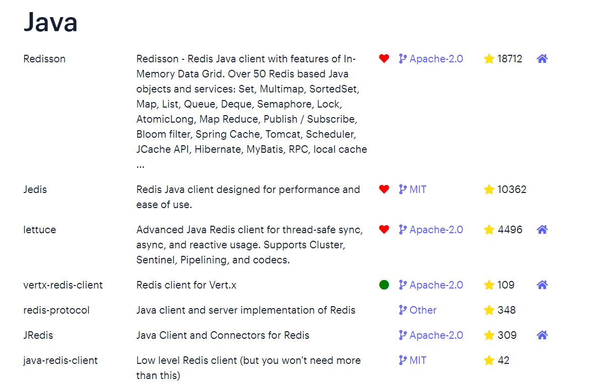

Redis 的 Java 客户端很多，常用的几种：

- Jedis
- Lettuce
- Spring Data Redis

标记为❤的就是推荐使用的java客户端，包括：

- Jedis和Lettuce：这两个主要是提供了Redis命令对应的API，方便操作Redis；Spring 对 Redis 客户端进行了整合，提供了 Spring Data Redis，对Jedis和Lettuce做了抽象和封装，且提供了对应的Starter，即 spring-boot-starter-data-redis；
- Redisson：是在Redis基础上实现了分布式的可伸缩的java数据结构，例如Map.Queue等，而且支持跨进程的同步机制：Lock.Semaphore等待，比较适合用来实现特殊的功能需求。

### 3.2 Spring Data Redis

Spring Data Redis 是 Spring 的一部分，提供了在 Spring 应用中通过简单的配置就可以访问 Redis 服务，对 Redis 底层开发包进行了高度封装。在 Spring 项目中，可以使用Spring Data Redis来简化 Redis 操作。

官网地址：https://spring.io/projects/spring-data-redis

* 提供了对不同Redis客户端的整合（Lettuce和Jedis）
* 提供了RedisTemplate统一API来操作Redis
* 支持Redis的发布订阅模型
* 支持Redis哨兵和Redis集群
* 支持基于Lettuce的响应式编程
* 支持基于JDK.JSON.字符串.Spring对象的数据序列化及反序列化
* 支持基于Redis的JDKCollection实现

Spring Data Redis中提供了一个高度封装的类：**RedisTemplate**，对相关api进行了归类封装，将同一类型操作封装为operation接口，具体分类如下：

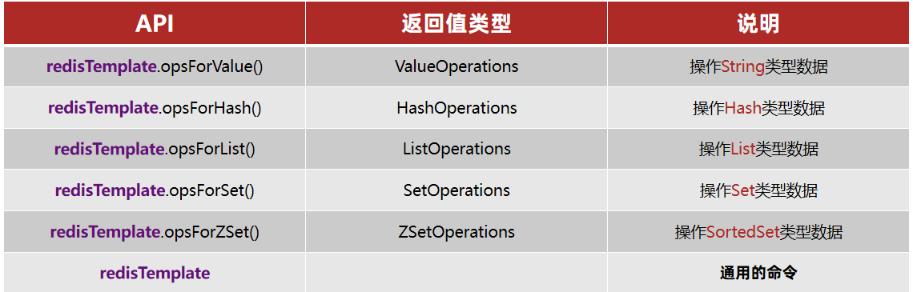

---

快速入门

导入Spring Data Redis的相关maven坐标：

```xml
 <dependency>
            <groupId>org.springframework.boot</groupId>
            <artifactId>spring-boot-starter-data-redis</artifactId>
        </dependency>
        <!--common-pool-->
        <dependency>
            <groupId>org.apache.commons</groupId>
            <artifactId>commons-pool2</artifactId>
        </dependency>
        <!--Jackson依赖-->
        <dependency>
            <groupId>com.fasterxml.jackson.core</groupId>
            <artifactId>jackson-databind</artifactId>
        </dependency>
        <dependency>
            <groupId>org.projectlombok</groupId>
            <artifactId>lombok</artifactId>
            <optional>true</optional>
        </dependency>
        <dependency>
            <groupId>org.springframework.boot</groupId>
            <artifactId>spring-boot-starter-test</artifactId>
            <scope>test</scope>
        </dependency>
```

配置Redis，在application-dev.yml中添加：

```yaml
spring:
  application:
    name: spring-data-redis-demo
  data:
    redis:
      host: 127.0.0.1
      port: 6388
      password: 123456
      lettuce:
        pool:
          max-active: 8  #最大连接
          max-idle: 8   #最大空闲连接
          min-idle: 0   #最小空闲连接
          max-wait: 100ms #连接等待时间
```

> Tips
>
> database:指定使用Redis的哪个数据库，Redis服务启动后默认有16个数据库，编号分别是从0到15。

测试代码

```java
@SpringBootTest
class RedisDemoApplicationTests {

    @Autowired
    private RedisTemplate<String, Object> redisTemplate;

    @Test
    void testString() {
        // 写入一条String数据
        redisTemplate.opsForValue().set("name", "张三");
        // 获取string数据
        Object name = redisTemplate.opsForValue().get("name");
        System.out.println("name = " + name);
    }
}
```

**总结**

SpringDataRedis的使用步骤：

* 引入spring-boot-starter-data-redis依赖
* 在application.yml配置Redis信息
* 注入RedisTemplate

### 3.3 数据序列化器

RedisTemplate可以接收任意Object作为值写入Redis，并默认使用`JdkSerializationRedisSerializer`来序列化：

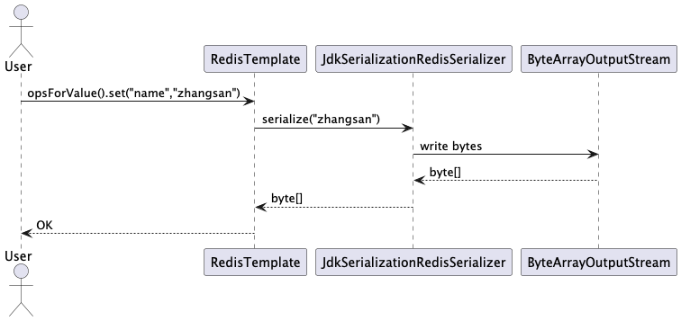

缺点

- 可读性差
- 内存占用较大

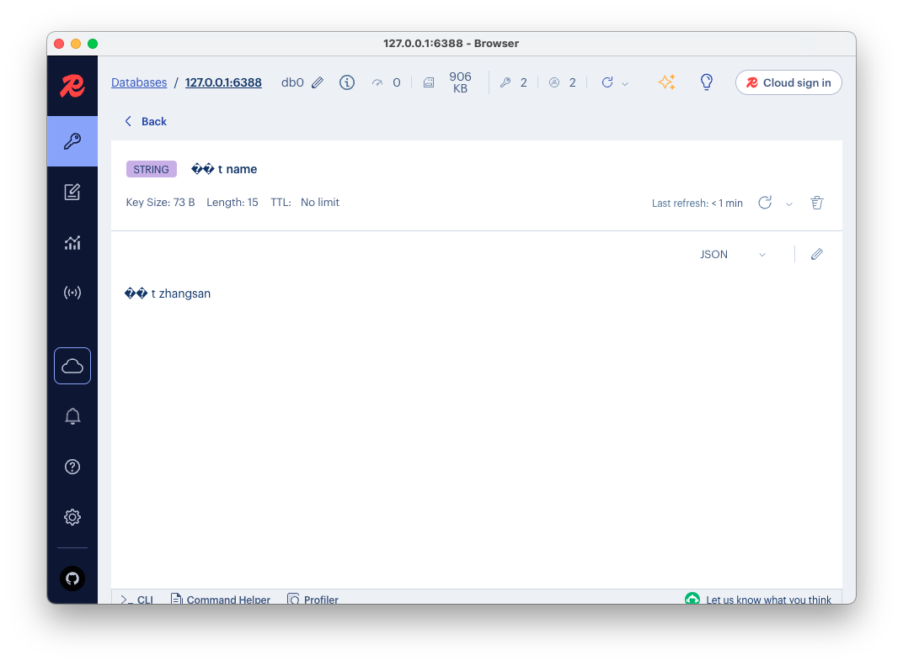**编写配置类，创建RedisTemplate对象**

```java
@Configuration
public class RedisConfig {
  
    @Bean
    public RedisTemplate<String, Object> redisTemplate(RedisConnectionFactory redisConnectionFactory) {

        // 创建RedisTemplate对象
        RedisTemplate<String, Object> redisTemplate = new RedisTemplate<>();
        // 设置连接工厂
        redisTemplate.setConnectionFactory(redisConnectionFactory);
        // 设置Key采用String序列化
        redisTemplate.setKeySerializer(RedisSerializer.string());
        redisTemplate.setHashKeySerializer(RedisSerializer.string());
        // 设置Value采用Json序列化
        redisTemplate.setValueSerializer(RedisSerializer.json());
        redisTemplate.setHashValueSerializer(RedisSerializer.json());
        // 返回
        return redisTemplate;
    }
}

```

> **解释说明：**
>
> 当前配置类不是必须的，因为 Spring Boot 框架会自动装配 RedisTemplate 对象，但是默认的key序列化器为JdkSerializationRedisSerializer，导致存到Redis中后的数据和原始数据有差别，故设置StringRedisSerializer序列化器。

改进后，整体体可读性有了很大提升，并且能将Java对象自动的序列化为JSON字符串，查询时能自动把JSON反序列化为Java对象。不过，其中记录了序列化时对应的class名称，目的是为了查询时实现自动反序列化。这会带来额外的内存开销。

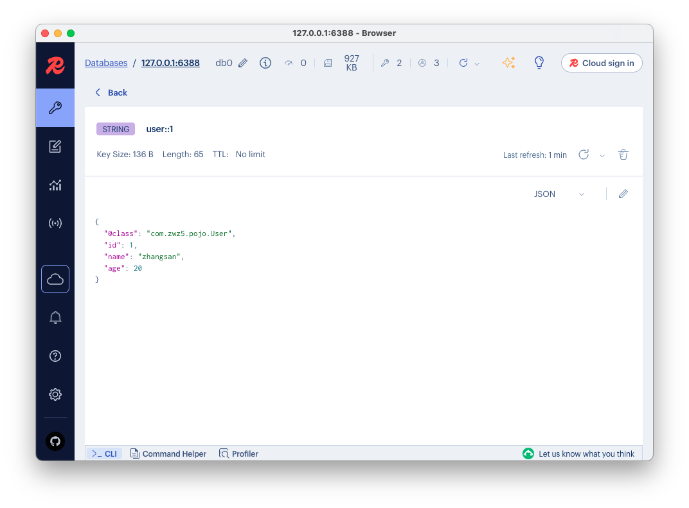

为了减少内存的消耗，我们可以采用手动序列化的方式，换句话说，就是不借助默认的序列化器，而是我们自己来控制序列化的动作，同时，我们只采用String的序列化器，这样，在存储value时，我们就不需要在内存中就不用多存储数据，从而节约我们的内存空间

**手动序列化的方式**

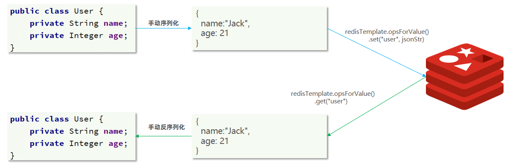

```java
    /**
     * SpringDataRedis提供了RedisTemplate的子类：StringRedisTemplate的key和value的序列化方式默认就是String方式。
     *  redisTemplate.setValueSerializer(RedisSerializer.string());
     *  redisTemplate.setHashValueSerializer(RedisSerializer.string());
     */
    @Autowired
    private StringRedisTemplate stringRedisTemplate;
    private static final ObjectMapper mapper = new ObjectMapper();
    @Test
    void testUserStringJson() throws JsonProcessingException {
        User user = User.builder().id(1).name("zhangsan").age(20).build();
        // 手动序列化
        String json = mapper.writeValueAsString(user);
        stringRedisTemplate.opsForValue().set("user::1", json);
        String jsonUser = stringRedisTemplate.opsForValue().get("user::1");
        User readUser = mapper.readValue(jsonUser, User.class);

        System.out.println("user = " + readUser);
    }
```

最后小总结：

RedisTemplate的两种序列化实践方案：

* 方案一：
  * 自定义RedisTemplate
  * 修改RedisTemplate的序列化器为GenericJackson2JsonRedisSerializer

* 方案二：
  * 使用StringRedisTemplate
  * 写入Redis时，手动把对象序列化为JSON
  * 读取Redis时，手动把读取到的JSON反序列化为对象


