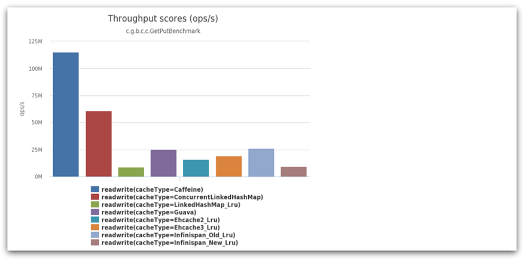
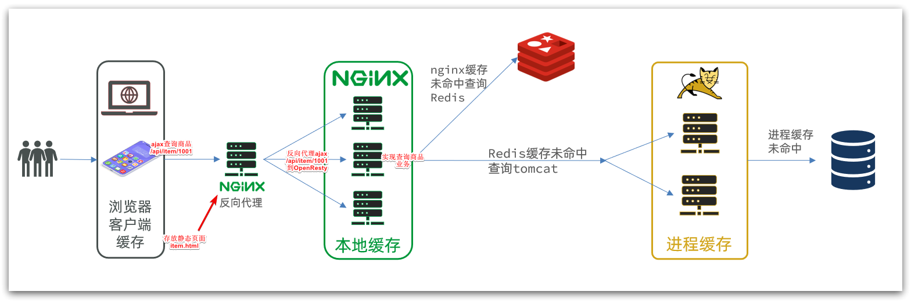
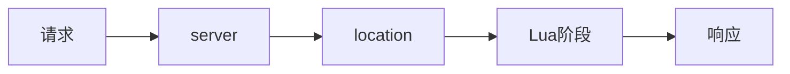
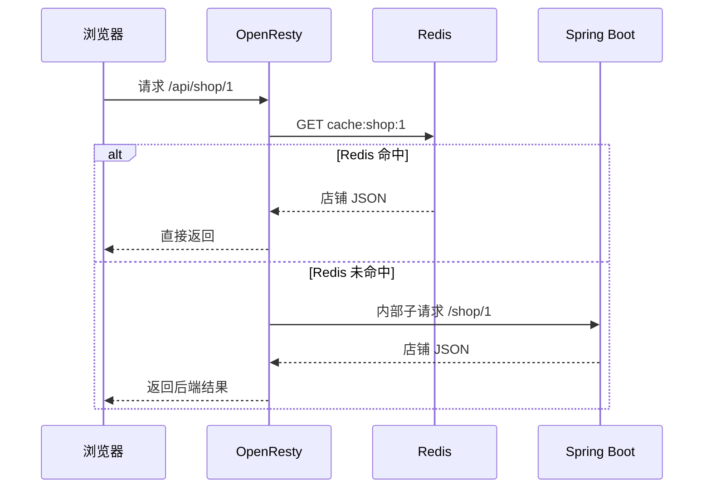
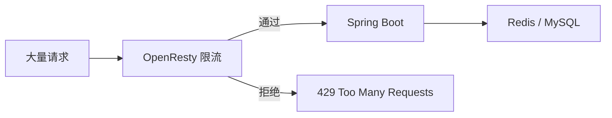
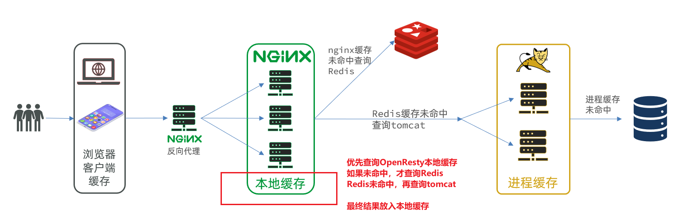
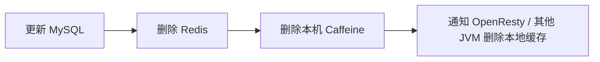
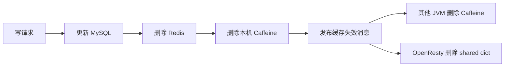

## 10.多级缓存篇

多级缓存不是“缓存越多越好”，而是把不同层级的缓存放在合适的位置：

```text
浏览器 / CDN
  ↓
Nginx / OpenResty 本地缓存
  ↓
Redis 分布式缓存
  ↓
Spring Boot / Caffeine
  ↓
MySQL
```

这是从“浏览器请求进入系统”的完整链路看；如果请求已经进入 Java 应用内部，则通常是先查 Caffeine，再查 Redis，最后查 MySQL。

经典业务场景：商品详情、店铺详情、分类列表、首页推荐。这类接口通常读多写少、热点明显，可以用多级缓存减少后端压力。

学习本篇时先抓三条主线：

```text
读请求：从近到远查缓存，命中就返回
写请求：先改数据库，再让各级缓存失效
一致性：越靠前的缓存越快，但越容易短暂不一致
```

各层缓存的大致定位：

| 层级 | 典型技术 | 优点 | 主要问题 |
| ---- | -------- | ---- | -------- |
| 浏览器 / CDN | HTTP Cache、CDN | 离用户最近，抗流量能力强 | 更新不可控，适合静态资源 |
| OpenResty 本地缓存 | `lua_shared_dict` | 不进 Java，性能高 | 多节点不共享，失效通知复杂 |
| Redis | String、Hash、ZSet | 多实例共享，容量大 | 网络 IO，热点 key、穿透击穿 |
| JVM 本地缓存 | Caffeine | 进程内访问最快 | 单 JVM 可见，多实例不一致 |
| MySQL | InnoDB | 数据最终来源 | 成本最高，不能抗高并发读 |

本篇重点是 Caffeine 和 OpenResty 在多级缓存中的用法。缓存穿透、缓存击穿、分布式锁在前面已有专门笔记，这里只保留必要结论，不重复展开。

### 10.1 Caffeine

Caffeine 是 Java 里的高性能 JVM 本地缓存库，可以理解为一个更适合生产使用的 `ConcurrentHashMap + 过期策略 + 淘汰策略 + 加载机制`。



它适合放在应用进程内部，作为 Redis 前面的一层一级缓存：

```
进入 Java 的请求 -> Caffeine 本地缓存 -> Redis 分布式缓存 -> MySQL
```

**本地缓存与 Redis 的区别**

| 对比项 | Caffeine 本地缓存 | Redis 分布式缓存 |
| ------ | ----------------- | ---------------- |
| 访问速度 | 进程内内存访问，最快 | 需要网络 IO，稍慢 |
| 数据共享 | 只在当前 JVM 内可见 | 多实例共享 |
| 容量 | 受 JVM 堆内存限制 | 容量更大，可独立扩容 |
| 可靠性 | 进程重启即丢失 | 可持久化、可主从、哨兵、集群 |
| 一致性 | 多节点容易不一致 | 所有节点访问同一份缓存 |
| 适用场景 | 热点、小体积、读多写少数据 | 通用缓存、会话、分布式锁、全局数据 |

Caffeine 不需要单独部署，它是 Java 依赖，运行在 Spring Boot 应用进程里。

依赖示例：

```xml
<dependency>
    <groupId>com.github.ben-manes.caffeine</groupId>
    <artifactId>caffeine</artifactId>
</dependency>
```

如果使用 Spring Cache 注解，还需要：

```xml
<dependency>
    <groupId>org.springframework.boot</groupId>
    <artifactId>spring-boot-starter-cache</artifactId>
</dependency>
```

#### 10.1.1 Caffeine 加载方式

Caffeine 常用的加载方式有三种：`Cache`、`LoadingCache`、`AsyncLoadingCache`。

**Cache：手动加载**

`Cache` 不知道数据应该从哪里来，缓存未命中时需要调用方自己写加载逻辑。

```java
Cache<Long, Shop> shopCache = Caffeine.newBuilder()
        .initialCapacity(100)
        .maximumSize(10_000)
        .expireAfterWrite(Duration.ofSeconds(30))
        .build();

Shop shop = shopCache.get(id, key -> getById(key));
```

常用 API：

```java
shopCache.getIfPresent(id);          // 只查缓存，没命中返回 null
shopCache.get(id, key -> getById(key)); // 未命中时原子加载并写入缓存
shopCache.put(id, shop);             // 主动写入
shopCache.invalidate(id);            // 删除指定 key
shopCache.invalidateAll();           // 清空缓存
```

> 推荐使用 `cache.get(key, loader)`，不要手写 `getIfPresent + put`，并发场景下会造成同一个 key 被多个线程重复回源。

**LoadingCache：同步自动加载**

`LoadingCache` 在创建时指定统一的加载函数，业务代码只需要调用 `get`。

```java
LoadingCache<Long, Shop> shopCache = Caffeine.newBuilder()
        .maximumSize(10_000)
        .expireAfterWrite(Duration.ofSeconds(30))
        .build(id -> getById(id));

Shop shop = shopCache.get(id);
```

适合加载逻辑统一的场景，例如“根据店铺 id 查询店铺”。

**AsyncLoadingCache：异步自动加载**

`AsyncLoadingCache` 返回 `CompletableFuture`，适合加载过程较慢、希望异步化的场景。

```java
AsyncLoadingCache<Long, Shop> shopCache = Caffeine.newBuilder()
        .maximumSize(10_000)
        .expireAfterWrite(Duration.ofSeconds(30))
        .executor(cacheOpsExecutor)
        .buildAsync((id, executor) -> CompletableFuture.supplyAsync(() -> getById(id), executor));

CompletableFuture<Shop> future = shopCache.get(id);
Shop shop = future.join();
```

项目里如果要使用异步加载，优先复用 `AsyncConfig` 里的 `cacheOpsExecutor`，避免把缓存加载任务丢到公共线程池。

**三种方式对比**

| 类型 | 加载方式 | 返回值 | 适合场景 |
| ---- | -------- | ------ | -------- |
| `Cache` | 调用方手动加载 | 直接返回对象 | 加载逻辑不固定，需要灵活控制 |
| `LoadingCache` | 缓存内部同步加载 | 直接返回对象 | 加载逻辑统一，代码最简洁 |
| `AsyncLoadingCache` | 缓存内部异步加载 | `CompletableFuture` | 加载耗时较长，想减少阻塞 |

注意：Caffeine 不缓存 `null`。如果数据库查不到数据，要么不写本地缓存，要么用 `Optional`、空对象或短 TTL 空值缓存来表示空结果，避免缓存穿透。


#### 10.1.2 **Caffeine 过期策略**

Caffeine 的过期策略用于控制“数据多久后不能再用”。常见策略有三种。

**expireAfterWrite：写入后过期**

从创建或最后一次更新开始计时，到期后过期。

```java
Cache<Long, Shop> shopCache = Caffeine.newBuilder()
        .expireAfterWrite(Duration.ofSeconds(30))
        .maximumSize(10_000)
        .build();
```

适合大多数业务数据，例如店铺详情、店铺分类、首页推荐等。数据写入缓存后最多保留一段时间，避免长期脏读。

**expireAfterAccess：访问后过期**

从最后一次读或写开始计时，超过指定时间无人访问才过期。

```java
Cache<Long, Shop> shopCache = Caffeine.newBuilder()
        .expireAfterAccess(Duration.ofMinutes(5))
        .maximumSize(10_000)
        .build();
```

适合会话、临时上下文、最近访问数据。访问越频繁，存活越久。

**refreshAfterWrite：写入后刷新**

`refreshAfterWrite` 不是过期删除，而是在数据写入一段时间后，下一次访问触发异步刷新。刷新期间先返回旧值，刷新成功后替换为新值。

```java
LoadingCache<Long, Shop> shopCache = Caffeine.newBuilder()
        .maximumSize(10_000)
        .refreshAfterWrite(Duration.ofSeconds(30))
        .expireAfterWrite(Duration.ofMinutes(2))
        .executor(cacheOpsExecutor)
        .build(id -> getById(id));
```

适合热点数据：允许短时间旧值，但不希望用户请求一直等待回源。

**组合使用**

常见组合：

```java
Caffeine.newBuilder()
        .maximumSize(10_000)
        .expireAfterWrite(Duration.ofMinutes(2))
        .refreshAfterWrite(Duration.ofSeconds(30))
        .recordStats()
        .build(id -> getById(id));
```

理解重点：

- `refreshAfterWrite` 只让数据“有资格刷新”，真正刷新要等下一次访问触发。
- 刷新期间旧值仍可返回；如果刷新失败，旧值会继续保留并记录异常。
- `expireAfterWrite` 是兜底过期，防止长期没人访问的数据永远不清理。
- 定时过期不是严格实时删除，Caffeine 通常在读写操作或维护任务中清理过期数据。
- 对过期时间敏感时，可以配置 `scheduler`；日常业务通常不需要。


#### 10.1.3 **Caffeine 内存淘汰策略**

本地缓存一定要设置容量上限，否则热点扩大或异常流量可能把 JVM 堆内存打满。

**maximumSize：按数量限制**

```java
Cache<Long, Shop> shopCache = Caffeine.newBuilder()
        .initialCapacity(100)
        .maximumSize(10_000)
        .build();
```

适合每个缓存对象大小差不多的场景，例如店铺、分类、用户简要信息。

**maximumWeight：按权重限制**

当不同对象大小差异很大时，可以使用权重。

```java
Cache<Long, List<Shop>> shopListCache = Caffeine.newBuilder()
        .maximumWeight(100_000)
        .weigher((Long key, List<Shop> value) -> value.size())
        .build();
```

注意：

- `maximumSize` 和 `maximumWeight` 不能同时使用。
- 权重在写入或更新时计算，不会因为对象内部字段变化自动重新计算。
- 权重只是容量控制，不代表真实内存字节数，除非自己用估算逻辑实现。

**W-TinyLFU**

Caffeine 的核心淘汰算法是 W-TinyLFU，可以简单理解为：

- 不是单纯 LRU：不会只因为“最近访问”就保留。
- 不是单纯 LFU：不会只因为“历史访问次数多”就保留。
- 它会综合最近性和访问频率，尽量把真正的热点数据留在缓存中。
- 对突发冷数据扫库更友好，避免大量一次性数据挤掉长期热点。

所以 Caffeine 的命中率通常比简单 LRU 更好，适合热点访问明显的接口。

**其他缓存技术的淘汰策略**

| 技术 | 常见策略 | 说明 |
| ---- | -------- | ---- |
| Redis | `allkeys-lru`、`volatile-lru`、`allkeys-lfu`、`volatile-ttl`、`noeviction` 等 | 由 `maxmemory-policy` 控制，全局作用于 Redis 实例 |
| Guava Cache | 近似 LRU | 功能较老，很多新项目优先选 Caffeine |
| HashMap / ConcurrentHashMap | 无自动淘汰 | 必须自己控制容量和过期，否则容易内存泄漏 |
| Caffeine | W-TinyLFU | 综合频率和最近性，命中率更高 |

**removalListener**

可以监听缓存项被删除的原因，常用于日志、监控、排查缓存淘汰。

```java
Cache<Long, Shop> shopCache = Caffeine.newBuilder()
        .maximumSize(10_000)
        .removalListener((Long key, Shop value, RemovalCause cause) -> {
            log.debug("shop cache removed, key={}, cause={}", key, cause);
        })
        .build();
```

常见删除原因：

| 原因 | 含义 |
| ---- | ---- |
| `EXPLICIT` | 主动调用 `invalidate` 删除 |
| `REPLACED` | 新值覆盖旧值 |
| `COLLECTED` | 被 GC 回收，通常来自弱引用或软引用 |
| `EXPIRED` | 过期删除 |
| `SIZE` | 超过容量上限后淘汰 |

弱引用、软引用也能作为淘汰方式，但可控性较差，业务缓存一般优先使用 `maximumSize` 或 `maximumWeight`。


#### 10.1.4 并发加载与线程安全

Caffeine 本身是线程安全的，可以被多个请求线程共享。真正需要注意的是“缓存未命中后的加载方式”。

**错误写法：`getIfPresent + put`**

```java
Shop shop = shopCache.getIfPresent(id);
if (shop == null) {
    shop = getById(id);
    shopCache.put(id, shop);
}
return shop;
```

问题：

- 多个线程同时未命中时，会一起查询数据库。
- 热点 key 过期瞬间可能形成小型缓存击穿。
- 代码里还容易遗漏空值、异常、监控等处理。

**推荐写法：`cache.get(key, loader)`**

```java
Shop shop = shopCache.get(id, key -> getById(key));
```

同一个 key 并发加载时，Caffeine 会尽量保证加载和写入是原子的，其他线程复用结果，减少重复回源。

**LoadingCache 写法**

```java
LoadingCache<Long, Shop> shopCache = Caffeine.newBuilder()
        .maximumSize(10_000)
        .expireAfterWrite(Duration.ofSeconds(30))
        .build(id -> getById(id));

Shop shop = shopCache.get(id);
```

**并发使用注意点**

- loader 里不要再对同一个 cache 做递归写入，容易触发递归计算问题。
- loader 抛异常时通常不会写入缓存，请在业务层决定是否降级。
- 缓存值尽量使用不可变对象，或者不要在多个线程间共享后继续修改对象内部状态。
- 异步刷新或异步加载要指定业务线程池，避免默认公共线程池不可控。
- 本地缓存只解决当前 JVM 内的并发加载，多个应用实例之间仍然需要 Redis 锁、消息通知或短 TTL 控制一致性。

可以开启统计信息辅助调优：

```java
Cache<Long, Shop> shopCache = Caffeine.newBuilder()
        .maximumSize(10_000)
        .recordStats()
        .build();

System.out.println(shopCache.stats().hitRate());
System.out.println(shopCache.stats().evictionCount());
```

#### 10.1.5 **Caffeine + Redis 多级缓存**

Caffeine 和 Redis 组合时，要先明确分工：

```text
Caffeine：解决单个 Java 进程内的极致读取速度
Redis：解决多实例共享缓存和跨进程一致入口
MySQL：最终可信数据源
```

典型适用场景：店铺详情、商品详情、分类列表、配置项。这些数据读多写少，可以接受短时间不一致。

**查询流程**

```text
1. 查 Caffeine
2. 命中：直接返回
3. 未命中：查 Redis
4. Redis 命中：写入 Caffeine，返回
5. Redis 未命中：查 MySQL
6. MySQL 命中：写入 Redis，再写入 Caffeine
7. MySQL 未命中：Redis 写短 TTL 空值；Caffeine 可用 `Optional.empty()` 做短 TTL 空值缓存
```

**最小配置示例**

```java
@Configuration
public class CaffeineConfig {

    @Bean
    public Cache<Long, Shop> shopLocalCache() {
        return Caffeine.newBuilder()
                .initialCapacity(100)
                .maximumSize(10_000)
                .expireAfterWrite(Duration.ofSeconds(30))
                .recordStats()
                .build();
    }
}
```

**业务伪代码**

```java
public Shop queryById(Long id) {
    return localCache.get(id, key -> {
        Shop shop = queryFromRedis(key);
        if (shop != null) {
            return shop;
        }

        shop = queryFromDb(key);
        if (shop != null) {
            writeRedis(key, shop);
        }
        return shop;
    });
}
```

如果要缓存空值，Caffeine 不能直接缓存 `null`，可以用 `Optional.empty()` 表达。缓存穿透的完整方案前面已有专门笔记，这里只记结论：空值缓存 TTL 要短，避免错误数据长期存在。

**更新流程**

```text
1. 更新 MySQL
2. 删除 Redis 缓存
3. 删除当前 JVM 的 Caffeine 缓存
4. 多实例部署时，通过 MQ / Redis PubSub / Canal 通知其他 JVM 删除本地缓存
```

**一致性重点**

本地缓存最大的问题不是性能，而是多实例一致性：

- A 实例更新数据并删除了自己的本地缓存。
- B 实例的 Caffeine 里可能还保留旧数据。
- 所以本地缓存通常只能做短 TTL 热点缓存。

常见解决方案：

| 方案 | 说明 |
| ---- | ---- |
| 短 TTL | 最简单，允许几十秒内短暂不一致 |
| 更新时删除本机 Caffeine + Redis | 单机有效，多实例不够 |
| MQ / Redis PubSub 广播删除 | 更新后通知所有应用实例删除本地缓存 |
| Canal 监听 MySQL binlog | 数据变更后统一广播缓存失效 |
| 版本号校验 | 缓存值带版本，读到旧版本时丢弃 |

延迟双删、逻辑过期、互斥锁等细节不在这里展开，复习时回到缓存专题和分布式锁专题。

**使用建议**

- 只缓存热点、小体积、读多写少的数据，例如店铺详情、店铺分类、配置信息。
- 不建议缓存强一致数据，例如秒杀库存、订单状态、余额等。
- Caffeine TTL 通常要短于 Redis TTL，例如本地 10~60 秒，Redis 30 分钟。
- 本地缓存必须设置 `maximumSize` 或 `maximumWeight`。
- 更新接口必须同时处理 Redis 和 Caffeine 的失效。
- 多实例部署时，要接受短暂不一致，或者引入广播失效机制。

**复习重点**

- Caffeine 是 JVM 本地缓存，不是分布式缓存。
- `cache.get(key, loader)` 比 `getIfPresent + put` 更适合并发加载。
- `refreshAfterWrite` 是刷新，不是过期；刷新期间可以返回旧值。
- 本地缓存容量一定要受控，否则可能造成 JVM OOM。
- Caffeine + Redis 的核心问题是缓存命中顺序和数据一致性。

### 10.2 OpenResty


OpenResty 可以理解为“带 Lua 编程能力的 Nginx”。普通 Nginx 更偏反向代理、静态资源、负载均衡；OpenResty 在这些能力上，额外允许我们在请求处理阶段写 Lua 逻辑，例如鉴权、限流、读 Redis、读本地缓存、拼装响应。

学习 OpenResty 时不要先陷入配置细节，可以先抓住一个经典场景：

> 商品详情页是高频读接口。用户每刷新一次详情页，如果都进入 Java，再查 Redis 或 MySQL，Tomcat 线程和后端缓存都会承压。OpenResty 可以在请求进入 Java 之前，先查本地缓存或 Redis，命中后直接返回。



多级缓存中的位置可以这样理解：

```text
浏览器
  ↓
OpenResty：本地缓存、限流、鉴权、Redis 查询
  ↓
Spring Boot：业务逻辑、Caffeine、Redis、数据库
```

当前项目的 `docker-compose.yml` 已经提供 OpenResty 学习环境，主要借用它来验证配置即可：

- OpenResty 入口：`http://localhost:8088`
- 普通 Nginx 入口：`http://localhost:8080`
- Redis / MySQL / Spring Boot 作为后续多级缓存实验依赖

#### 10.2.1 简单入门

这一节的目标不是记住所有配置，而是知道 OpenResty 怎么从“普通代理”变成“能写一点业务逻辑的网关”。

学习路径：

```text
先让 Nginx 返回固定内容
  ↓
再用 Lua 输出动态内容
  ↓
最后把复杂 Lua 拆到文件
```

**OpenResty 适合做什么**

- 在 Nginx 层写少量业务逻辑，减少 Java 服务压力。
- 在请求进入后端之前完成鉴权、限流、缓存查询、灰度路由等网关逻辑。
- 利用 Nginx 的事件模型和 Lua 协程，支撑高并发 IO。
- 对热点读接口，可以直接查本地缓存或 Redis，避免每次都进入 Tomcat。

不适合做什么：

- 不适合承载复杂业务编排，复杂业务仍放在 Java Service。
- 不适合直接写大量数据库逻辑。
- 不适合替代 Spring Security、事务、领域模型等后端能力。

**Nginx 与 OpenResty 对比**

| 对比项 | Nginx | OpenResty |
| ------ | ----- | --------- |
| 核心能力 | 静态资源、反向代理、负载均衡 | Nginx 能力 + Lua 编程 |
| 业务逻辑 | 配置为主，逻辑较弱 | 可写 Lua 处理请求 |
| Redis 访问 | 需要额外模块或转发给后端 | 可用 `lua-resty-redis` 直接访问 |
| 适合场景 | 通用网关和静态资源 | 高并发网关、热点缓存、限流、鉴权 |

**本地怎么验证**

借鉴当前项目环境即可，不需要单独安装 OpenResty：

```shell
cd /Users/zhaowenzhuo/Workspace/heimadianping-app
docker-compose up -d openresty
```

```text
访问 http://localhost:8088/hello       # Lua block 示例
访问 http://localhost:8088/lua/hello   # Lua 文件示例
```

修改配置后的两个常用命令：

```bash
docker-compose exec openresty openresty -t          # 检查配置语法
docker-compose exec openresty openresty -s reload   # 重新加载配置
```

**最小配置 1：普通 Nginx 返回内容**

先不用 Lua，只验证 `server` 和 `location` 是否生效。

```nginx
location = /ping {
    default_type text/plain;
    return 200 "pong";
}
```

访问 `/ping` 返回 `pong`，说明请求已经被这个 location 捕获。

**最小配置 2：用 Lua 返回动态内容**

`content_by_lua_block` 适合短逻辑，能直观看到 OpenResty 的编程能力。

```nginx
location /hello {
    default_type text/plain;
    content_by_lua_block {
        ngx.say("hello openresty")
    }
}
```

**最小配置 3：Lua 拆到文件**

真实项目中不建议把业务逻辑都写进 `nginx.conf`，稍微复杂一点就拆成 Lua 文件。

```nginx
location = /lua/hello {
    default_type application/json;
    content_by_lua_file /usr/local/openresty/nginx/lua/hello.lua;
}
```

`hello.lua` 示例：

```lua
local cjson = require "cjson.safe"

ngx.header["Content-Type"] = "application/json; charset=utf-8"

ngx.say(cjson.encode({
    ok = true,
    message = "hello openresty",
    method = ngx.req.get_method(),
    uri = ngx.var.uri,
    time = ngx.localtime()
}))
```

**主配置需要关注什么**

入门阶段只记三个位置：

```nginx
http {
    # Lua 模块查找路径，require("hello") 会从这里找 hello.lua
    lua_package_path "/usr/local/openresty/nginx/lua/?.lua;;";

    # 站点配置拆到 conf.d，避免 nginx.conf 越写越大
    include /etc/nginx/conf.d/*.conf;
}
```

> 复习重点：`return` 用来验证路由；`content_by_lua_block` 适合短逻辑；`content_by_lua_file` 适合正式维护。


#### 10.2.2 OpenResty请求流程

这一节要解决的问题是：请求来了以后，到底先看哪个配置、在哪个阶段写 Lua。

不要一开始背所有 Nginx 阶段，先抓主线：



以商品详情请求 `/api/shop/1` 为例：

```text
1. 找到监听 80 端口、server_name 匹配的 server
2. 在这个 server 内匹配最合适的 location
3. 先执行 rewrite / access 等前置逻辑
4. 在 content 阶段查缓存、代理后端或直接返回
5. 请求结束后进入 log 阶段记录日志
```

**第一步：匹配 server**

server 主要由 `listen` 和 `server_name` 决定。

```nginx
server {
    listen 80;              # 请求进入的端口
    server_name localhost;  # 请求头 Host
}
```

匹配规则简化理解：

1. 先看请求进来的端口，例如容器内 `80`。
2. 再看 Host 头是否匹配 `server_name`。
3. 如果没有精确匹配，会进入该端口的默认 server。

**第二步：匹配 location**

location 决定“这个 URI 由谁处理”。复习时重点记优先级，不需要死背所有细节：

```text
= 精确匹配 > ^~ 前缀匹配 > 正则匹配 > 普通前缀匹配
```

常见匹配方式：

| 写法 | 含义 | 示例 |
| ---- | ---- | ---- |
| `location = /a` | 精确匹配 | 只匹配 `/a` |
| `location ^~ /static/` | 前缀匹配，命中后不再走正则 | 静态资源常用 |
| `location ~ \.jpg$` | 正则匹配，区分大小写 | 匹配 jpg |
| `location ~* \.jpg$` | 正则匹配，不区分大小写 | 匹配 jpg/JPG |
| `location /api` | 普通前缀匹配 | 匹配 `/api/shop` |

经典配置例子：

```nginx
location = /health {
    return 200 "ok";          # 精确匹配，适合健康检查
}

location ^~ /static/ {
    root /usr/share/nginx/html; # 静态资源，不再走正则
}

location /api {
    proxy_pass http://backend; # API 统一代理后端
}
```

**第三步：在合适阶段做合适的事**

对学习多级缓存来说，常用阶段其实就四个：

| 阶段 | 主要作用 | 常用 Lua 指令 |
| ---- | -------- | ------------- |
| rewrite | 改写 URI、参数规范化、简单路由 | `rewrite_by_lua_block` |
| access | 鉴权、限流、黑名单、权限判断 | `access_by_lua_block` |
| content | 生成响应或反向代理到后端 | `content_by_lua_block` / `content_by_lua_file` |
| log | 请求结束后记录日志、埋点 | `log_by_lua_block` |

场景化理解：

```text
rewrite：把 /api/shop/1 改成后端需要的 /shop/1
access ：检查 token、判断是否被限流
content：查 OpenResty 本地缓存；未命中再查 Redis / Java
log    ：记录耗时、命中哪一级缓存、状态码
```

配置只保留关键骨架：

```nginx
location /api/shop/ {
    rewrite_by_lua_block {
        -- 做 URI 改写、参数整理
    }

    access_by_lua_block {
        -- 做登录校验、限流、黑名单
    }

    content_by_lua_file /usr/local/openresty/nginx/lua/shop.lua;
}
```

**容易混淆的点**

- `rewrite` 不是返回响应的主要阶段，它更适合改 URI 或补参数。
- `access` 只判断“能不能继续访问”，例如 token、限流、黑名单。
- `content` 才是真正产出响应的地方，可以 `ngx.say`，也可以代理后端。
- `log` 阶段请求已经结束，不适合再影响响应结果。

> 复习重点：请求先匹配 `server`，再匹配 `location`，然后按阶段执行 Lua；多级缓存的核心逻辑一般写在 `content` 阶段，鉴权和限流一般写在 `access` 阶段。

#### 10.2.3 OpenResty Lua基础

OpenResty 使用 LuaJIT 执行 Lua。学习时不需要把 Lua 当成完整后端语言，只要掌握网关场景常用语法即可。

**变量与类型**

```lua
local name = "tom"          -- 字符串
local age = 18              -- number
local ok = true             -- boolean
local empty = nil           -- 空值
```

Lua 中只有 `false` 和 `nil` 表示假，`0`、空字符串都是真。

**table**

Lua 的 table 既可以当数组，也可以当 map。

```lua
local user = {
    id = 1,
    name = "zhangsan",
    roles = {"admin", "user"}
}

ngx.say(user.name)
ngx.say(user.roles[1])      -- Lua 数组从 1 开始
```

**if 判断**

```lua
local token = ngx.var.http_authorization

if not token then
    ngx.status = 401
    ngx.say('{"success":false,"errorMsg":"未登录"}')
    return ngx.exit(401)
end
```

**函数**

```lua
local function ok(data)
    return {
        success = true,
        data = data
    }
end
```

**模块化**

`common.lua`：

```lua
local _M = {}

function _M.say_hello(name)
    return "hello " .. name
end

return _M
```

使用：

```lua
local common = require("common")
ngx.say(common.say_hello("openresty"))
```

**请求参数**

```lua
local args = ngx.req.get_uri_args()
local id = args["id"]

local method = ngx.req.get_method()
local uri = ngx.var.uri
local token = ngx.var.http_authorization
```

正则 location 的捕获值：

```nginx
location ~ /api/shop/(\d+) {
    content_by_lua_file /usr/local/openresty/nginx/lua/shop.lua;
}
```

```lua
local shopId = ngx.var[1]
```

**JSON 处理**

推荐使用 `cjson.safe`，解析失败不会直接抛异常。

```lua
local cjson = require "cjson.safe"

local obj = cjson.decode('{"id":1,"name":"shop"}')
ngx.say(cjson.encode(obj))
```

**统一 JSON 响应**

```lua
local cjson = require "cjson.safe"

local function json(status, body)
    ngx.status = status
    ngx.header["Content-Type"] = "application/json; charset=utf-8"
    ngx.say(cjson.encode(body))
    return ngx.exit(status)
end

-- 用法
return json(401, { success = false, errorMsg = "未登录" })
```

**简单鉴权 Demo**

```lua
local token = ngx.var.http_authorization

if not token or token == "" then
    ngx.status = 401
    ngx.say('{"success":false,"errorMsg":"未登录"}')
    return ngx.exit(401)
end

-- token 合法性可以继续交给 Redis 或后端校验
```

> 复习重点：Lua 文件里要多用 `local`，避免变量污染全局；JSON 解析建议用 `cjson.safe`。

#### 10.2.4 反向代理配置

反向代理是 OpenResty 调用后端 Java 服务的基础。复习时不要只记 `proxy_pass`，还要理解三个问题：

```text
1. 请求转发到哪里：upstream / proxy_pass
2. 后端看到的请求是什么样：URI、Host、Header
3. 出故障时怎么处理：超时、重试、失败摘除
```

**基础代理骨架**

```nginx
upstream heimadianping_backend {
    # OpenResty 在容器内，访问宿主机 Spring Boot 用 host.docker.internal
    server host.docker.internal:8081 max_fails=5 fail_timeout=10s weight=1;
}

server {
    listen 80;
    server_name localhost;

    location /api {
        default_type application/json;

        # 使用 HTTP/1.1，便于与后端保持长连接
        proxy_http_version 1.1;

        # 清空 Connection，避免客户端传来的 close 影响代理到后端的连接复用
        proxy_set_header Connection "";

        # 保留原始 Host，例如 localhost:8088 或 api.xxx.com
        proxy_set_header Host $host;

        # 直接连接 OpenResty 的客户端 IP
        proxy_set_header X-Real-IP $remote_addr;

        # 追加代理链路，格式通常是 client, proxy1, proxy2
        proxy_set_header X-Forwarded-For $proxy_add_x_forwarded_for;

        # 原始协议，后端可用于判断 http / https
        proxy_set_header X-Forwarded-Proto $scheme;

        # /api/shop/1 -> /shop/1
        rewrite /api(/.*) $1 break;

        # 代理到 upstream
        proxy_pass http://heimadianping_backend;
    }
}
```

**常见请求头含义**

| 请求头 | 作用 | 后端常见用途 |
| ------ | ---- | ------------ |
| `Host` | 原始域名或主机 | 多租户、回调地址、日志 |
| `X-Real-IP` | 当前 Nginx 认为的客户端 IP | 获取用户 IP |
| `X-Forwarded-For` | 完整代理链路 IP 列表 | 追踪真实来源 |
| `X-Forwarded-Proto` | 原始协议 `http/https` | 生成 HTTPS 链接、防止协议判断错误 |
| `X-Forwarded-Host` | 原始 Host | 多层代理后保留入口域名 |
| `X-Request-Id` | 请求唯一标识 | 全链路日志排查 |

可以补充：

```nginx
proxy_set_header X-Forwarded-Host $host;
proxy_set_header X-Request-Id $request_id;
```

**CDN 场景下怎么获取真实用户 IP**

如果链路是：

```text
用户 -> CDN -> OpenResty -> Spring Boot
```

此时 OpenResty 看到的 `$remote_addr` 通常是 CDN 节点 IP，不一定是真实用户 IP。真实 IP 通常由 CDN 放在请求头中，例如：

```text
X-Forwarded-For: 用户IP, CDN节点IP
X-Real-IP: 用户IP
CF-Connecting-IP: 用户IP       # Cloudflare
X-Forwarded-Proto: https
```

关键点：不能无脑相信客户端传来的 `X-Forwarded-For`，否则用户可以伪造 IP 绕过限流或风控。正确做法是只信任“可信代理”传来的头。

Nginx 可使用 `real_ip` 模块处理：

```nginx
# 只信任这些 CDN / 上层代理 IP 段
set_real_ip_from 203.0.113.0/24;
set_real_ip_from 198.51.100.0/24;

# 从 X-Forwarded-For 中取真实 IP
real_ip_header X-Forwarded-For;

# 递归向前找第一个不在可信代理列表中的 IP，通常就是用户 IP
real_ip_recursive on;
```

处理后：

```nginx
proxy_set_header X-Real-IP $remote_addr;
proxy_set_header X-Forwarded-For $proxy_add_x_forwarded_for;
```

后端获取 IP 的优先级建议：

```text
如果接入层已正确配置 real_ip：
    优先使用 X-Real-IP
否则：
    从 X-Forwarded-For 中取第一个可信用户 IP
兜底：
    使用 request.getRemoteAddr()
```

Spring Boot 中如果使用反向代理头，还可以配置：

```yaml
server:
  forward-headers-strategy: framework
```

> 复习重点：`X-Forwarded-For` 是链路列表，不是天然可信；必须结合可信代理 IP 段判断。

**proxy_pass 路径规则**

这是复习时最容易混的点。

```nginx
location /api/ {
    proxy_pass http://backend/;
}
```

请求 `/api/shop/1` 转发为：

```text
http://backend/shop/1
```

因为 `proxy_pass` 后面带 `/`，会把匹配到的 `/api/` 替换掉。

```nginx
location /api/ {
    proxy_pass http://backend;
}
```

请求 `/api/shop/1` 转发为：

```text
http://backend/api/shop/1
```

因为 `proxy_pass` 后面不带 URI，原始 URI 会完整传给后端。

路径规则总结：

| 配置 | `/api/shop/1` 转发结果 |
| ---- | ---------------------- |
| `location /api/ { proxy_pass http://backend/; }` | `/shop/1` |
| `location /api/ { proxy_pass http://backend; }` | `/api/shop/1` |
| `rewrite /api(/.*) $1 break; proxy_pass http://backend;` | `/shop/1` |

**upstream 常见配置**

```nginx
upstream backend {
    # 默认轮询
    server 127.0.0.1:8081 weight=1;
    server 127.0.0.1:8082 weight=1;

    # 失败摘除：10 秒内失败 3 次，暂时认为不可用
    # server 127.0.0.1:8081 max_fails=3 fail_timeout=10s;
}
```

常用负载均衡方式：

| 方式 | 配置 | 说明 |
| ---- | ---- | ---- |
| 轮询 | 默认 | 请求均匀分散 |
| 权重 | `weight=2` | 配置高的实例分到更多请求 |
| IP Hash | `ip_hash;` | 同一 IP 尽量落同一后端 |
| URI Hash | `hash $request_uri consistent;` | 同一资源尽量落同一后端 |
| 最少连接 | `least_conn;` | 优先发给连接数少的实例 |

如果后端有 JVM 本地缓存，为了提高命中率，可以按业务 key 做 hash，让同一个资源尽量打到同一个后端实例：

```nginx
upstream backend {
    hash $request_uri consistent;
    server 127.0.0.1:8081;
    server 127.0.0.1:8082;
}
```

注意：`ip_hash` 对 NAT、公司出口 IP、移动网络不一定友好；多级缓存里更常见的是按资源 ID 或 URI 做 hash。

**超时、重试、失败处理**

生产中代理配置至少要考虑超时：

```nginx
location /api/ {
    proxy_connect_timeout 1s;   # 连接后端超时
    proxy_send_timeout 3s;      # 向后端发送请求超时
    proxy_read_timeout 3s;      # 等待后端响应超时

    # 哪些错误可以重试下一个 upstream 节点
    proxy_next_upstream error timeout http_502 http_503 http_504;

    # 最多尝试几个后端节点，避免无限重试放大流量
    proxy_next_upstream_tries 2;

    proxy_pass http://backend;
}
```

配置思想：

- 超时时间不要太长，否则会拖住 Nginx worker 和后端连接。
- 重试只适合幂等请求，例如 GET；下单、支付这类写请求不能随便重试。
- 502/503/504 可以考虑切换节点，业务 4xx 不应该重试。

**内部子请求**

Lua 中可以用 `ngx.location.capture` 发起 Nginx 内部子请求，常用于调用后端接口。

```lua
local resp = ngx.location.capture("/internal/shop/1", {
    method = ngx.HTTP_GET
})

if not resp or resp.status ~= 200 then
    ngx.log(ngx.ERR, "query backend failed")
    return ngx.exit(502)
end

ngx.say(resp.body)
```

对应配置：

```nginx
location /internal/ {
    internal;                         # 只允许 Nginx 内部访问，外部不能直接访问
    rewrite /internal(/.*) $1 break;
    proxy_pass http://heimadianping_backend;
}
```

**灰度路由思路**

OpenResty 可以在 `rewrite` 或 `access` 阶段根据请求头、用户 ID、Cookie 决定走哪个 upstream。

```nginx
upstream backend_stable {
    server 127.0.0.1:8081;
}

upstream backend_gray {
    server 127.0.0.1:8082;
}
```

伪代码：

```lua
local uid = ngx.var.http_x_user_id
if uid and tonumber(uid) % 100 < 5 then
    ngx.var.target = "backend_gray"   -- 5% 用户进入灰度
else
    ngx.var.target = "backend_stable"
end
```

> 复习重点：反向代理不只是 `proxy_pass`，还包括真实 IP 传递、路径改写、超时重试、负载均衡和灰度路由。

#### 10.2.5 OpenResty + Redis

OpenResty 访问 Redis 的典型场景：

- 登录态校验：从 Redis 查询 token 对应用户。
- 黑名单：IP、用户、token 是否禁止访问。
- 分布式限流：计数器、滑动窗口、令牌桶。
- 多级缓存：本地缓存未命中后先查 Redis。

**访问流程**



**Redis 工具封装**

```lua
local redis = require "resty.redis"

local function close_redis(red)
    -- set_keepalive 不是关闭连接，而是放回连接池
    local ok, err = red:set_keepalive(10000, 100)
    if not ok then
        ngx.log(ngx.ERR, "redis keepalive failed: ", err)
    end
end

local function read_redis(host, port, key)
    local red = redis:new()
    red:set_timeouts(1000, 1000, 1000) -- connect/send/read timeout，单位 ms

    local ok, err = red:connect(host, port)
    if not ok then
        ngx.log(ngx.ERR, "connect redis failed: ", err)
        return nil
    end

    local val, err = red:get(key)
    if val == ngx.null then
        close_redis(red)
        return nil
    end

    if not val then
        ngx.log(ngx.ERR, "redis get failed, key=", key, ", err=", err)
        close_redis(red)
        return nil
    end

    close_redis(red)
    return val
end
```

结合当前 Docker 网络，OpenResty 容器可访问固定 IP 的 Redis，例如哨兵主节点初始是 `172.30.0.10:6380`。生产中不建议写死主节点，后续应接入哨兵、集群客户端或统一代理。

**登录态校验示例**

项目后端登录态 key 形如：

```text
login:token:{token}
```

OpenResty 可以在 `access_by_lua_block` 中提前校验：

```nginx
location /api/ {
    access_by_lua_block {
        local token = ngx.var.http_authorization
        if not token or token == "" then
            ngx.status = 401
            ngx.say('{"success":false,"errorMsg":"未登录"}')
            return ngx.exit(401)
        end

        -- 这里只演示思路：实际应封装 read_redis，并处理 Redis 异常降级
        -- local user = read_redis("172.30.0.10", 6380, "login:token:" .. token)
    }

    proxy_pass http://heimadianping_backend;
}
```

**Redis 异常时怎么处理**

| 场景 | 建议 |
| ---- | ---- |
| 鉴权依赖 Redis | 保守策略：Redis 异常时转发给后端校验，或直接拒绝，取决于业务安全要求 |
| 黑名单依赖 Redis | Redis 异常时可放行并记录告警，避免全站不可用 |
| 缓存查询依赖 Redis | Redis 异常时回源 Java，不直接失败 |
| 限流依赖 Redis | 核心接口可以 fail close，普通接口可以 fail open |

> 本篇只关注 OpenResty 访问 Redis 的位置和降级思路，Redis Sentinel / Cluster 客户端接入不展开，复习时回到 Redis 高可用与集群专题。

#### 10.2.6 OpenResty实现限流

限流的目标不是“拦所有请求”，而是在异常流量、热点突增、恶意刷接口时保护系统核心资源。

限流本质是在回答三个问题：

```text
限谁：IP、用户、设备、接口、资源
限多少：每秒、每分钟、每天允许多少次
超过后怎么办：拒绝、排队、降级、验证码、人机校验
```

**为什么在 OpenResty 层限流**



限流放在 OpenResty 的好处：

- 请求还没进入 Java，就能快速拒绝。
- 能保护后端线程池、数据库连接池、Redis。
- 可以统一按 IP、用户、接口维度做网关级控制。

**经典业务场景**

| 场景 | 风险 | 限流思路 |
| ---- | ---- | -------- |
| 短信验证码 | 短信成本高，容易被刷 | 手机号 + IP 双维度限流 |
| 登录接口 | 暴力破解、撞库 | IP + 账号维度限流，失败次数越多越严格 |
| 秒杀下单 | 瞬时流量极高，库存强一致 | userId + voucherId 限流，入口快速拒绝 |
| 店铺详情 / 商品详情 | 热点访问压垮 Java | IP 粗限流 + 热点缓存 |
| 搜索接口 | 查询成本高 | IP + keyword + userId 限流 |
| 评论 / 发帖 | 垃圾内容、刷屏 | userId + 行为类型 + 时间窗口 |

限流不是越严格越好。要按接口价值和风险区分策略：

```text
高风险写接口：宁可误伤一点，也要保护数据和成本
普通读接口：优先保护后端，尽量不要影响正常用户
核心支付/下单：入口限流 + 后端幂等 + 队列削峰
```

**本地限流与 Redis 分布式限流**

| 方案 | 优点 | 缺点 | 适用场景 |
| ---- | ---- | ---- | -------- |
| OpenResty 本地限流 | 性能最好，不依赖 Redis | 多节点之间计数不共享 | 单节点、粗粒度保护 |
| Redis 分布式限流 | 多节点共享计数 | 有网络 IO，Redis 异常要降级 | 多实例网关、全局限流 |

**限流 key 设计**

| 维度 | key 示例 | 场景 |
| ---- | -------- | ---- |
| IP | `rate:ip:127.0.0.1` | 防爬、防刷 |
| userId | `rate:user:101` | 登录用户行为控制 |
| API | `rate:api:/voucher/seckill` | 热点接口保护 |
| userId + API | `rate:user:101:/voucher/seckill` | 防止单用户刷某接口 |
| 手机号 + IP | `rate:sms:phone:138xxx:ip:1.1.1.1` | 短信验证码 |
| userId + resourceId | `rate:seckill:user:101:voucher:5` | 秒杀一人一单前置保护 |

key 设计原则：

- key 中要包含“被限制对象”，例如 IP、userId、手机号。
- key 中要包含“行为”，例如 login、sms、seckill。
- 热点接口要避免所有请求打到同一个超级 key，必要时按用户或资源拆分。
- key 要设置 TTL，避免 Redis 中留下大量历史计数。
- 对 URL 中的高基数字段要谨慎，例如搜索关键词可能导致 key 数量暴涨。

示例：

```text
rate:sms:phone:{phone}:1m
rate:sms:ip:{ip}:1m
rate:login:account:{username}:5m
rate:api:{api}:ip:{ip}:1s
rate:seckill:voucher:{voucherId}:user:{userId}:1s
```

**限流算法选择**

| 算法 | 思想 | 优点 | 缺点 | 适合场景 |
| ---- | ---- | ---- | ---- | -------- |
| 固定窗口 | 一个时间窗口内计数 | 简单，成本低 | 窗口边界有突刺 | 入门、粗限流 |
| 滑动窗口 | 统计最近一段时间内请求 | 更平滑，准确性好 | 存储和计算成本更高 | 登录、验证码、风控 |
| 漏桶 | 请求以固定速率流出 | 平滑流量 | 突发流量会排队或丢弃 | 保护下游稳定处理 |
| 令牌桶 | 按固定速率生成令牌，请求消耗令牌 | 允许一定突发 | 实现略复杂 | 高并发接口常用 |

**固定窗口限流**

简单易懂，适合入门。

```lua
local key = "rate:ip:" .. ngx.var.remote_addr
local limit = 100
local window = 60

local count = read_redis_count(key) -- 伪代码：读取当前计数
if count and tonumber(count) >= limit then
    ngx.status = 429
    ngx.say('{"success":false,"errorMsg":"请求过于频繁"}')
    return ngx.exit(429)
end

-- 伪代码：INCR key；第一次写入时设置 EXPIRE 60 秒
```

缺点：窗口边界可能产生突刺。例如 12:00:59 和 12:01:00 各打满一次，短时间内流量翻倍。

固定窗口适合做第一层粗保护，例如：

```text
同一 IP 每秒最多 50 次请求
同一手机号每分钟最多发送 1 次验证码
同一用户每分钟最多评论 10 次
```

**滑动窗口限流**

滑动窗口关心“当前时刻往前推一段时间”的请求数，比固定窗口更平滑。

常见 Redis 设计使用 ZSet：

```text
key：rate:login:ip:1.1.1.1
member：请求唯一 id，例如 timestamp-random
score：请求时间戳毫秒
```

处理流程：

```text
1. 删除窗口外的数据：ZREMRANGEBYSCORE key 0 now-window
2. 统计窗口内数量：ZCARD key
3. 如果数量 >= limit，拒绝
4. 否则写入当前请求：ZADD key now requestId
5. 设置过期时间：EXPIRE key window
```

Redis Lua 伪代码：

```lua
-- KEYS[1] = rate key
-- ARGV[1] = now 当前毫秒
-- ARGV[2] = window 窗口毫秒
-- ARGV[3] = limit 最大次数
-- ARGV[4] = member 请求唯一值

redis.call("ZREMRANGEBYSCORE", KEYS[1], 0, ARGV[1] - ARGV[2])

local count = redis.call("ZCARD", KEYS[1])
if count >= tonumber(ARGV[3]) then
    return 0
end

redis.call("ZADD", KEYS[1], ARGV[1], ARGV[4])
redis.call("PEXPIRE", KEYS[1], ARGV[2])
return 1
```

优点：

- 比固定窗口更准确。
- 可以表达“最近 60 秒最多 10 次”。
- 适合登录失败、验证码、发帖等需要相对精确控制的行为。

缺点：

- 每次请求要写一条 ZSet 记录。
- 大流量接口成本更高，需要控制 key 数量和窗口大小。

**令牌桶思想**

令牌桶可以这样理解：

```text
系统按固定速度往桶里放令牌
请求来了先拿令牌
拿到令牌：放行
拿不到令牌：拒绝或排队
桶有容量上限：允许短时间突发，但不会无限放大
```

适合秒杀、热点详情页、搜索这类允许瞬时突发但需要保护后端的接口。

伪代码：

```text
now = 当前时间
tokens = min(capacity, old_tokens + (now - last_time) * rate)
if tokens < 1:
    reject
else:
    tokens = tokens - 1
    allow
保存 tokens 和 last_time
```

**Redis + Lua 原子计数**

限流计数必须保证 `INCR` 和 `EXPIRE` 的原子性，推荐用 Redis Lua 脚本。

```lua
-- KEYS[1] = 限流 key
-- ARGV[1] = 窗口秒数
-- ARGV[2] = 最大请求数
local current = redis.call("INCR", KEYS[1])
if current == 1 then
    redis.call("EXPIRE", KEYS[1], ARGV[1])
end
if current > tonumber(ARGV[2]) then
    return 0
end
return 1
```

OpenResty 侧只需要执行脚本并判断返回值：

```lua
local allowed = eval_rate_limit_script(key, 60, 100) -- 伪代码
if allowed == 0 then
    ngx.status = 429
    ngx.say('{"success":false,"errorMsg":"请求过于频繁"}')
    return ngx.exit(429)
end
```

**多维度限流**

真实业务通常不是只限一个 key，而是多个规则同时生效。

短信验证码示例：

```text
同一手机号：60 秒 1 次，1 天 10 次
同一 IP：1 分钟 20 次，1 天 200 次
同一设备：1 分钟 5 次
```

伪流程：

```text
check(rate:sms:phone:{phone}:60s, 1)
check(rate:sms:phone:{phone}:1d, 10)
check(rate:sms:ip:{ip}:60s, 20)
check(rate:sms:device:{deviceId}:60s, 5)

任意一个不通过，直接拒绝
全部通过，才发送验证码
```

秒杀示例：

```text
网关层：限制同一用户对同一券的请求频率
Redis Lua：判断库存和一人一单
后端层：异步下单 + 数据库唯一约束兜底
```

也就是说，限流是入口保护，不替代业务幂等和一致性控制。

**不同接口策略**

| 接口类型 | 建议 |
| -------- | ---- |
| 登录验证码 | 按手机号 + IP 限流，严格控制 |
| 秒杀下单 | 按 userId + voucherId 限流，严格控制 |
| 店铺详情 | 按 IP 或 API 粗限流，避免误伤正常用户 |
| 静态资源 | 通常由 CDN / Nginx 层处理 |

**被限流后怎么返回**

建议返回 HTTP `429 Too Many Requests`：

```json
{
  "success": false,
  "errorMsg": "请求过于频繁，请稍后再试"
}
```

可以加响应头：

```nginx
add_header Retry-After 60 always;
```

业务上也可以分级处理：

| 场景 | 处理方式 |
| ---- | -------- |
| 普通刷接口 | 直接 429 |
| 登录失败过多 | 429 + 图形验证码 |
| 短信发送频繁 | 返回剩余等待秒数 |
| 秒杀过载 | 返回“排队中”或“活动太火爆” |

**限流失败与监控**

- Redis 异常时要明确 fail open 还是 fail close。
- 被限流要返回 `429`，不要伪装成业务失败。
- 日志至少记录限流 key、接口、IP、用户标识。
- 需要监控通过量、拒绝量、Redis 异常量、热点 key。

Redis 异常时的选择：

| 接口 | 建议 |
| ---- | ---- |
| 秒杀、支付、短信 | fail close 或降级排队，保护核心资源 |
| 普通查询 | fail open，避免 Redis 抖动导致全站不可用 |
| 登录风控 | 看业务安全要求，通常更偏保守 |

**OpenResty 本地限流模块**

OpenResty 也有常用限流库，例如 `resty.limit.req`，适合单个 OpenResty 实例内做本地限流。它性能高，但多实例不共享计数。

理解即可：

```lua
-- 伪代码：每秒 10 个请求，允许 20 个突发
local lim = limit_req.new("rate_store", 10, 20)
local delay, err = lim:incoming(key, true)

if not delay then
    return ngx.exit(429)
end

if delay > 0 then
    ngx.sleep(delay) -- 平滑请求
end
```

> 复习重点：限流先设计 key 和策略，再选择算法。固定窗口简单，滑动窗口更准确，令牌桶更适合允许突发；入口限流不能替代后端幂等、锁和数据库约束。

#### 10.2.7 OpenResty多级缓存

OpenResty 多级缓存的核心是：越靠前的缓存越快，但一致性越弱；越靠后的数据越准，但成本越高。



**本地缓存 shared dict**

OpenResty 的本地缓存使用 `lua_shared_dict`，它在同一个 Nginx 实例的多个 worker 之间共享。

```nginx
http {
    # 名称 shop_cache，容量 100m
    lua_shared_dict shop_cache 100m;
}
```

Lua 中读写：

```lua
local shop_cache = ngx.shared.shop_cache

shop_cache:set("cache:shop:1", '{"id":1}', 30) -- 30 秒过期
local val = shop_cache:get("cache:shop:1")
```

注意：

- shared dict 是单个 OpenResty 实例内共享，不是多机器共享。
- 容量固定，满了会触发淘汰或写入失败。
- 值适合放字符串、小对象 JSON，不适合放大对象。

**多级缓存读取函数**

```lua
local function read_data(key, local_ttl, backend_path)
    local local_cache = ngx.shared.shop_cache

    -- 1. 查 OpenResty 本地缓存
    local val = local_cache:get(key)
    if val then
        return val
    end

    -- 2. 查 Redis
    val = read_redis("172.30.0.10", 6380, key)
    if val then
        local_cache:set(key, val, local_ttl)
        return val
    end

    -- 3. 回源 Java
    local resp = ngx.location.capture(backend_path, { method = ngx.HTTP_GET })
    if not resp or resp.status ~= 200 then
        ngx.log(ngx.ERR, "backend query failed, key=", key)
        return nil
    end

    -- 4. 回源结果可短时间放入本地缓存
    local_cache:set(key, resp.body, local_ttl)
    return resp.body
end
```

**店铺详情示例流程**

```lua
local id = ngx.var[1]
local key = "cache:shop:" .. id

local shop_json = read_data(key, 30, "/internal/shop/" .. id)
if not shop_json then
    ngx.status = 404
    ngx.say('{"success":false,"errorMsg":"店铺不存在"}')
    return ngx.exit(404)
end

ngx.say(shop_json)
```

**TTL 设计**

| 数据 | OpenResty 本地 TTL | Redis TTL | 说明 |
| ---- | ------------------ | --------- | ---- |
| 店铺详情 | 10~60 秒 | 10~30 分钟 | 允许短暂旧值 |
| 店铺类型 | 1~5 分钟 | 数小时 | 变化少，适合缓存 |
| 秒杀库存 | 不建议本地缓存 | 秒杀脚本维护 | 强一致要求高 |
| 登录态 | 不建议长时间本地缓存 | Redis TTL | 避免退出登录后仍通过 |

**缓存更新与一致性**

多级缓存最容易出问题的是更新：



如果只删 Redis，不删 OpenResty 本地缓存，用户可能继续读到旧数据。因此：

- OpenResty 本地 TTL 要短。
- 写接口更新后，应考虑广播失效。
- 对强一致数据，不要放 OpenResty 本地缓存。
- Redis 作为分布式缓存，仍然是多个服务实例共享缓存的核心。

**缓存击穿保护**

热点 key 在本地缓存和 Redis 同时过期时，可能大量请求回源 Java。常见处理：

- 本地缓存设置短 TTL + 随机抖动。
- Redis 层使用互斥锁或逻辑过期。
- OpenResty 层用 `lua-resty-lock` 做本地回源互斥。
- Java 层保留 Caffeine / Redis 兜底。

这里不展开分布式锁、逻辑过期的完整实现，复习时回到前面的缓存和锁专题。本章只关注多级缓存链路怎么组织。

### 10.3 缓存同步

多级缓存的难点不在“读”，而在“写”。读请求只要一层层查即可；写请求会让多个缓存副本同时变脏。

```text
更新 MySQL
  ↓
Redis 旧值需要失效
  ↓
Java 进程内 Caffeine 旧值需要失效
  ↓
OpenResty 本地缓存旧值需要失效
  ↓
浏览器 / CDN 缓存也可能需要刷新
```

所以缓存同步要先明确目标：

```text
强一致：几乎不能读旧值，成本高
最终一致：允许短时间旧值，靠 TTL / 消息 / 版本修正
```

多级缓存通常选择最终一致。原因很简单：本地缓存、OpenResty 缓存、CDN 缓存都不是单点共享状态，强一致成本非常高。

#### 10.3.1 同步策略选择

常见策略：

| 策略 | 思路 | 优点 | 缺点 | 适合场景 |
| ---- | ---- | ---- | ---- | -------- |
| 短 TTL | 缓存自然过期 | 简单稳定 | 旧值窗口不可避免 | 读多写少、允许短暂旧值 |
| 主动删除 | 更新 DB 后删除缓存 | 实时性较好 | 多级、多实例删除复杂 | 后端可控写接口 |
| 消息广播 | 更新后发 MQ / PubSub 通知所有节点删除 | 可覆盖多 JVM / OpenResty | 依赖消息可靠性 | 多实例本地缓存 |
| Binlog 监听 | Canal 监听 MySQL 变更后删除缓存 | 不侵入业务代码 | 架构更复杂，有延迟 | 多系统共写数据库 |
| 版本号校验 | 缓存带版本，读到旧版本丢弃 | 能识别旧值 | 需要业务字段支持 | 配置、商品详情等 |

复习时可以先记这个结论：

```text
单体应用：更新 DB 后删除 Redis + 本机 Caffeine
多实例应用：再加 MQ / PubSub 通知其他 JVM 删除本地缓存
OpenResty 本地缓存：要么短 TTL，要么接收广播删除
跨系统写数据库：考虑 Canal 监听 binlog
```

#### 10.3.2 推荐写入流程

对于店铺详情、商品详情这类读多写少数据，推荐流程：



伪代码：

```text
updateDb(data)
deleteRedis(cacheKey)
deleteLocalCaffeine(cacheKey)
publish(CacheInvalidMessage(cacheKey))
```

消费者收到消息后：

```text
if message.key matches local cache:
    delete Caffeine key
    delete OpenResty shared dict key
```

注意点：

- 更新数据库和删除缓存不要反过来。先删缓存再更新 DB，可能被并发读请求把旧 DB 值重新写回缓存。
- 删除缓存失败要记录日志和告警，必要时重试。
- 如果业务可以接受短暂旧值，本地缓存 TTL 设置短一些是最简单的兜底。

#### 10.3.3 OpenResty 本地缓存同步

OpenResty 的 `lua_shared_dict` 是单个 OpenResty 实例内共享，不是集群共享。如果有多个 OpenResty 节点：

```text
OpenResty-1 有 cache:shop:1
OpenResty-2 有 cache:shop:1
OpenResty-3 有 cache:shop:1
```

更新店铺后，只删 Redis 不够，这些本地缓存仍可能返回旧值。

可选方案：

| 方案 | 做法 | 适用情况 |
| ---- | ---- | -------- |
| 短 TTL | OpenResty 本地缓存只存 10~60 秒 | 最简单，适合大多数读多写少数据 |
| 管理接口删除 | Java 更新后调用 OpenResty 内部接口删除 key | 节点少、调用链可控 |
| Redis Pub/Sub | OpenResty 订阅失效消息，收到后删除本地 key | 轻量广播，但消息不保证持久 |
| MQ 广播 | Java 发布缓存失效消息，OpenResty 或旁路服务消费 | 更可靠，架构更重 |

对于学习阶段，先掌握短 TTL 方案即可。真正生产环境再根据一致性要求选择广播删除。

#### 10.3.4 缓存预热与热点发现

多级缓存不一定都等请求来了再加载。对明显热点数据，可以提前预热。

适合预热的数据：

- 首页分类列表
- 热门店铺、热门商品
- 秒杀活动基本信息
- 配置项、字典表

预热流程：

```text
应用启动 / 定时任务
  ↓
查询热点数据
  ↓
写 Redis
  ↓
必要时写 Caffeine 或 OpenResty 本地缓存
```

热点发现方式：

| 方式 | 说明 |
| ---- | ---- |
| 运营配置 | 人工指定热门商品、活动 |
| 日志统计 | 根据访问日志统计 TOP N |
| Redis 计数 | 对接口或资源 ID 做访问计数 |
| 监控告警 | 突然出现的高频 key 触发预热 |

缓存预热也要注意：

- 不要一次性加载过多数据，避免启动慢或 Redis 压力过大。
- 热点数据要设置合理 TTL 和抖动。
- 预热失败不能影响应用启动主流程，除非这是强依赖配置。

#### 10.3.5 复习重点

- 多级缓存的读流程很简单，写流程和失效同步才是重点。
- 越靠前的缓存越快，但越难保证一致性。
- Caffeine 和 OpenResty 本地缓存都只在本进程或本实例内有效。
- Redis 是多实例共享缓存，但也不是最终数据源。
- 对读多写少数据，短 TTL + 主动删除通常够用。
- 对多实例本地缓存，需要 MQ、PubSub、Canal 或版本号做进一步同步。
- 秒杀库存、余额、订单状态这类强一致数据，不适合放在多级本地缓存里。
