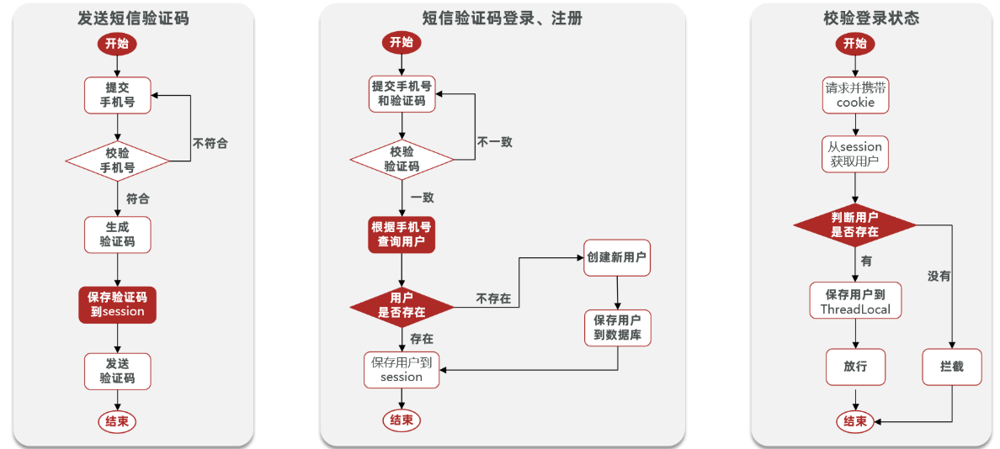
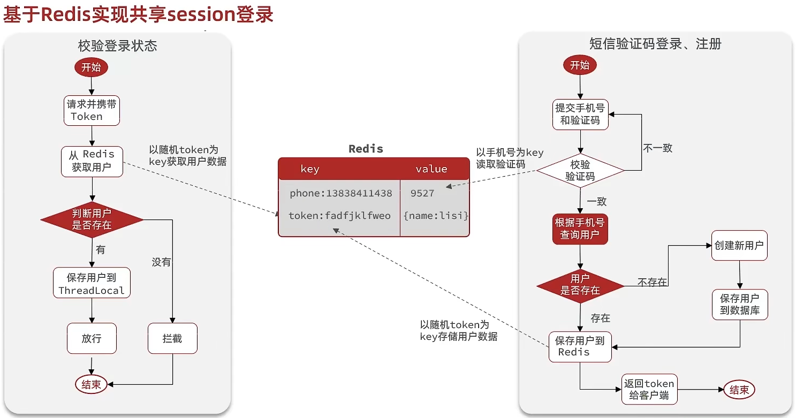

## 4.Ression登录

### 4.1 基于Session实现登录

#### 4.1.1 代码实现

业务流程：



发送验证码

```java
  @PostMapping("code")
  public Result sendCode(@RequestParam("phone") String phone, HttpSession session) {
      // 校验手机号
      if (RegexUtils.isPhoneInvalid(phone)) {
          // 不符合，返回错误信息
          return Result.fail("手机号格式错误！");
      }
      // 生成成验证码
      String code = RandomUtils.generateRandomString(6);
      session.setAttribute(phone, code);
      log.debug("发送短信验证码成功，验证码：{}", code);
      // 返回ok
      return Result.ok();
  }
```

登录

```java
 @PostMapping("/login")
  public Result login(@RequestBody LoginFormDTO loginForm, HttpSession session){

      String phone = loginForm.getPhone();
      // 校验手机号
      if (RegexUtils.isPhoneInvalid(phone)) {
          // 不符合，返回错误信息
          return Result.fail("手机号格式错误！");
      }
      // 校验验证码
      if (loginForm.getCode() == null || !loginForm.getCode().equals(session.getAttribute(phone))) {
          return Result.fail("验证码错误！");
      }
      // 查找用户，如果不存在则创建
      User user = userService.query().eq("phone", phone).one();
      if (user == null) {
          //不存在，则创建
          user =  userService.createUserWithPhone(phone);
      }
      //7.保存用户信息到session中
      UserDTO userDTO = new UserDTO();
      BeanUtils.copyProperties(user, userDTO);
      session.setAttribute("user", userDTO);
      return Result.ok();
  }
```

拦截器

```java
@Slf4j
public class LoginInterceptor implements HandlerInterceptor {
  
    @Override
    public boolean preHandle(HttpServletRequest request, HttpServletResponse response, Object handler) throws Exception {
        // 获取session中的用户信息
        UserDTO user = (UserDTO) request.getSession().getAttribute("user");
        //判断用户是否存在
        if(user == null){
            response.setStatus(401);
            return false;
        }
        //存用户信息到Threadlocal
        UserHolder.saveUser(user);
        log.info("验证成功，用户：{}",user);
        //放行
        return true;
    }

    @Override
    public void afterCompletion(HttpServletRequest request, HttpServletResponse response, Object handler, Exception ex) throws Exception {
        UserHolder.removeUser();
    }
```

注册`LoginInterceptor`，并设置拦截路径

```java
@Configuration
public class MvcConfig implements WebMvcConfigurer {

    @Override
    public void addInterceptors(InterceptorRegistry registry) {
        // 登录拦截器
        registry.addInterceptor(new LoginInterceptor())
                .addPathPatterns("/**")
                .excludePathPatterns(
                        "/shop/**",
                        "/voucher/**",
                        "/shop-type/**",
                        "/upload/**",
                        "/blog/hot",
                        "/user/code",
                        "/user/login"
                ).order(1);
    }
}
```

#### 4.1.2 Session共享问题


每个 Tomcat（或应用服务器）都有自己独立的 Session 存储。但这样做会有问题出现：  

- 用户第一次访问 A 服务器 → 登录信息写入 A 的 Session。  
- 第二次访问被负载均衡到 B 服务器 → B 没有该 Session → 登录拦截失效。  

**1.早期方案：Session 拷贝**

- **原理**：各 Tomcat 间同步 Session，保证每台服务器都有相同数据。  
- **缺点**：  
  1. **内存浪费**：每台服务器存一整份 Session。  
  2. **同步延迟**：可能出现数据不一致。  
  3. **扩展性差**：服务器数量增加，压力成倍上升。  

**2.主流方案：Session 统一存储（Redis）**

- **做法**：不依赖单机 Session，把 Session 存储到 Redis。  
- **优势**：  
  - Redis 本身是分布式存储，天然支持共享。  
  - 集中存储，避免多台服务器同步问题。  
  - 可结合 TTL（过期时间）统一管理登录态。  

**3。其他可选方案**：  

- **数据库存储 Session**：可靠但性能较差。  
- **JWT（无状态会话）**：完全去掉 Session，改用 Token 存储用户状态。  
  - 优点：无须共享存储，适合微服务。  
  - 缺点：Token 一旦签发无法修改，踢人、强制下线困难。  

### 4.2 Redis实现Session共享登录

**设计key，value结构**

设计这个key的时候，需要注意满足两点：

1、key要具有唯一性

2、key要方便携带

这里如果采用phone来存储用户信息当然是可以的，但是把敏感数据存储到redis中并相应给前端不太合适，所以在后台生成一个随机字符串token来作为用户信息的key，然后让前端携带token就能完成整体逻辑。value采用hash结构，将用户信息转化为hash；

---

**流程及代码实现**



发送验证码

```java
@PostMapping("code")
public Result sendCode(@RequestParam("phone") String phone, HttpSession session) {
    // 校验手机号
    if (RegexUtils.isPhoneInvalid(phone)) {
        // 不符合，返回错误信息
        return Result.fail("手机号格式错误！");
    }
    // 生成验证码
    String code = RandomUtils.generateRandomString(6);
    session.setAttribute(phone, code);

    // 存入Redis，并设置过期时间
    String redisKey = RedisConstants.LOGIN_CODE_KEY + phone;
    stringRedisTemplate.opsForValue().set(redisKey, code ,2, TimeUnit.MINUTES);
    log.debug("发送短信验证码成功，验证码：{}", code);

    return Result.ok();
}
```

登录

```java
@PostMapping("/login")
public Result login(@RequestBody LoginFormDTO loginForm, HttpSession session){

    // 校验手机号
    String phone = loginForm.getPhone();
    if (phone == null || RegexUtils.isPhoneInvalid(phone)) {
        // 不符合，返回错误信息
        return Result.fail("手机号格式错误！");
    }
    // 校验验证码
    String code = loginForm.getCode();
    if (code == null) {
        return Result.fail("验证码为空！");
    }
    // 从redis中获取验证码
    String cacheCode = stringRedisTemplate.opsForValue().get(RedisConstants.LOGIN_CODE_KEY + phone);
    if (cacheCode == null || !code.equals(cacheCode)) {
        return Result.fail("验证码错误！");
    }
    // 查找用户，如果不存在则创建
    User user = userService.query().eq("phone", phone).one();
    if (user == null) {
        //不存在，则创建
        user =  userService.createUserWithPhone(phone);
    }
    // 保存用户信息到redis中
    String token = UUID.randomUUID().toString();
    UserDTO userDTO = new UserDTO();
    BeanUtils.copyProperties(user, userDTO);
    // 将User对象转化为HashMap
    Map<String, String> userMap = new HashMap<>();
    BeanMap.create(userDTO).forEach((k, v) -> userMap.put(k.toString(), v == null ? "" : v.toString()));
    String redisToken = RedisConstants.LOGIN_USER_KEY + token;
    // 存入Redis，并设置过期时间
    stringRedisTemplate.opsForHash().putAll(redisToken, userMap);
    stringRedisTemplate.expire(redisToken,RedisConstants.LOGIN_USER_TTL, TimeUnit.MINUTES);

    return Result.ok(token);
}
```

### 4.3 登录状态刷新

当用户登录后，Redis中的用户信息缓存会有有效期，在用户操作期间，为了增强体验，避免频繁登录，需要对登录状态进行续期，即在拦截器中刷新redis中用户key的有效期，但这样实现会有一个问题：

拦截器只作用于需要权限校验的路径，当用户访问无需拦截的路径时，拦截器不生效 → 登录 Token 的刷新逻辑无法执行；用户在长时间访问“无需拦截路径”时，Token 不会续期，可能提前过期，影响用户体验。

**改进方案**


1. **第一个全局拦截器**（拦截所有路径）  

   - 提取并校验 Token

   - 将用户信息存入 `ThreadLocal`

   - 刷新 Token 有效期**（保证活跃用户会话持续）

2. **第二个权限拦截器**（只拦截需要权限的路径）  
   - 判断 `ThreadLocal` 中是否有用户对象
   - 若无 → 说明未登录或 Token 失效 → 拦截并返回未授权

**代码实现**

全局拦截器`RefreshTokenInterceptor`

```java
@Slf4j
public class RefreshTokenInterceptor implements HandlerInterceptor {

    private StringRedisTemplate stringRedisTemplate;

    public RefreshTokenInterceptor(StringRedisTemplate stringRedisTemplate) {
        this.stringRedisTemplate = stringRedisTemplate;
    }

    @Override
    public boolean preHandle(HttpServletRequest request, HttpServletResponse response, Object handler) throws Exception {
        // 获取请求头中的token
        String token = request.getHeader("authorization");
        if (!StringUtils.hasLength(token)) {
            return true;
        }
        String key  = RedisConstants.LOGIN_USER_KEY + token;
        Map<Object, Object> userMap = stringRedisTemplate.opsForHash().entries(key);
        // 判断用户是否存在
        if (userMap.isEmpty()) {
            return true;
        }
        // 将查询的Hash转化为DTO（自动类型转换）
        Map<String, Object> map = userMap.entrySet().stream()
                .collect(Collectors.toMap(
                        e -> e.getKey().toString(),
                        Map.Entry::getValue
                ));
        ObjectMapper objectMapper = new ObjectMapper();
        UserDTO userDTO = objectMapper.convertValue(map, UserDTO.class);

        // 保存用户信息到Threadlocal
        UserHolder.saveUser(userDTO);
        // 刷新token有效期
        stringRedisTemplate.expire(key,RedisConstants.LOGIN_USER_TTL, TimeUnit.SECONDS);
        log.info("刷新token，key：{}",key);
        return true;
    }

    @Override
    public void afterCompletion(HttpServletRequest request, HttpServletResponse response, Object handler, Exception ex) throws Exception {
        UserHolder.removeUser();
    }
}
```

登录拦截器`LoginInterceptor`

```java
    @Override
    public boolean preHandle(HttpServletRequest request, HttpServletResponse response, Object handler) throws Exception {
        // 判断是否需要拦截（ThreadLocal中是否有用户）
        if (UserHolder.getUser() == null) {
            response.setStatus(401);
            return false;
        }
        log.info("验证成功，用户：{}",UserHolder.getUser());
        // 有用户，则放行
        return true;
    }
```

配置类`MvcConfig`，设置拦截器优先级

```java
@Configuration
public class MvcConfig implements WebMvcConfigurer {

    @Resource
    private StringRedisTemplate stringRedisTemplate;

    @Override
    public void addInterceptors(InterceptorRegistry registry) {
        // token刷新的拦截器
        registry.addInterceptor(new RefreshTokenInterceptor(stringRedisTemplate)).addPathPatterns("/**").order(0);
        // 登录拦截器
        registry.addInterceptor(new LoginInterceptor())
                .addPathPatterns("/**")
                .excludePathPatterns(
                        "/shop/**",
                        "/voucher/**",
                        "/shop-type/**",
                        "/upload/**",
                        "/blog/hot",
                        "/user/code",
                        "/user/login"
                ).order(1);
    }
}
```

**优点分析**

\- **全局刷新**：无论访问何种路径，都能刷新 Token 存活时间。  

\- **逻辑分离**：第一个拦截器负责 Token 校验与刷新，第二个拦截器只关注权限。  

**延伸思考**

使用 **过滤器 Filter** → 在请求入口就完成 Token 校验与刷新，再交给拦截器做权限控制；

使用 **网关层（如 Spring Cloud Gateway）** → 在微服务架构中统一完成 Token 校验与刷新，服务内部只做业务逻辑。  