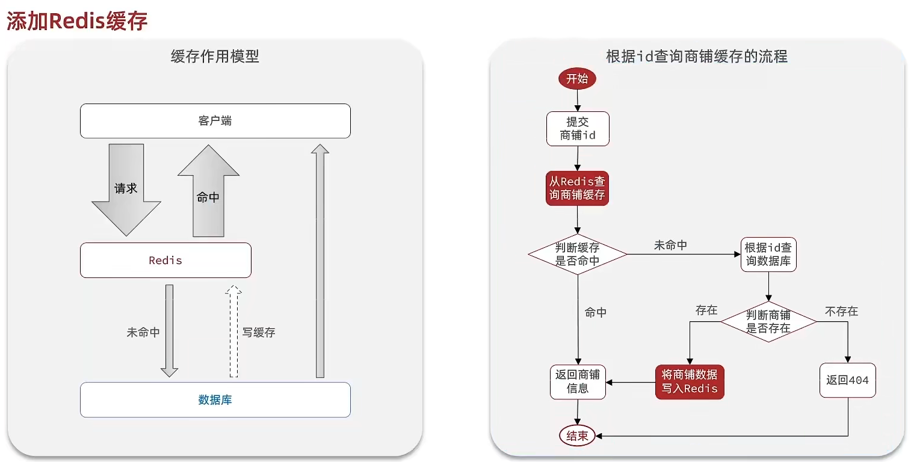
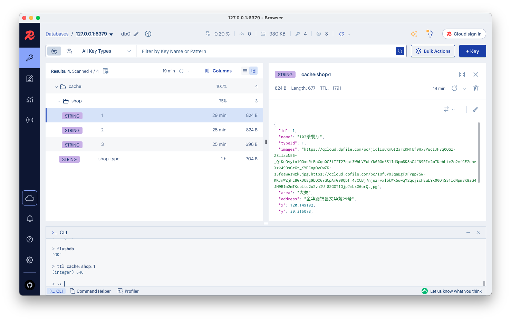
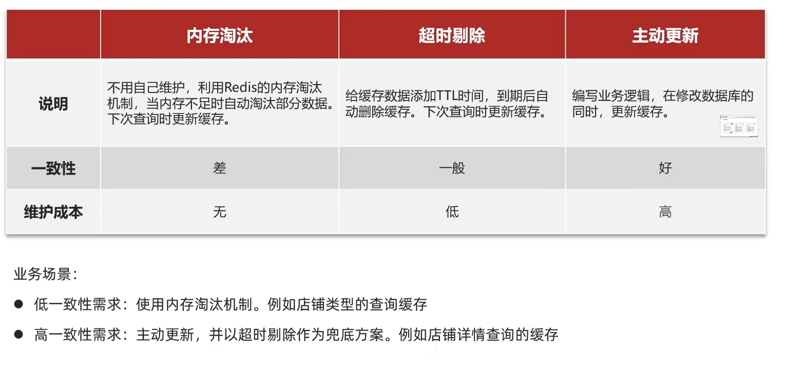
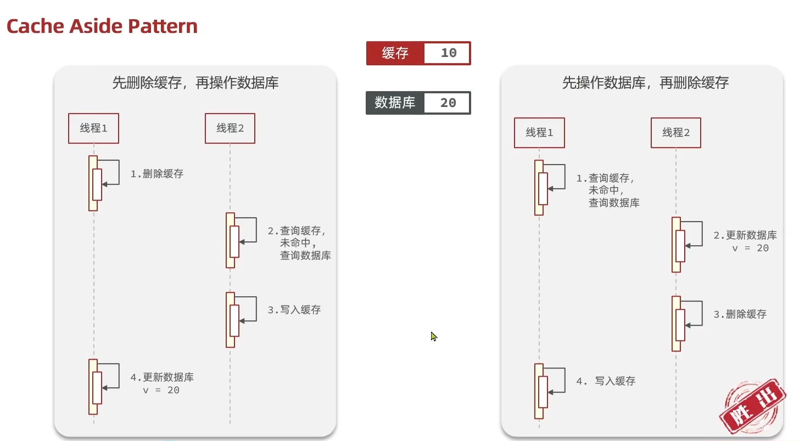
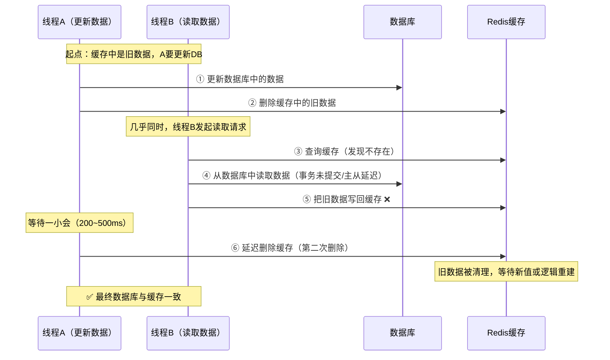
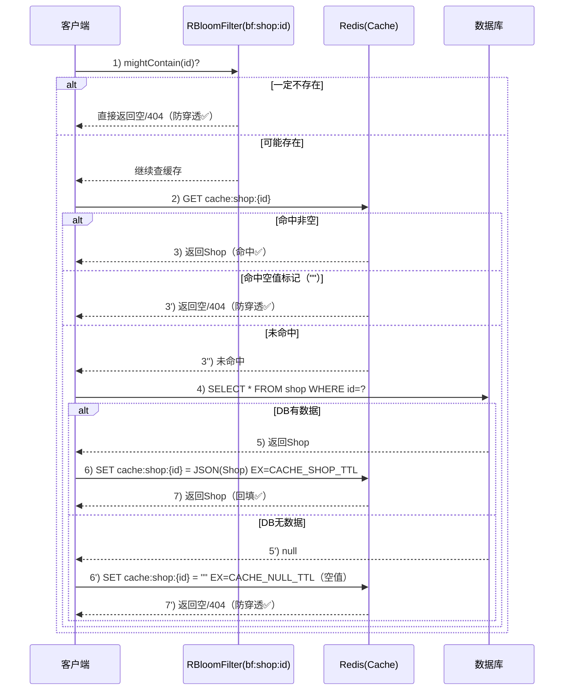
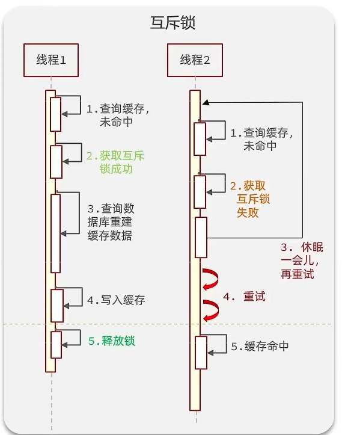
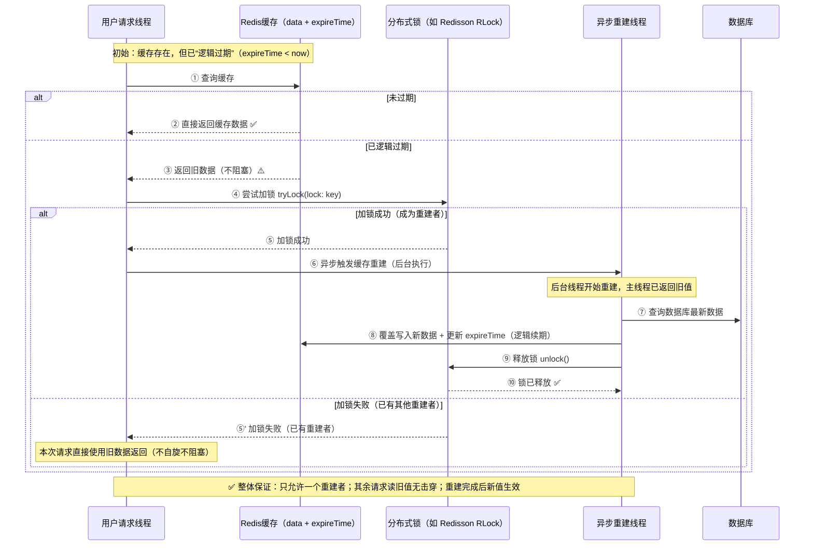

## 5. 商铺信息缓存思路

### 5.1 如何使用缓存

**缓存(**Cache)，就是数据交换的**缓冲区**，俗称的缓存就是**缓冲区内的数据**，一般从数据库中获取,存储于本地代码；

缓存数据存储于代码中,而代码运行在内存中,内存的读写性能远高于磁盘,缓存可以大大降低**用户访问并发量带来的**服务器读写压力；

实际开发过程中，大数据量,如果没有缓存来作为"避震器"，系统是几乎撑不住的，所以企业会大量运用到缓存技术，但是缓存也会增加代码复杂度和运营的成本:


**如何使用缓存**

实际开发中,会构筑**多级缓存**来使系统运行速度进一步提升，例如本地缓存与redis中的缓存并发使用

- **浏览器缓存**：主要是存在于浏览器端的缓存
- **应用层缓存：**可以分为tomcat本地缓存，Hashmap，或者是使用redis作为缓存，jvm缓存
- **数据库缓存：**在数据库中有一片空间是 buffer pool，增改查数据都会先加载到mysql的缓存中
- **CPU缓存：**当代计算机最大的问题是 cpu性能提升了，但内存读写速度没有跟上，所以为了适应当下的情况，增加了cpu的L1，L2，L3级的缓存

### 5.2 缓存商户数据

在查询商户信息时，是直接操作从数据库中去进行查询的，直接查询数据库性能慢，所以需要增加缓存

缓存模型和思路



`ShopServiceImpl.java`部分代码如下：

```java
@Override
public Shop queryById(Long id) {
    // 查询缓存
    String key = CACHE_SHOP_KEY + id;
    String shopJson = stringRedisTemplate.opsForValue().get(key);
    // 命中缓存，反序列化为对象返回
    if (StringUtils.hasLength(shopJson)) {
       return jsonUtils.jsonToBean(shopJson, Shop.class);
    }
    // 未命中则查询数据库
    Shop shop = getById(id);
    if (shop == null) {
        throw new NullException("未查询到商品");
    }
    // 写入缓存
    stringRedisTemplate.opsForValue().set(key, jsonUtils.beanToJson(shop), CACHE_SHOP_TTL, TimeUnit.MINUTES);
    return shop;
}
```

当访问第二次后，商户信息会缓存起来：



### 5.3 缓存更新策略

缓存更新是redis为了节约内存而设计出来的，当向redis插入太多数据，此时就可能会导致缓存中的数据过多，所以redis会对部分数据进行更新。

**内存淘汰：**redis自动进行，内存达到设定的max-memery，会自动触发淘汰机制，淘汰掉一些不重要的数据(可以设置策略方式)

**超时剔除：**当给redis设置了过期时间ttl后，redis会将超时的数据进行删除，方便继续使用缓存

**主动更新 **：手动调用方法把缓存删掉，通常用于解决缓存和数据库不一致问题



#### 5.3.1 主动更新

主动更新操作缓存和数据库时有三个问题需要考虑：

* **删除缓存还是更新缓存？**
  * 更新缓存：每次更新数据库都更新缓存，无效写操作较多
  * 删除缓存：更新数据库时让缓存失效，查询时再更新缓存

* **如何保证缓存与数据库的操作的同时成功或失败？**
  * 单体系统，将缓存与数据库操作放在一个事务
  * 分布式系统，利用TCC等分布式事务方案
* **先操作缓存还是先操作数据库？**
  * 先删除缓存，再操作数据库
  * 先操作数据库，再删除缓存



#### 5.3.2 实现商铺缓存与数据库双写一致

**Cache-Aside 模式流程**：

1. 读缓存，命中直接返回；
2. 未命中则读数据库，写入缓存并设置 TTL；
3. 更新时先改数据库，再删缓存（可延迟重删）。

**1.设置redis缓存时添加过期时间**

```java
stringRedisTemplate.opsForValue().set(key, jsonUtils.beanToJson(shop), CACHE_SHOP_TTL, TimeUnit.MINUTES);
```

**2.修改数据后删除缓存**

当修改了数据之后，需要将缓存中的数据进行删除，查询时发现缓存中没有数据，则会从mysql中加载最新的数据，从而避免数据库和缓存不一致的问题，且需要注意原子性问题。

```java
@Override
@Transactional
public void update(Shop shop) {
    Long id = shop.getId();
    if (id == null) {
        throw new NullException("商品id不能为空");
    }
    // 更新数据库
    updateById(shop);
    // 删除对应缓存
    String key = CACHE_SHOP_KEY + shop.getId();
    stringRedisTemplate.delete(key);
    // 延迟双删，避免并发环境旧值回填
    // 异步线程池
    CompletableFuture.runAsync(() -> {
        try { Thread.sleep(300); } catch (InterruptedException ignored) { Thread.currentThread().interrupt(); }
        stringRedisTemplate.delete(key);
    }, cacheOpsExecutor);
}
```



### 5.4 缓存穿透

一、缓存穿透介绍

是指请求的 key 在缓存和数据库中都不存在，每次请求都会绕过缓存直接访问数据库，导致数据库压力过大。

例子
请求商品 id = -1 或 999999：

- 缓存中没有；
- 数据库中也没有；
  👉 每次请求都查数据库，缓存形同虚设。

---

二、穿透的危害

- 数据库压力暴增；
- 如果被恶意利用（攻击者故意请求不存在的数据），会造成 **缓存穿透攻击**；
- 可能导致服务雪崩。

---

三、解决缓存穿透的常见方案

| 方案                  | 原理                                                 | 优点             | 缺点                       |
| --------------------- | ---------------------------------------------------- | ---------------- | -------------------------- |
| **缓存空值**          | 查询数据库为空时，也写入缓存 `"null"` 并设置较短 TTL | 简单易实现       | 占用部分内存，缓存无效数据 |
| **布隆过滤器**        | 在缓存前加一层过滤器，提前判断 key 是否可能存在      | 高效防止无效请求 | 存在误判，不支持删除       |
| **接口限流 / 验证码** | 对异常流量进行拦截                                   | 防攻击有效       | 用户体验差                 |

---

四、业务流程图


#### 5.4.1 布隆过滤器

布隆过滤器(Bloom Filter）一种**概率型数据结构**，用来判断：“某个元素可能存在”或“一定不存在”。

它由：

- 一段**位数组（bit array）**
- 若干个**哈希函数**

共同组成。

---

**工作原理（简化理解）**

1. 将元素通过多个哈希函数计算多个下标；
2. 把这些位置的 bit 置为 1；
3. 查询时重新哈希：
   - 若所有位置都是 1 → “可能存在”
   - 若有任意一个是 0 → “一定不存在”

---

**布隆过滤器特点**

| 特性           | 说明                                                         |
| -------------- | ------------------------------------------------------------ |
| 高效           | 查询时间复杂度为 O(k)，其中 k 是哈希函数数量，判断速度非常快 |
| 节省内存       | 使用位数组（bit array）存储，所占空间远小于完整集合          |
| 支持大规模数据 | 能高效处理百万级、千万级数据的存在性判断                     |
| 存在误判       | 可能误判“存在”，但绝不会误判“不存在”                         |
| 不支持删除     | 无法直接删除单个元素（可用计数型布隆过滤器解决）             |
| 可扩展         | Guava、Redisson、RedisBloom 都提供现成实现                   |
| 典型应用场景   | 防止缓存穿透、爬虫过滤、垃圾邮件过滤、黑名单校验等           |

#### 5.4.2 实现解决方案

使用 Redisson `RBloomFilter` 的 `queryById` 读链路（含缓存空值、防穿透）



```java
  public Shop queryByPassThrough(Long id) {

      // TODO Redisson 的 RBloomFilter 来实现布隆过滤器，后续补充
      // 查询缓存
      String key = CACHE_SHOP_KEY + id;
      String shopJson = stringRedisTemplate.opsForValue().get(key);
      // 命中有效缓存，反序列化为对象返回
      if (StringUtils.hasText(shopJson)) {
          return jsonUtils.jsonToBean(shopJson, Shop.class);
      }
      // 命中空值缓存，则Result.fail
      if (shopJson != null && shopJson.isEmpty()) {
          throw new NullException("未查询到值");
      }
      // 未命中则查询数据库
      Shop shop = getById(id);
      if (shop == null) {
          // throw new NullException("未查询到店铺");
          // 解决缓存穿透：将空值写入redis
          stringRedisTemplate.opsForValue().set(key, "", CACHE_NULL_TTL, TimeUnit.MINUTES);
          throw new NullException("未查询到值");
      }
      // 写入缓存
      stringRedisTemplate.opsForValue().set(key, jsonUtils.beanToJson(shop), CACHE_SHOP_TTL, TimeUnit.MINUTES);
      return shop;
  }
```

### 5.5 缓存雪崩TODO

**什么是缓存雪崩**：在同一时段大量热点 Key 同时过期或缓存层整体不可用，导致海量请求直击数据库，出现抖动甚至崩溃。

**常见触发场景**

- 大批 Key 统一 TTL，集中失效（活动、预热时一次性写入）。
- 统一重启/故障导致缓存整体失效（实例/集群宕机、网络隔离）。
- 定时任务在同一时刻批量刷新缓存。
- 上游突增流量（促销/突发热点）叠加缓存 miss。

**风险信号**

- 缓存命中率瞬时大幅下降、DB QPS/CPU 飙升。
- RT 抖动、错误率上升、线程池排队/拒绝。
- Redis 连接数、拒绝数、慢查询激增。

**解决思路：让“失效”不扎堆 + 回源不拥堵 + 系统有兜底**

- 失效“打散”：TTL 随机化、错峰/分片刷新、逻辑过期。
- 回源“控并发”：互斥重建、请求合并、限流降级。
- 系统“兜底”：多级缓存、静态/默认值、熔断与隔离。

**代码实现**

- TTL 随机化（打散过期时间）

  ```java
  long base = TimeUnit.MINUTES.toSeconds(30);
  long jitter = ThreadLocalRandom.current().nextLong(60, 5 * 60); // 1~5分钟扰动
  stringRedisTemplate.opsForValue().set(key, json, base + jitter, TimeUnit.SECONDS);
  
  ```

### 5.6 缓存击穿

缓存击穿问题也叫热点Key问题，就是一个被高并发访问并且缓存重建业务较复杂的key突然失效了，无数的请求访问会在瞬间给数据库带来巨大的冲击。

常见的解决方案有两种：

* 互斥锁
* 逻辑过期

**互斥锁方案：**由于保证了互斥性，所以数据一致，且实现简单，因为仅仅只需要加一把锁而已，也没其他的事情需要操心，所以没有额外的内存消耗，缺点在于有锁就有死锁问题的发生，且只能串行执行性能肯定受到影响

**逻辑过期方案：** 线程读取过程中不需要等待，性能好，有一个额外的线程持有锁去进行重构数据，但是在重构数据完成前，其他的线程只能返回之前的数据，且实现起来麻烦

#### 5.6.1 互斥锁

锁能实现互斥性。假设线程过来，只能一个人的来访问数据库，从而避免对于数据库访问压力过大，但这也会影响查询的性能，因为此时会让查询的性能从并行变成了串行，我们可以采用tryLock方法 + double check来解决这样的问题。



**需求：修改根据id查询商铺的业务，基于互斥锁方式，并优化来解决缓存击穿问题**

实现步骤思路

```
// 布隆过滤器
// 查询缓存
// 命中有效缓存，反序列化为对象返回
// 命中空值缓存，则Result.fail
// 未命中 获取锁
// 获取锁失败，开始有限期自旋，避免死锁
// 获取锁成功，开始缓存重建
// double check 缓存是否命中
// 命中缓存则直接返回
// 未命中则查询数据库
// 数据库没有数据：解决缓存穿透，将空值缓存（短 TTL）
// 写入有效缓存（业务 TTL + 随机抖动）
// 持有人释放锁
```

实现代码：

```java
/**
* 缓存击穿 互斥锁方案
*/
public Shop queryWithMutex(Long id) {

  // TODO 布隆过滤器
  // 查询缓存
  final String key = CACHE_SHOP_KEY + id;
  final String lockKey = LOCK_SHOP_KEY + id;

  String cachedShopJson = stringRedisTemplate.opsForValue().get(key);

  // 命中有效缓存，反序列化为对象返回
  if (StringUtils.hasText(cachedShopJson)) {
      return jsonUtils.jsonToBean(cachedShopJson, Shop.class);
  }
  // 命中空值缓存，则Result.fail
  if (cachedShopJson != null && cachedShopJson.isEmpty()) {
      throw new NullException("未查询到值");
  }
  // 未命中 互斥锁重建缓存
  // 有限次自旋 + 指数退避（避免热点轮询压垮 Redis）
  String token = null;
  long backoff = 50L;                 // 起始退避 50ms
  final long maxBackoff = 500L;       // 单次最大退避 500ms
  int attempts = 0;
  final int maxAttempts = 8;          // 最多自旋 8 次（~1.3s 左右）

  final long lockWaitStart = System.nanoTime(); // A) 开始统计拿锁耗时

  try {
      while ((token = tryLock(lockKey, LOCK_SHOP_TTL)) == null) {
          // 退避等待并加入抖动，降低同步化
          long jitter = ThreadLocalRandom.current().nextLong(0, backoff / 3 + 1);
          Thread.sleep(backoff + jitter);
          if (++attempts >= maxAttempts) {
              long waitMs = (System.nanoTime() - lockWaitStart) / 1_000_000;
              log.warn("shopId={} 获取锁超时，等待{}毫秒，尝试{}次\n", id, waitMs, attempts);
              throw new LockException("锁占用，请稍后重试");
          }
          backoff = Math.min(backoff * 2, maxBackoff);
          // 每轮重查一次缓存，避免无意义等待
          cachedShopJson = stringRedisTemplate.opsForValue().get(key);
          if (StringUtils.hasText(cachedShopJson)) {
              long waitedMs = (System.nanoTime() - lockWaitStart) / 1_000_000;
              log.info("shopId={} 获取锁前缓存已被其他线程填充，等待{}毫秒，尝试{}次\n", id, waitedMs, attempts);
              return jsonUtils.jsonToBean(cachedShopJson, Shop.class);
          }
          if (cachedShopJson != null && cachedShopJson.isEmpty()) {
              throw new NullException("未查询到值");
          }
      }
      long lockCostMs = (System.nanoTime() - lockWaitStart) / 1_000_000;
      log.info("shopId={} 成功获取锁，用时{}毫秒，尝试{}次\n", id, lockCostMs, attempts);
      // 获取锁成功，double check 缓存是否命中，命中则直接返回
      cachedShopJson = stringRedisTemplate.opsForValue().get(key);
      if (StringUtils.hasText(cachedShopJson)) {
          return jsonUtils.jsonToBean(cachedShopJson, Shop.class);
      }
      if (cachedShopJson != null && cachedShopJson.isEmpty()) {
          throw new NullException("未查询到值");
      }

      final long rebuildStart = System.nanoTime(); // 开始记录重建缓存时间
      // 未命中则查询数据库
      Shop shop = getById(id);
      // 数据库没有数据：解决缓存穿透，将空值缓存（短 TTL）
      if (shop == null) {
          stringRedisTemplate.opsForValue().set(key, "", CACHE_NULL_TTL, TimeUnit.MINUTES);
          long rebuildMs = (System.nanoTime() - rebuildStart) / 1_000_000;
          log.info("shopId={} 缓存重建结果为空, 用时{}毫秒\n", id, rebuildMs);
          throw new NullException("未查询到值");
      }
      // 写入有效缓存（业务 TTL + 随机抖动）
      long jitterMinutes = ThreadLocalRandom.current().nextLong(1, 6); // 1~5 分钟扰动
      stringRedisTemplate.opsForValue().set(
              key,
              jsonUtils.beanToJson(shop),
              CACHE_SHOP_TTL + jitterMinutes,
              TimeUnit.MINUTES
      );
      long rebuildMs = (System.nanoTime() - rebuildStart) / 1_000_000;
      log.info("shopId={} 缓存重建完成\n, cost={}ms ttl={}min(+{}jitter)", id, rebuildMs, CACHE_SHOP_TTL, jitterMinutes);
      return shop;
  } catch (InterruptedException e) {
      Thread.currentThread().interrupt();
      throw new RuntimeException(e);
  } finally {
      // 释放锁
      // 仅在持有锁的情况下按 token 释放，避免误删他人锁
      if (token != null) {
          boolean unlocked = unlock(lockKey, token);
          log.debug("shopId={} 释放锁结果={}\n", id, unlocked);
      }
  }
}
```

#### 5.6.2 逻辑过期和异步缓存重建

**需求：修改根据id查询商铺的业务，基于逻辑过期方式来解决缓存击穿问题**

思路分析：当用户开始查询redis时，判断是否命中，如果没有命中则直接返回空数据，不查询数据库，而一旦命中后，将value取出，判断value中的过期时间是否满足，如果没有过期，则直接返回redis中的数据，如果过期，则在开启独立线程后直接返回之前的数据，独立线程去重构数据，重构完成后释放互斥锁。

实现时序图：



因为现在redis中存储的数据的value需要带上过期时间，所以需要构建实体类`RedisData`，实现代码：

```java
@Data
public class RedisData {
    private LocalDateTime expireTime;
    private Object data;
}
```

实现步骤思路

```
缓存击穿处理：逻辑过期 + 异步重建
使用场景：热点店铺读多写少，允许短暂返回旧值。
1. 读取 Redis 逻辑过期结构，命中空串说明数据库无记录，直接抛出 NullException。
2. 命中后反序列化 RedisData，未过期直接返回 Shop。
3. 已过期则尝试获取 lock:shop:id 互斥锁并做二次校验；获取成功后异步查库写回新的逻辑过期数据。
4. 未获得锁的线程与加锁线程的同步返回值均为旧数据，以保证接口可用性。
```

`queryWithLogicalExpire`代码实现：

```java
    public Shop queryWithLogicalExpire(Long id) {
        final String key = CACHE_SHOP_KEY + id;
        String cachedShopJson = stringRedisTemplate.opsForValue().get(key);
        long jitterMinutes = ThreadLocalRandom.current().nextLong(1, 3);
        // 命中空串表示数据库无记录
        if (cachedShopJson != null && cachedShopJson.isEmpty()) {
            throw new NullException("未查询到值");
        }
        // 缓存命中后解析逻辑过期结构
        if (StringUtils.hasText(cachedShopJson)) {
            RedisData redisData = jsonUtils.jsonToBean(cachedShopJson, RedisData.class);
            Shop shop = jsonUtils.convertValue(redisData.getData(), Shop.class);
            // 缓存仍有效直接返回
            LocalDateTime expireTime = redisData.getExpireTime();
            if (expireTime != null && expireTime.isAfter(LocalDateTime.now())) {
                return shop;
            }
            // 缓存已过期则尝试获取互斥锁
            final String lockKey = LOCK_SHOP_KEY + id;
            String token = null;
            // 拿到锁后在线程池中异步重建
            if ((token = tryLock(lockKey, LOCK_SHOP_TTL)) != null) {
                try {
                    // double check 避免重复重建
                    String cachedShopJson_dc = stringRedisTemplate.opsForValue().get(key);
                    // 再次解析逻辑过期结构
                    if (StringUtils.hasText(cachedShopJson_dc)) {
                        redisData = jsonUtils.jsonToBean(cachedShopJson_dc, RedisData.class);
                        shop = jsonUtils.convertValue(redisData.getData(), Shop.class);
                        // 二次校验仍有效直接返回
                        expireTime = redisData.getExpireTime();
                        if (expireTime != null && expireTime.isAfter(LocalDateTime.now())) {
                            return shop;
                        }
                    }
                    // 在线程池中异步重建缓存
                    CompletableFuture.runAsync(() -> {
                        // 从数据库查询最新 Shop
                        Shop latest = getById(id);
                        if (latest == null) {
                            stringRedisTemplate.opsForValue().set(key, "", CACHE_NULL_TTL + jitterMinutes, TimeUnit.MINUTES);
                        } else {
                            // 写入新的逻辑过期数据
                            stringRedisTemplate.opsForValue().set(
                                    key,
                                    jsonUtils.beanToJson(RedisData.builder().data(latest).expireTime(LocalDateTime.now().plusMinutes(CACHE_SHOP_TTL + jitterMinutes)).build())
                            );
                        }
                    }, cacheOpsExecutor);
                } catch (Exception e) {
                    // 记录日志，避免向外抛异常
                    log.error("async rebuild cache failed, key={}", key);
                } finally {
                    // 释放锁
                    // 仅在持有锁的情况下按 token 释放，避免误删他人锁
                    if (token != null) {
                        unlock(lockKey, token);
                    }
                }
            }
            return shop;
        }

        // 缓存未命中则回源数据库并写入逻辑过期结构
        // 从数据库查询最新 Shop
        Shop shop = getById(id);
        if (shop == null) {
            stringRedisTemplate.opsForValue().set(key, "", CACHE_NULL_TTL + jitterMinutes, TimeUnit.MINUTES);
            throw new NullException("未查询到值");
        }
        // 写入新的逻辑过期数据
        stringRedisTemplate.opsForValue().set(
                key,
                jsonUtils.beanToJson(RedisData.builder().data(shop).expireTime(LocalDateTime.now().plusMinutes(CACHE_SHOP_TTL + jitterMinutes)).build())
        );
        return shop;
    }
```

### 5.7 Redis工具包

1.通过抽象接口CacheClient，实例化一个StringRedisTemplate工具包

```java
public interface CacheClient {

    /**
     * 写入缓存，使用默认过期策略（无过期或由实现决定）。
     */
    <T> void set(String key, T value);

    /**
     * 写入缓存并指定存活时间。
     */
    <T> void set(String key, T value, Long expire, TimeUnit timeUnit);

    /**
     * 写入缓存并指定逻辑过期时间
     */
    <T> void setWithLogicalExpire(String key, T value, Long expire, TimeUnit timeUnit);

    /**
     * 按字符串形式读取缓存。
     */
    String get(String key);

    /**
     * 从缓存中读取并转换成目标类型。
     */
    <T> T get(String key, Class<T> type);
}
```

StringRedisTemplates实例化中抽象缓存实现方法；queryByPassThrough方法实现如下：

```java
package com.zwz5.common.cache;

import com.zwz5.common.redis.RedisData;
import com.zwz5.common.utils.JsonUtils;
import com.zwz5.exception.LockException;
import com.zwz5.exception.NullException;
import com.zwz5.pojo.entity.Shop;
import jakarta.annotation.Resource;
import lombok.RequiredArgsConstructor;
import lombok.extern.slf4j.Slf4j;
import org.springframework.beans.factory.annotation.Qualifier;
import org.springframework.dao.DataAccessException;
import org.springframework.data.redis.core.StringRedisTemplate;
import org.springframework.data.redis.core.script.DefaultRedisScript;
import org.springframework.stereotype.Component;
import org.springframework.util.StringUtils;

import java.time.Duration;
import java.time.LocalDateTime;
import java.util.Collections;
import java.util.Objects;
import java.util.Optional;
import java.util.UUID;
import java.util.concurrent.CompletableFuture;
import java.util.concurrent.Executor;
import java.util.concurrent.ThreadLocalRandom;
import java.util.concurrent.TimeUnit;
import java.util.function.Function;

import static com.baomidou.mybatisplus.extension.toolkit.Db.getById;
import static com.zwz5.constants.RedisConstants.*;

/**
 * 基于 Redis 的缓存实现。
 */
@Slf4j
@Component
@RequiredArgsConstructor
public class RedisCacheClient implements CacheClient {

    private final StringRedisTemplate stringRedisTemplate;
    private final JsonUtils jsonUtils;

    // 避免使用公共 ForkJoinPool，异步任务有自己可观测、可限流的线程池
    private final Executor cacheOpsExecutor;

    @Override
    public <T> void set(String key, T value) {
        set(key, value, null, null);
    }

    @Override
    public <T> void set(String key, T value, Long expire, TimeUnit timeUnit) {
        Objects.requireNonNull(key, "key must not be null");
        if (value == null) {
            stringRedisTemplate.opsForValue().set(key, "");
            return;
        }
        if (expire == null || timeUnit == null || expire <= 0) {
            stringRedisTemplate.opsForValue().set(key, convertToString(value));
        } else {
            stringRedisTemplate.opsForValue().set(key, convertToString(value), expire, timeUnit);
        }
    }

    @Override
    public <T> void setWithLogicalExpire(String key, T value, Long expire, TimeUnit timeUnit) {
        Objects.requireNonNull(key, "key must not be null");
        if (value == null) {
            stringRedisTemplate.opsForValue().set(key, "");
            return;
        }
        if (expire == null || timeUnit == null || expire <= 0) {
            stringRedisTemplate.opsForValue().set(key, convertToString(value));
        } else {
            RedisData redisData = RedisData.builder()
                    .data(convertToString(value))
                    .expireTime(LocalDateTime.now().plusSeconds(timeUnit.toSeconds(expire)))
                    .build();
            stringRedisTemplate.opsForValue().set(key, convertToString(redisData));
        }
    }

    @Override
    public String get(String key) {
        Objects.requireNonNull(key, "key must not be null");
        try {
            return stringRedisTemplate.opsForValue().get(key);
        } catch (DataAccessException ex) {
            log.warn("Read cache failed. key={}", key, ex);
            return null;
        }
    }

    @Override
    public <T> T get(String key, Class<T> type) {
        Objects.requireNonNull(type, "type must not be null");
        String value = get(key);
        if (value == null) {
            return null;
        }
        if (type == String.class) {
            return type.cast(value);
        }
        return jsonUtils.jsonToBean(value, type);
    }

    /**
     * 缓存穿透方法
     *
     * @return
     */
    public <T, R> R queryByPassThrough(String prefix, T id, Class<R> type, Function<T, R> dbFallback, Long expire, TimeUnit timeUnit) {
        Objects.requireNonNull(id, "key must not be null");
        String key = prefix + id;
        String jsonStr = stringRedisTemplate.opsForValue().get(key);
        // 命中cache，反序列化为对象返回
        if (StringUtils.hasText(jsonStr)) {
            return jsonUtils.jsonToBean(jsonStr, type);
        }
        // 命中empty cache
        if (jsonStr != null && jsonStr.isEmpty()) {
            return null;
        }
        // 未命中查询db
        R r = (R) dbFallback.apply(id);
        // TTL抖动
        long jitterMinutes = ThreadLocalRandom.current().nextLong(1, 3);
        expire += jitterMinutes;
        if (r == null) {
            // 构建empty cache 为短TTL
            this.set(key, "", expire / 10, timeUnit);
            return null;
        }
        this.set(key, r, expire, timeUnit);
        return r;
    }

    /**
     * 缓存击穿 互斥锁方案
     *
     * @param id
     * @return
     */
    public <T, R> R queryWithMutex(String prefix, T id, Class<R> type, Function<T, R> dbFallback, Long expire, TimeUnit timeUnit) {
        Objects.requireNonNull(id, "key must not be null");
        String key = prefix + id;
        String lockKey = LOCK_SHOP_KEY + id;

        String jsonStr = stringRedisTemplate.opsForValue().get(key);
        // 命中有效缓存，反序列化为对象返回
        if (StringUtils.hasText(jsonStr)) {
            return jsonUtils.jsonToBean(jsonStr, type);
        }
        // 命中empty cache
        if (jsonStr != null && jsonStr.isEmpty()) {
            return null;
        }
        // 未命中 互斥锁重建缓存
        // 有限次自旋 + 指数退避（避免热点轮询压垮 Redis）
        String token = null;
        long backoff = 50L;                 // 起始退避 50ms
        final long maxBackoff = 500L;       // 单次最大退避 500ms
        int attempts = 0;
        final int maxAttempts = 8;          // 最多自旋 8 次（~1.3s 左右）

        final long lockWaitStart = System.nanoTime(); // A) 开始统计拿锁耗时

        try {
            while ((token = tryLock(lockKey, LOCK_SHOP_TTL)) == null) {
                // 退避等待并加入抖动，降低同步化
                long jitter = ThreadLocalRandom.current().nextLong(0, backoff / 3 + 1);
                Thread.sleep(backoff + jitter);
                if (++attempts >= maxAttempts) {
                    long waitMs = (System.nanoTime() - lockWaitStart) / 1_000_000;
                    log.warn("shopId={} 获取锁超时，等待{}毫秒，尝试{}次\n", id, waitMs, attempts);
                    throw new LockException("锁占用，请稍后重试");
                }
                backoff = Math.min(backoff * 2, maxBackoff);
                // 每轮重查一次缓存，避免无意义等待
                jsonStr = stringRedisTemplate.opsForValue().get(key);
                if (StringUtils.hasText(jsonStr)) {
                    long waitedMs = (System.nanoTime() - lockWaitStart) / 1_000_000;
                    log.info("shopId={} 获取锁前缓存已被其他线程填充，等待{}毫秒，尝试{}次\n", id, waitedMs, attempts);
                    return jsonUtils.jsonToBean(jsonStr, type);
                }
                if (jsonStr != null && jsonStr.isEmpty()) {
                    return null;
                }
            }
            long lockCostMs = (System.nanoTime() - lockWaitStart) / 1_000_000;
            log.info("shopId={} 成功获取锁，用时{}毫秒，尝试{}次\n", id, lockCostMs, attempts);
            // 获取锁成功，double check 缓存是否命中，命中则直接返回
            jsonStr = stringRedisTemplate.opsForValue().get(key);
            if (StringUtils.hasText(jsonStr)) {
                return jsonUtils.jsonToBean(jsonStr, type);
            }
            if (jsonStr != null && jsonStr.isEmpty()) {
                return null;
            }
            final long rebuildStart = System.nanoTime(); // 开始记录重建缓存时间
            // 未命中则查询数据库

            R r = (R) dbFallback.apply(id);
            // 数据库没有数据：解决缓存穿透，将空值缓存（短 TTL）
            if (r == null) {
                stringRedisTemplate.opsForValue().set(key, "", CACHE_NULL_TTL, timeUnit);
                long rebuildMs = (System.nanoTime() - rebuildStart) / 1_000_000;
                log.info("shopId={} 缓存重建结果为空, 用时{}毫秒\n", id, rebuildMs);
                return null;
            }
            // 写入有效缓存（业务 TTL + 随机抖动）
            long jitterMinutes = ThreadLocalRandom.current().nextLong(1, 3); // 1~5 分钟扰动
            stringRedisTemplate.opsForValue().set(
                    key,
                    jsonUtils.beanToJson(r),
                    expire + jitterMinutes,
                    timeUnit
            );
            long rebuildMs = (System.nanoTime() - rebuildStart) / 1_000_000;
            log.info("shopId={} 缓存重建完成\n, cost={}ms ttl={}min(+{}jitter)", id, rebuildMs, expire, jitterMinutes);
            return r;
        } catch (InterruptedException e) {
            Thread.currentThread().interrupt();
            throw new RuntimeException(e);
        } finally {
            // 释放锁
            // 仅在持有锁的情况下按 token 释放，避免误删他人锁
            if (token != null) {
                boolean unlocked = unlock(lockKey, token);
                log.debug("shopId={} 释放锁结果={}\n", id, unlocked);
            }
        }
    }

    /**
     * 缓存击穿处理：逻辑过期 + 异步重建
     * 使用场景：热点店铺读多写少，允许短暂返回旧值。
     * 1. 读取 Redis 逻辑过期结构，命中空串说明数据库无记录，直接返回null。
     * 2. 命中后反序列化 RedisData，未过期直接返回 Shop。
     * 3. 已过期则尝试获取 lock:shop:id 互斥锁并做二次校验；获取成功后异步查库写回新的逻辑过期数据。
     * 4. 未获得锁的线程与加锁线程的同步返回值均为旧数据，以保证接口可用性。
     */
    public <T, R> R queryWithLogicalExpire(String prefix, T id, Class<R> type, Function<T, R> dbFallback, Long expire, TimeUnit timeUnit) {
        Objects.requireNonNull(id, "key must not be null");
        String key = prefix + id;
        long jitterMinutes = ThreadLocalRandom.current().nextLong(1, 3);
        String jsonStr = stringRedisTemplate.opsForValue().get(key);
        // 命中empty cache
        if (jsonStr != null && jsonStr.isEmpty()) {
            return null;
        }
        // 命中cache,解析逻辑过期结构
        if (StringUtils.hasText(jsonStr)) {
            RedisData redisData = jsonUtils.jsonToBean(jsonStr, RedisData.class);
            R r = jsonUtils.convertValue(redisData.getData(), type);
            // 缓存仍有效直接返回
            LocalDateTime expireTime = redisData.getExpireTime();
            if (expireTime != null && expireTime.isAfter(LocalDateTime.now())) {
                return r;
            }
            // 缓存已过期则尝试获取互斥锁
            final String lockKey = LOCK_SHOP_KEY + id;
            String token = null;
            // 拿到锁后在线程池中异步重建
            if ((token = tryLock(lockKey, LOCK_SHOP_TTL)) != null) {
                try {
                    // double check
                    String jsonStr_dc = stringRedisTemplate.opsForValue().get(key);
                    if (StringUtils.hasText(jsonStr_dc)) {
                        redisData = jsonUtils.jsonToBean(jsonStr_dc, RedisData.class);
                        r = jsonUtils.convertValue(redisData.getData(), type);
                        expireTime = redisData.getExpireTime();
                        if (expireTime != null && expireTime.isAfter(LocalDateTime.now())) {
                            return r;
                        }
                    }
                    // 异步重建缓存
                    CompletableFuture.runAsync(() -> {
                        // 从db查询最新
                        R latest = (R) dbFallback.apply(id);
                        if (latest == null) {
                            stringRedisTemplate.opsForValue().set(key, "", CACHE_NULL_TTL + jitterMinutes, timeUnit);
                        } else {
                            // 写入新的逻辑过期数据
                            stringRedisTemplate.opsForValue().set(
                                    key,
                                    jsonUtils.beanToJson(RedisData.builder().data(latest).expireTime(LocalDateTime.now().plusMinutes(expire + jitterMinutes)).build())
                            );
                        }
                    }, cacheOpsExecutor);
                } catch (Exception e) {
                    // 记录日志
                    log.error("async rebuild cache failed, key={}", key);
                } finally {
                    // 释放锁
                    // 仅在持有锁的情况下按 token 释放，避免误删他人锁
                    unlock(lockKey, token);

                }
            }
            return r;
        }

        // 缓存未命中则回源数据库并写入逻辑过期结构
        // 从数据库查询最新 Shop
        R r =  (R) dbFallback.apply(id);
        if (r == null) {
            stringRedisTemplate.opsForValue().set(key, "", CACHE_NULL_TTL + jitterMinutes, timeUnit);
            return null;
        }
        // 写入新的逻辑过期数据
        stringRedisTemplate.opsForValue().set(
                key,
                jsonUtils.beanToJson(RedisData.builder().data(r).expireTime(LocalDateTime.now().plusMinutes(expire + jitterMinutes)).build())
        );
        return r;
    }


    private <T> String convertToString(T value) {
        if (value instanceof String str) {
            return str;
        }
        return jsonUtils.beanToJson(value);
    }

    /**
     * 尝试获取分布式锁（原子设置过期），返回锁token；失败返回 null
     *
     * @param key           锁的键
     * @param expireSeconds 过期时间（秒）
     * @return 是否成功获取锁
     */
    public String tryLock(String key, long expireSeconds) {
        String token = UUID.randomUUID().toString();
        Boolean ok = stringRedisTemplate.opsForValue().setIfAbsent(key, token, expireSeconds, TimeUnit.SECONDS);
        return (ok != null && ok) ? token : null;
    }

    private static final String UNLOCK_LUA =
            "if redis.call('get', KEYS[1]) == ARGV[1] then " +
                    "  return redis.call('del', KEYS[1]) " +
                    "else return 0 end";

    /**
     * 释放分布式锁（仅当 token 匹配时删除）
     *
     * @param key   锁的键
     * @param token 锁token
     * @return 是否成功释放锁
     */
    public boolean unlock(String key, String token) {
        Long res = stringRedisTemplate.execute(
                new DefaultRedisScript<>(UNLOCK_LUA, Long.class),
                Collections.singletonList(key),
                token
        );
        return res != null && res > 0;
    }
}

```

