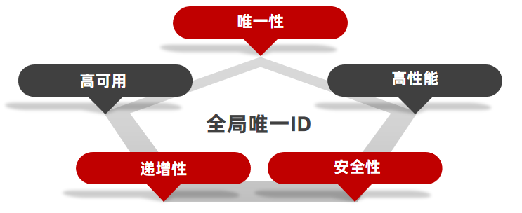
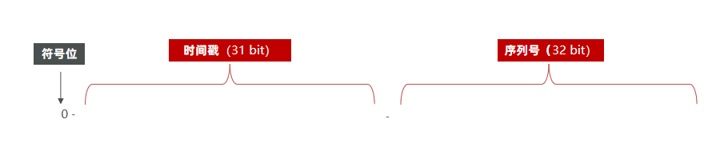
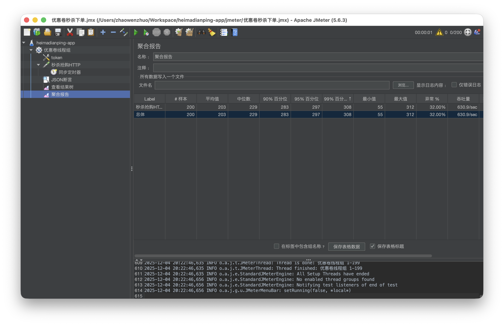
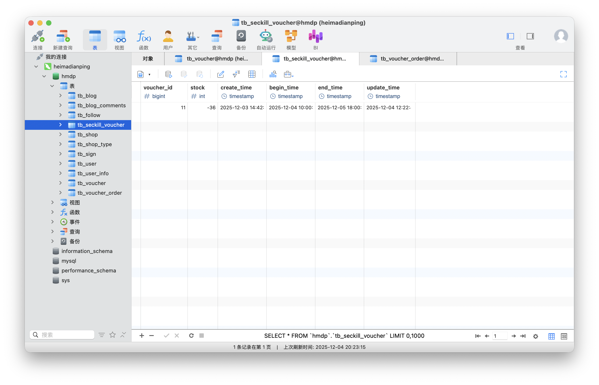
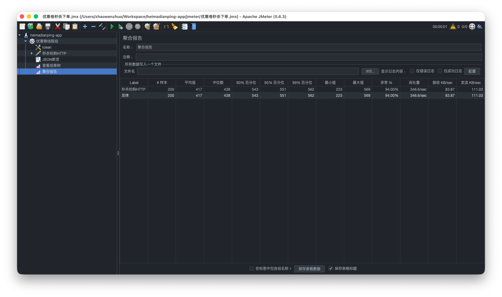
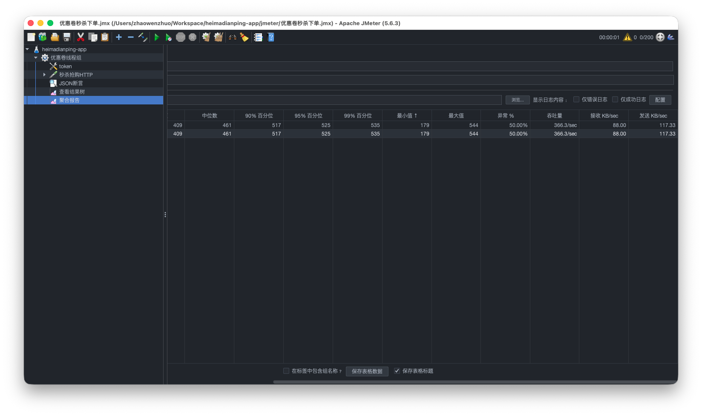

## 6.Redis优惠卷

### 6.1 全局唯一ID生成

当用户抢购时，就会生成订单表中，而订单表如果使用数据库自增ID就存在一些问题：

* id的规律性太明显
* 受单表数据量的限制

场景分析一：如果id具有太明显的规则，会让用户猜测出来一些敏感信息，比如商城在一天时间内，卖出了多少单，这明显不合适。

场景分析二：随着商城规模越来越大，MySQL的单表的容量不宜超过500W，数据量过大要进行拆库拆表，但拆分表之后，从逻辑上讲是同一张表，但数据库id自增会导致id冲突，于是乎我们需要保证id的唯一性。

**全局ID生成器**，是一种在分布式系统下用来生成全局唯一ID的工具，一般要满足下列特性：



为了增加ID的安全性，我们可以不直接使用Redis自增的数值，而是拼接一些其它信息：



ID的组成部分：符号位：1bit，永远为0

时间戳：31bit，以秒为单位，可以使用69年

序列号：32bit，秒内的计数器，支持每秒产生2^32个不同ID

### 6.2 Redis实现全局唯一Id

```java
@Slf4j
@Component
@RequiredArgsConstructor
public class RedisIdWorker {
    // 生成时间戳
    // 2023-01-01 00:00:00 UTC 对应的 epoch 秒
    private static final long BEGIN_TIMESTAMP = 1672531200L;
    private static final int bits = 32;

    private final StringRedisTemplate stringRedisTemplate;

    public long nextId(String prefix) {
        // 1.生成时间戳
        LocalDateTime now = LocalDateTime.now();
        long now_second = now.toEpochSecond(ZoneOffset.UTC);
        long timestamp = now_second - BEGIN_TIMESTAMP;
        // 2.生成序列号
        // 序列号32位，用Redis自增实现 + 业务 日期前缀实现
        String date = now.format(DateTimeFormatter.BASIC_ISO_DATE);
        Long count = stringRedisTemplate.opsForValue().increment("icr:" + prefix + ":" + date);
        return timestamp << bits | count;
    }
}
```

测试目的

1. **验证 ID 是否唯一**
2. **验证 Redis 自增 or Worker 算法是否线程安全**
3. **验证高并发下性能表现（耗时）**
4. **输出是否有异常 / 是否抛错**

```
启动测试
   ↓
创建线程池
   ↓
创建 300 个并发任务
   ↓
每个任务生成 100 个 ID（共 30,000）
   ↓
CountDownLatch 等待所有执行完
   ↓
输出总耗时
   ↓
测试结束
```

```java
@SpringBootTest
class RedisIdWorkerTest {

    @Resource
    RedisIdWorker redisIdWorker;

    private ExecutorService es = Executors.newFixedThreadPool(500);

    @Test
    void nextId() throws InterruptedException {
        CountDownLatch latch = new CountDownLatch(300);
        Runnable task = () -> {
            for (int i = 0; i < 100; i++) {
                long orderId = redisIdWorker.nextId("order");
                System.out.println("order_id:" + orderId);
            }
            latch.countDown();
        };
        long start = System.currentTimeMillis();
        for (int i = 0; i < 300; i++) {
            es.submit(task);
        }
        latch.await();
        long end = System.currentTimeMillis();
        System.out.println("time:" + (end - start));
    }
}
```

### 6.3 添加优惠卷

每个店铺都可以发布优惠券，分为平价券和特价券。平价券可以任意购买，而特价券需要秒杀抢购：


#### 6.3.1 优惠卷表结构设计

tb_voucher：优惠券的基本信息，优惠金额、使用规则等；

| 字段名       | 类型             | 说明                             |
| ------------ | ---------------- | -------------------------------- |
| id           | bigint unsigned  | 主键，自增                       |
| shop_id      | bigint unsigned  | 商铺 ID                          |
| title        | varchar(255)     | 优惠券标题                       |
| sub_title    | varchar(255)     | 副标题                           |
| rules        | varchar(1024)    | 使用规则                         |
| pay_value    | bigint unsigned  | 支付金额（单位：分）             |
| actual_value | bigint           | 抵扣金额（单位：分）             |
| type         | tinyint unsigned | 优惠券类型（0 普通券；1 秒杀券） |
| status       | tinyint unsigned | 状态（1 上架，2 下架，3 过期）   |
| create_time  | timestamp        | 创建时间                         |
| update_time  | timestamp        | 更新时间                         |

tb_seckill_voucher：秒杀卷的库存、开始抢购时间，结束抢购时间；

- 秒杀卷由于优惠力度大，所以需要限制数量，从表结构上也能看出，秒杀卷除了具有优惠卷的基本信息以外，还具有库存，抢购时间，结束时间等等字段。


| 字段名      | 类型            | 说明                 |
| ----------- | --------------- | -------------------- |
| voucher_id  | bigint unsigned | 对应优惠券ID（主键） |
| stock       | int             | 秒杀库存             |
| create_time | timestamp       | 创建时间             |
| begin_time  | timestamp       | 活动开始时间         |
| end_time    | timestamp       | 活动结束时间         |
| update_time | timestamp       | 更新时间             |

**业务代码实现**

```java
@RestController
@RequestMapping("/voucher")
public class VoucherController {

    @Resource
    private IVoucherService voucherService;

    /**
     * 新增普通券
     * @param voucher 优惠券信息
     * @return 优惠券id
     */
    @PostMapping
    public Result addVoucher(@RequestBody Voucher voucher) {
        voucherService.save(voucher);
        return Result.ok(voucher.getId());
    }

    /**
     * 新增秒杀券
     * @param voucher 优惠券信息，包含秒杀信息
     * @return 优惠券id
     */
    @PostMapping("seckill")
    public Result addSeckillVoucher(@RequestBody Voucher voucher) {
        voucherService.addSeckillVoucher(voucher);
        return Result.ok(voucher.getId());
    }

    /**
     * 查询店铺的优惠券列表
     * @param shopId 店铺id
     * @return 优惠券列表
     */
    @GetMapping("/list/{shopId}")
    public Result queryVoucherOfShop(@PathVariable("shopId") Long shopId) {
       return voucherService.queryVoucherOfShop(shopId);
    }
}

```

VoucherServiceImpl实现

```java
@Service
public class VoucherServiceImpl extends ServiceImpl<VoucherMapper, Voucher> implements IVoucherService {

    @Resource
    private ISeckillVoucherService seckillVoucherService;

    @Override
    public Result queryVoucherOfShop(Long shopId) {
        // 查询优惠券信息
        List<Voucher> vouchers = getBaseMapper().queryVoucherOfShop(shopId);
        // 返回结果
        return Result.ok(vouchers);
    }

    @Transactional
    @Override
    public void addSeckillVoucher(Voucher voucher) {
        // 保存优惠券
        save(voucher);
        // 保存秒杀信息
        SeckillVoucher seckillVoucher = SeckillVoucher.builder()
                .voucherId(voucher.getId())
                .stock(voucher.getStock())
                .beginTime(voucher.getBeginTime())
                .endTime(voucher.getEndTime())
                .build();
        seckillVoucherService.save(seckillVoucher);
    }
}

```

### 6.4 实现秒杀抢购


秒杀逻辑


VoucherOrderServiceImpl实现

```java
@Service
public class VoucherOrderServiceImpl extends ServiceImpl<VoucherOrderMapper, VoucherOrder> implements IVoucherOrderService {

    @Resource
    private ISeckillVoucherService seckillVoucherService;
    @Resource
    private RedisIdWorker redisIdWorker;

    /**
     * 秒杀优惠卷抢购实现
     *
     * @param voucherId 优惠卷id
     * @return
     */
    @Override
    @Transactional
    public Result seckillVoucher(Long voucherId) {

        // 1.判断优惠卷是否存在
        SeckillVoucher voucher = seckillVoucherService.getById(voucherId);
        if (voucher == null) {
            return Result.fail("没有优惠卷");
        }
        // 2.判断优惠卷是否开始或结束
        if (voucher.getBeginTime().isAfter(LocalDateTime.now())) {
            return Result.fail("抢购还未开始！");
        }
        if (voucher.getEndTime().isBefore(LocalDateTime.now())) {
            return Result.fail("抢购已经结束！");
        }
        // 3.判断优惠卷库存是否足够
        if (voucher.getStock() < 1) {
            return Result.fail("库存不足！");
        }
        // 4.扣减库存
        seckillVoucherService.update()
                .setSql("stock = stock - 1 ")
                .eq("voucher_id", voucherId)
                .update();
        // 5.增加订单
        VoucherOrder voucherOrder = new VoucherOrder();
        voucherOrder.setId(redisIdWorker.nextId("order"));
        voucherOrder.setVoucherId(voucherId);
        Long userId = UserHolder.getUser().getId();
        voucherOrder.setUserId(userId);
        voucherOrder.setCreateTime(LocalDateTime.now());
        voucherOrder.setUpdateTime(LocalDateTime.now());
        save(voucherOrder);
        return Result.ok(voucherOrder.getId());
    }
}
```

**JMeter压测**

设置库存100，并发请求200，会发现异常请求只有32%，一般情况来说，只有100个请求会因为库存不足而请求失败



查看数据库，发现库存超卖了36个



> 超卖数量与数据库连接池线程数，cpu线程数都有关系

### 6.5 库存超卖问题分析

假设线程1过来查询库存，判断出来库存大于1，正准备去扣减库存，此时线程2去查询库存，发现这个数量也大于1，那么这两个线程都会去扣减库存，最终多个线程一起扣减库存，出现库存的超卖问题。


**超卖问题是典型的多线程安全问题**，针对这一问题的常见解决方案是加锁，通常有两种解决方案：见下图：


#### 6.5.1 悲观锁与乐观锁

**悲观锁：**

 悲观锁可以实现对于数据的串行化执行，比如syn，和lock都是悲观锁的代表，同时，悲观锁中又可以再细分为公平锁，非公平锁，可重入锁，等等

**乐观锁：**

  乐观锁：会有一个版本号，每次操作数据会对版本号+1，再提交回数据时，会去校验是否比之前的版本大1 ，如果大1 ，则进行操作成功，这套机制的核心逻辑在于，如果在操作过程中，版本号只比原来大1 ，那么就意味着操作过程中没有人对他进行过修改，他的操作就是安全的，如果不大1，则数据被修改过，当然乐观锁还有一些变种的处理方式比如cas

  乐观锁的典型代表：就是cas，利用cas进行无锁化机制加锁，var5 是操作前读取的内存值，while中的var1+var2 是预估值，如果预估值 == 内存值，则代表中间没有被人修改过，此时就将新值去替换 内存值

  其中do while 是为了在操作失败时，再次进行自旋操作，即把之前的逻辑再操作一次。

```java
int var5;
do {
    var5 = this.getIntVolatile(var1, var2);
} while(!this.compareAndSwapInt(var1, var2, var5, var5 + var4));

return var5;
```

#### 6.5.2 乐观锁解决超卖问题

**方案一：**VoucherOrderServiceImpl 在扣减库存时，改为：

```java
// 4.扣减库存
boolean success = seckillVoucherService.update()
      .setSql("stock = stock - 1")
      .eq("voucher_id", voucherId)
      .eq("stock", voucher.getStock())
      .update();
if (!success) {
  return Result.fail("库存不足！");
}
```



以上逻辑的核心含义是：只要扣减库存时的库存和之前查询到的库存是一样的，说明数据库库存未修改过，按照乐观锁的逻辑，那么此时就是线程安全的，但是通过通过测试发现会有很多失败，原因在于：假设多个线程同时拿到了100的库存，然后一起去进行扣减，但是只有1个人能扣减成功，其他线程在扣减时，库存已经被修改过了，所以此时其他线程都会失败

**方案二：**

```java
// 4.扣减库存
boolean success = seckillVoucherService.update()
        .setSql("stock = stock - 1")
        .eq("voucher_id", voucherId)
        .gt("stock", 0)   // 关键：stock > 0
        .update();
if (!success) {
    return Result.fail("库存不足！");
}
```

等价于：

```sql
UPDATE seckill_voucher
SET stock = stock - 1
WHERE voucher_id = #{voucherId}
  AND stock > 0;
```

可以看到200个线程成功扣减成功了100个



### 6.6 实现抢购一人一单

需求：修改秒杀业务，要求同一个优惠券，一个用户只能下一单

VoucherOrderServiceImpl改进：

```java
  @Override
  @Transactional
  public Result seckillVoucher(Long voucherId) {

      // 1.判断优惠卷是否存在
      // 2.判断优惠卷是否开始或结束
      // 3.判断优惠卷库存是否足够
      // 4.判断用户是否购买
      Long userId = UserHolder.getUser().getId();
      Long count = query().eq("user_id", userId).eq("voucher_id", voucherId).count();
      if (count > 0) {
          return Result.fail("用户已经购买！");
      }
      // 5.扣减库存
      boolean success = seckillVoucherService.update()
              .setSql("stock = stock - 1")
              .eq("voucher_id", voucherId)
              //.eq("stock", voucher.getStock())
              .gt("stock", 0)   // 关键：stock > 0
              .update();
      if (!success) {
          return Result.fail("库存不足！");
      }
      // 6.增加订单
  }
```

从功能上看

- “查数据库有没有该用户该券的订单，有就拦住” 
- 在单线程 / 低并发情况下是完全正确的，没有问题。

但是在**高并发秒杀**场景下，这里会出现一个典型问题：**并发下可能出现【一人多单】**

#### 6.6.1 高并发场景下一人多单

假设这种情况：

- 同一个用户 userId = 1，同一个 voucherId = 10
- 两个请求几乎同时到达，叫它们 T1、T2

执行过程可能是这样：

1. **T1 执行到查询 count**
   - 事务还没提交
   - 数据库中还没有该用户该券的订单 → count = 0
2. **T2 也执行到查询 count**
   - 此时 T1 还没插入订单或还没提交
   - 对 T2 来说，数据库里也没有记录 → count = 0
3. T1 通过判断，继续执行：扣库存 → 插订单
4. T2 也通过判断，继续执行：扣库存 → 插订单

结果就是：**同一个用户，对同一张券，可能生成两条订单记录**，你的一人一单就被绕过去了。

> 原因：

- > “是否已购买”判断，**是读操作**，没法在高并发下保证“只有一个线程看到 count=0”。

- > @Transactional 也挡不住这个问题，除非用更高的隔离级别（一般不会这么干）。

初步改善第一步，使用JVM级别锁

```java
@Override
  @Transactional
  public Result seckillVoucher(Long voucherId) {

      Long userId = UserHolder.getUser().getId();
      synchronized (userId.toString().intern()) {
          // 1.判断优惠卷是否存在
          // 2.判断优惠卷是否开始或结束
          // 3.判断优惠卷库存是否足够
          if (voucher.getStock() < 1) {
              return Result.fail("库存不足！");
          }
          // 4.判断用户是否购买
          Long count = query().eq("user_id", userId).eq("voucher_id", voucherId).count();
          if (count > 0) {
              return Result.fail("用户已经购买！");
          }
          // 5.扣减库存
          boolean success = seckillVoucherService.update()
                  .setSql("stock = stock - 1")
                  .eq("voucher_id", voucherId)
                  //.eq("stock", voucher.getStock())
                  .gt("stock", 0)   // 关键：stock > 0
                  .update();
          if (!success) {
              return Result.fail("库存不足！");
          }
          // 6.增加订单
      }
  }
```

以上代码改进后有一定缓解，但还是存在问题，在 **Spring 声明式事务 + 默认隔离级别（READ_COMMITTED）** 的前提下，**仍然有“一人多单”的可能**，原因在于当前方法被spring的事务控制，方法内部加锁可能会导致当前方法事务还没有提交，事务边界在方法外，锁已经释放也会导致多单问题。

**那这把锁还有没有用？**

有用，但它解决的是另外一件事：

- 它确实保证了：**同一时刻，只有一个线程在执行这段业务逻辑**
- 在**不加事务、或者使用编程式事务**并且**在锁内控制好提交时机**的情况下，可以做到真正串行 + 可见

改善第二步，调整锁的范围在事务边界外

> 注：使用代理对象，避免事务失效，使用启动类需要加`@EnableAspectJAutoProxy(exposeProxy = true)`

```java
@Service
public class VoucherOrderServiceImpl extends ServiceImpl<VoucherOrderMapper, VoucherOrder> implements IVoucherOrderService {

    @Resource
    private ISeckillVoucherService seckillVoucherService;
    @Resource
    private RedisIdWorker redisIdWorker;

    /**
     * 秒杀优惠卷抢购实现
     *
     * @param voucherId 优惠卷id
     * @return
     */
    @Override
    public Result seckillVoucher(Long voucherId) {
        Long userId = UserHolder.getUser().getId();
        synchronized (userId.toString().intern()) {
          // 使用代理对象，避免事务失效
            IVoucherOrderService voucherOrderServiceProxy = (IVoucherOrderService) AopContext.currentProxy();
            return voucherOrderServiceProxy.createVoucherOrder(userId, voucherId);
        }
    }

    @Transactional
    public Result createVoucherOrder(Long userId, Long voucherId) {
        // 1.判断优惠卷是否存在
        SeckillVoucher voucher = seckillVoucherService.getById(voucherId);
        if (voucher == null) {
            return Result.fail("没有优惠卷");
        }
        // 2.判断优惠卷是否开始或结束
        if (voucher.getBeginTime().isAfter(LocalDateTime.now())) {
            return Result.fail("抢购还未开始！");
        }
        if (voucher.getEndTime().isBefore(LocalDateTime.now())) {
            return Result.fail("抢购已经结束！");
        }
        // 3.判断优惠卷库存是否足够
        if (voucher.getStock() < 1) {
            return Result.fail("库存不足！");
        }
        // 4.判断用户是否购买
        Long count = query().eq("user_id", userId).eq("voucher_id", voucherId).count();
        if (count > 0) {
            return Result.fail("用户已经购买！");
        }
        // 5.扣减库存
        boolean success = seckillVoucherService.update()
                .setSql("stock = stock - 1")
                .eq("voucher_id", voucherId)
                //.eq("stock", voucher.getStock())
                .gt("stock", 0)   // 关键：stock > 0
                .update();
        if (!success) {
            return Result.fail("库存不足！");
        }
        // 6.增加订单
        VoucherOrder voucherOrder = new VoucherOrder();
        voucherOrder.setId(redisIdWorker.nextId("order"));
        voucherOrder.setVoucherId(voucherId);
        voucherOrder.setUserId(userId);
        voucherOrder.setCreateTime(LocalDateTime.now());
        voucherOrder.setUpdateTime(LocalDateTime.now());
        save(voucherOrder);
        return Result.ok(voucherOrder.getId());
    }
}
```

#### 6.6.2 集群环境下锁失效问题

1. **集群环境下锁失效问题**：synchronized 是 JVM 级别的锁，每个服务实例有自己的一套锁**。负载均衡后**每个服务实例有自己的一套锁，并不能保证并发线程安全问题。
2. intern() 带来的隐患：userId.toString().intern() 会把字符串放进字符串池中：如果userId 非常多，就会**不停向常量池塞新字符串**，字符串池在 JDK8 之后在堆上，但依然是全局结构，**可能导致内存占用变大和GC 压力变大**
