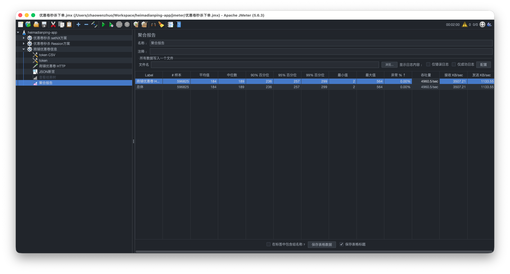
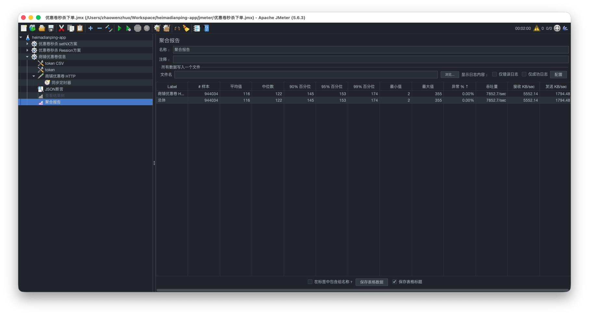
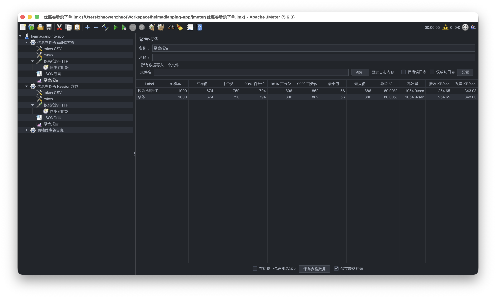
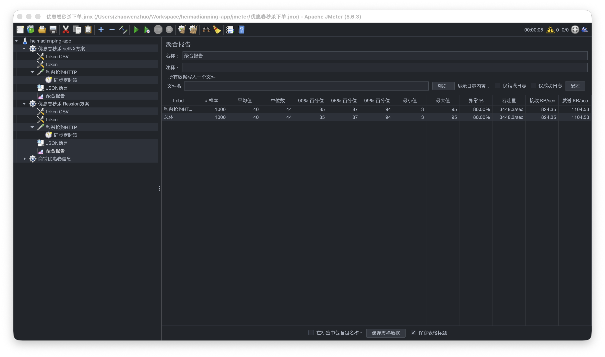

## 7.Redis分布式锁篇

### 7.1 分布式锁介绍

分布式锁：满足分布式系统或集群模式下多进程可见并且互斥的锁。

分布式锁的核心思想就是让大家都使用同一把锁，只要大家使用的是同一把锁，那么我们就能锁住线程，不让线程进行，让程序串行执行，这就是分布式锁的核心思路


常见的分布式锁有三种

**MySQL：mysql本身就带有锁机制，但是由于mysql性能本身一般，所以采用分布式锁的情况下，其实使用mysql作为分布式锁比较少见

**Redis**：redis作为分布式锁是非常常见的一种使用方式，现在企业级开发中基本都使用redis或者zookeeper作为分布式锁，利用setnx这个方法，如果插入key成功，则表示获得到了锁，如果有人插入成功，其他人插入失败则表示无法获得到锁，利用这套逻辑来实现分布式锁

**Zookeeper**：zookeeper也是企业级开发中较好的一个实现分布式锁的方案，由于本套视频并不讲解zookeeper的原理和分布式锁的实现，所以不过多阐述


### 7.2 Redis实现分布式锁

利用redis 的setNx 方法，当有多个线程进入时，我们就利用该方法，第一个线程进入时，redis 中就有这个key 了，返回了1，如果结果是1，则表示他抢到了锁，那么他去执行业务，然后再删除锁，退出锁逻辑，没有抢到锁的哥们，等待一定时间后重试即可

实现分布式锁时需要实现的两个基本方法：

* 获取锁：

  * 互斥：确保只能有一个线程获取锁
  * 非阻塞：尝试一次，成功返回true，失败返回false

* 释放锁：

  * 手动释放
  * 超时释放：获取锁时添加一个超时时间


#### 7.2.1 setNX实现分布式锁

**ILock**基本接口实现

```java
public interface Ilock {

    /**
     * 获取锁
     * @param timeout 锁持有的超时时间，到期自动释放
     * @return
     */
    boolean tryLock(long timeout);

    /**
     * 释放锁
     */
    void unlock();
}
```

**SimpleRedisLock**实现

利用setnx方法进行加锁，同时增加过期时间，防止死锁，此方法可以保证加锁和增加过期时间具有原子性

```java
@Slf4j
public class SimpleRedisLock implements Ilock {

    private final StringRedisTemplate stringRedisTemplate;
    private final String name;

    public SimpleRedisLock(StringRedisTemplate stringRedisTemplate, String name) {
        this.stringRedisTemplate = stringRedisTemplate;
        this.name = name;
    }

    private final String KEY_PREFIX = "lock:";

    @Override
    public boolean tryLock(long timeout) {
        String threadId = String.valueOf(Thread.currentThread().getId());
        Boolean success = stringRedisTemplate.opsForValue().setIfAbsent(KEY_PREFIX + name, threadId , timeout, TimeUnit.SECONDS);
        // 自动拆箱防止空异常 success != null && success：
        return Boolean.TRUE.equals(success);
    }

    @Override
    public void unlock() {
        stringRedisTemplate.delete(KEY_PREFIX + name);
    }
}
```

> 获取锁，redis里执行
>
> SET lock:order:userid NX  EX 10 

修改秒杀业务代码

```java
@Override
public Result seckillVoucher(Long voucherId) {
    Long userId = UserHolder.getUser().getId();
    // 1.判断优惠卷是否存在
    // 2.判断优惠卷是否开始或结束
    // 3.判断优惠卷库存是否足够
    Ilock ilock  = new SimpleRedisLock(stringRedisTemplate,"order:" + userId);
    boolean success = ilock.tryLock(300);
    if (!success) {
        return Result.fail("不允许重复下单！");
    }
    try {
        // 拿到锁后，通过代理对象完成订单检测，库存扣减，下单
        IVoucherOrderService voucherOrderServiceProxy = (IVoucherOrderService) AopContext.currentProxy();
        return voucherOrderServiceProxy.createVoucherOrder(userId, voucherId);
    } catch (IllegalStateException e) {
        throw new RuntimeException(e);
    } finally {
        ilock.unlock();
    }

    /*
    synchronized (userId.toString().intern()) {
        // 使用代理对象，避免事务失效
        IVoucherOrderService voucherOrderServiceProxy = (IVoucherOrderService) AopContext.currentProxy();
        return voucherOrderServiceProxy.createVoucherOrder(userId, voucherId);
    }
    */
}

@Transactional
  public Result createVoucherOrder(Long userId, Long voucherId) {
      // 4.判断用户是否购买
      Long count = query().eq("user_id", userId).eq("voucher_id", voucherId).count();
      if (count > 0) {
          return Result.fail("用户已经购买！");
      }
      // 5.扣减库存
      boolean success = seckillVoucherService.update()
              .setSql("stock = stock - 1")
              .eq("voucher_id", voucherId)
              //.eq("stock", voucher.getStock())
              .gt("stock", 0)   // 关键：stock > 0
              .update();
      if (!success) {
          return Result.fail("库存不足！");
      }
      // 6.增加订单
      VoucherOrder voucherOrder = new VoucherOrder();
      voucherOrder.setId(redisIdWorker.nextId("order"));
      voucherOrder.setVoucherId(voucherId);
      voucherOrder.setUserId(userId);
      voucherOrder.setCreateTime(LocalDateTime.now());
      voucherOrder.setUpdateTime(LocalDateTime.now());
      save(voucherOrder);
      return Result.ok(voucherOrder.getId());
  }
```

问题分析

unlock() 只根据 key 删除锁，**完全不校验是不是“自己加的锁”**，

**场景描述**

- 线程 A 拿到了锁，执行业务

- 锁设置了过期时间，比如 5 秒

- A 的业务执行比较慢，超过了 5 秒

- 锁在 Redis 中自动过期，被删掉

- 线程 B 在此时成功获取同一个锁

- A 执行完业务后调用 unlock()，直接 delete(key)

  → 把 B 正在持有的锁删掉，**B 以为自己有锁，实际上锁已经被删除**

### 7.3 锁误删问题

持有锁的线程在锁的内部出现了阻塞，导致他的锁自动释放，这时其他线程，线程2来尝试获得锁，就拿到了这把锁，然后线程2在持有锁执行过程中，线程1反应过来，继续执行，而线程1执行过程中，走到了删除锁逻辑，此时就会把本应该属于线程2的锁进行删除，这就是误删别人锁的情况说明

解决方案：解决方案就是在每个线程释放锁的时候，去判断一下当前这把锁是否属于自己，如果属于自己，则不进行锁的删除，假设还是上边的情况，线程1卡顿，锁自动释放，线程2进入到锁的内部执行逻辑，此时线程1反应过来，然后删除锁，但是线程1，一看当前这把锁不是属于自己，于是不进行删除锁逻辑，当线程2走到删除锁逻辑时，如果没有卡过自动释放锁的时间点，则判断当前这把锁是属于自己的，于是删除这把锁。


#### 7.3.1 解决锁误删问题

需求：修改之前的分布式锁实现，满足：在获取锁时存入线程标示（可以用UUID表示）
在释放锁时先获取锁中的线程标示，判断是否与当前线程标示一致

* 如果一致则释放锁
* 如果不一致则不释放锁

核心逻辑：在存入锁时，放入自己线程的标识，在删除锁时，判断当前这把锁的标识是不是自己存入的，如果是，则进行删除，如果不是，则不进行删除。


代码改造如下：

```java
@Slf4j
public class SimpleRedisLock implements Ilock {

    private final StringRedisTemplate stringRedisTemplate;
    private final String name;

    public SimpleRedisLock(StringRedisTemplate stringRedisTemplate, String name) {
        this.stringRedisTemplate = stringRedisTemplate;
        this.name = name;
    }

    private final String KEY_PREFIX = "lock:";
    private static final String ID_PREFIX = UUID.randomUUID() + "-";

    @Override
    public boolean tryLock(long timeout) {
        String threadId = ID_PREFIX + Thread.currentThread().getId();
        Boolean success = stringRedisTemplate.opsForValue().setIfAbsent(KEY_PREFIX + name, threadId , timeout, TimeUnit.SECONDS);
        // 自动拆箱防止空异常 success != null && success：
        return Boolean.TRUE.equals(success);
    }

    @Override
    public void unlock() {
        // 获取线程标示
        String threadId = ID_PREFIX + Thread.currentThread().getId();
        // 获取锁中的标示
        String id = stringRedisTemplate.opsForValue().get(KEY_PREFIX + name);
        // 判断标示是否一致
        if(threadId.equals(id)) {
            // 释放锁
            stringRedisTemplate.delete(KEY_PREFIX + name);
        }
    }
}
```

### 7.4 锁原子性问题

更为极端的误删逻辑说明：

线程1现在持有锁之后，在执行业务逻辑过程中，正准备删除锁，而且已经判断了当前这把锁确实是属于自己的，但是此时释放锁因为fullGC等其他原因发生了阻塞，导致锁到期，在锁释放的时候，

```java
  @Override
  public void unlock() {
      // 获取线程标示
      String threadId = ID_PREFIX + Thread.currentThread().getId();
      // 获取锁中的标示
      String id = stringRedisTemplate.opsForValue().get(KEY_PREFIX + name);
      // 判断标示是否一致
      if(threadId.equals(id)) {
        	// 这里发生了阻塞，锁正好到期，也会导致锁误删问题
          // 释放锁
          stringRedisTemplate.delete(KEY_PREFIX + name);
      }
  }
```

那么此时线程2进来，但是线程1会接着往后执行，当阻塞结束后，就会执行删除锁代码，相当于条件判断并没有起到作用，这就是删锁时的原子性问题，之所以有这个问题，**是因为线程1的拿锁，比锁，删锁，实际上并不是原子性的**，我们要防止刚才的情况发生。

#### 7.4.1 LUA介绍及语法

Redis提供了Lua脚本功能，基本语法参考网站：https://www.runoob.com/lua/lua-tutorial.html，使用Lua的原因如下：

| **原因**                             | **说明**                 |
| ------------------------------------ | ------------------------ |
| GET + DEL 不是原子操作，会被打断     | 导致误删其他线程的锁     |
| 锁可能在 GET 与 DEL 之间过期或被重建 | 会删掉后续线程获取的锁   |
| Lua 脚本在 Redis 中原子执行          | 保证比较和删除不可分割   |
| 分布式锁必须保证释放的安全性         | 否则锁机制约束会完全失效 |

> 分布式锁的释放必须是“检查锁身份 + 删除锁”二者不可拆分，否则会误删别人的锁，而 Lua 是 Redis 中唯一能保证原子性的方式

**Lua基本语法**

```lua
redis.call('命令名称', 'key', '其它参数', ...)

# 执行 set name jack
redis.call('set', 'name', 'jack')
```

例如，我们要先执行set name Rose，再执行get name，则脚本如下：

```lua
# 先执行 set name jack
redis.call('set', 'name', 'Rose')
# 再执行 get name
local name = redis.call('get', 'name')
# 返回
return name
```

**Redis命令来调用脚本**

```bash
EVAL "return redis.call('set', 'name', 'jack') "
```

#### 7.4.2 通过Lua解决原子性问题

在RedisTemplate中，可以利用execute方法去执行lua脚本


**改造后的释放锁代码**

```java
private final DefaultRedisScript<Long> UNLOCK_SCRIPT;

{
    UNLOCK_SCRIPT = new DefaultRedisScript<>();
    UNLOCK_SCRIPT.setLocation(new ClassPathResource("lock/unlock_script.lua"));
    UNLOCK_SCRIPT.setResultType(Long.class);
}

/**
 * 使用lua脚本释放锁，保证原子性操作
 */
public void unlock() {
    String lock_token = ID_PREFIX + Thread.currentThread().getId();
    stringRedisTemplate.execute(
            UNLOCK_SCRIPT,
            Collections.singletonList( KEY_PREFIX + name),
            lock_token);
}
```

lua脚本实现：

```lua
-- 这里的 KEYS[1] 就是锁的key，这里的ARGV[1] 就是当前线程标示
-- 获取锁中的标示，判断是否与当前线程标示一致
if (redis.call("GET",KEYS[1]) == ARGV[1]) then
    redis.call("DEL",KEYS[1])
end
return 0
```

总结：**当前方案还会有什么问题**？

如果**锁的生命周期没覆盖住业务**，还是为出现一人多单的问题，需要实现锁的自动续期，分布式锁要保证的是：**在整个临界区期间，只有一个线程能执行**。

举例：锁的实际生存时间只有 3 秒，而业务耗时 5 秒+，**锁的生命周期 < 业务执行时间**，那后半段业务其实是“裸奔”的，自然挡不住线程 2。

**方案一：把锁的过期时间设置得足够长**

**方案二：实现“锁自动续期”（看门狗）**，思路类似 Redisson 的实现：

1. 加锁成功后，启动一个后台定时任务（只在当前线程持有锁时有效）
2. 每隔一段时间（比如锁 TTL 的 1/3）去检查：
   - 如果锁还在且 value 仍是当前线程的标识 → expire(key, 原 TTL) 再续期
   - 如果锁已经不在或者不是自己的 → 停止续期任务
3. 业务执行完，调用 unlock()，顺便停止续期任务

这样只要业务没结束，锁就会被持续续命，不会中途过期。

#### 7.4.3 setNX实现方式的局限性

基于setnx实现的分布式锁存在有一些问题：

**不可重试**：当线程在获得锁失败后，直接返回抢购失败，而不是再次尝试获得锁；

**超时释放：**在加锁时增加了过期时间，防止死锁，如果卡顿的时间超长，虽然采用了lua表达式防止删锁的时候，误删别人的锁，但当业务时间大于锁的安全周期，锁超时释放后，有会安全隐患；

**主从一致性：** 如果Redis提供了主从集群，当向集群写数据时，主机需要异步的将数据同步给从机，而万一在同步过去之前，主机宕机了，就会出现死锁问题。


## 8.Redission篇

### 8.1 Redission介绍

#### 8.1.1 Redisson 是什么

Redisson是一个在Redis的基础上实现的Java驻内存数据网格（In- Data Grid）。它不仅提供了一系列的分布式的Java常用对象，还提供了许多分布式服务，其中就包含了各种分布式锁的实现。

**Redisson 的定位**

Redisson 的目标不是做 Redis 客户端（虽然它能执行 Redis 操作），而是：**分布式协调框架**

Redisson 的重点是分布式环境下的：

- 分布式锁
- 分布式同步器
- 分布式集合
- 分布式限流
- 延迟队列

这些功能在 Redis 原生命令里是没有的，但 Redisson 提供了成熟、安全、可用于生产环境的实现。

**Redisson 和 Jedis / Lettuce 的区别**

| **对比项**      | **Redisson**          | **Jedis / Lettuce**     |
| --------------- | --------------------- | ----------------------- |
| 主要定位        | **分布式工具框架**    | **Redis 客户端**        |
| 分布式锁        | ✔ 自带                | ❌ 需要手写 Lua          |
| 自动续期        | ✔ 内置 Watchdog       | ❌                       |
| 集合 / Map 结构 | ✔ 自带分布式结构      | ⚠️ 只能执行 Redis 命令   |
| API 风格        | 高级、抽象、Java 风格 | 命令式，接近 Redis 原生 |
| 使用难度        | 较低                  | 较高                    |

#### 8.1.2 Redisson 能解决什么？

**分布式锁**

- 防止超卖
- 防止重复下单
- 保证订单操作的互斥
- 替代手写 Lua 脚本

**分布式同步器**

就像 JUC（Java 并发库）升级成分布式版：

- RSemaphore → 分布式信号量
- RCountDownLatch → 分布式     闭锁
- RReadWriteLock → 分布式读写锁

**分布式数据结构**

| **Java**      | **Redisson**   |
| ------------- | -------------- |
| ConcurrentMap | RMap           |
| BlockingQueue | RBlockingQueue |
| Set           | RSet           |
| PriorityQueue | RPriorityQueue |

> 这些结构都支持分布式、可持久化、线程安全。

#### 8.1.3 Redisson的优缺点

**✔ 优点 1：不需要写 Lua**

分布式锁、队列、自动续期等逻辑复杂，原生 Redis 需要你写 Lua 才能保证原子性，而 Redisson 已经做完了。

**✔ 优点 2：支持自动续期 Watchdog**

锁不会因为超时而提前释放，大幅降低锁误删问题。

**✔ 优点 3：功能丰富且稳定**

Redisson 是业内最成熟的 Java 分布式协作框架之一，广泛应用在：

- 订单系统
- 支付系统
- 秒杀系统
- 抢购系统
- 调度系统

**✔ 优点 4：Spring Boot 官方支持**

配置简单，开箱即用。

**缺点**

- 不适合做纯 Redis 客户端（查询大量数据）
- 不适合高吞吐的缓存场景（推荐 Lettuce）

#### 8.1.4 Redisson 支持的Redis 部署模式

Redisson 几乎支持 **所有 Redis 部署方式**，选择什么模式，影响 Redisson 的配置。

| **Redis 方式**           | **支持** | **说明**                   |
| ------------------------ | -------- | -------------------------- |
| 单机模式                 | ✔        | 最简单，适合本地开发       |
| 主从模式（Master-Slave） | ✔        | 读写分离                   |
| 哨兵模式（Sentinel）     | ✔        | 主节点自动故障转移         |
| Redis Cluster（集群）    | ✔        | 分片+高可用（生产最常用）  |
| Replicated（复制模式）   | ✔        | 官方 Redis Enterprise 才有 |
| 云服务版 Redis           | ✔        | AWS、腾讯云、阿里云        |

### 8.2 Redisson准备

引入依赖

```java
<dependency>
	<groupId>org.redisson</groupId>
	<artifactId>redisson</artifactId>
	<version>3.13.6</version>
</dependency>
```

#### 8.2.1 使用 YML配置

**1.单机模式**

```yaml
spring:
  redis:
    redisson:
      file: classpath:redisson-single.yaml
```

redisson-single.yaml 内容：

```yaml
singleServerConfig:
  address: "redis://127.0.0.1:6379"
  password: 123456
  database: 0
```

**2.主从模式**

```yaml
masterSlaveServersConfig:
  masterAddress: "redis://127.0.0.1:6379"
  slaveAddresses:
    - "redis://127.0.0.1:6380"
    - "redis://127.0.0.1:6381"
```

**3. 哨兵模式（Sentinel）**

```yaml
sentinelServersConfig:
  masterName: mymaster
  sentinelAddresses:
    - "redis://127.0.0.1:26379"
    - "redis://127.0.0.1:26380"
```

**4.Redis Cluster 集群模式**

```yaml
clusterServersConfig:
  nodeAddresses:
    - "redis://127.0.0.1:7001"
    - "redis://127.0.0.1:7002"
    - "redis://127.0.0.1:7003"
```

#### **8.2.2 使用 Java Code 构建**

**1.单机模式**

```java
@Configuration
public class RedissonConfig {

    @Bean
    public RedissonClient redissonClient(){
        // 配置
        Config config = new Config();
        config.useSingleServer().setAddress("redis://127.0.0.1:6379")
            .setPassword("123456");
        // 创建RedissonClient对象
        return Redisson.create(config);
    }
}
```

**2.集群模式**

```java
config.useClusterServers()
        .addNodeAddress("redis://127.0.0.1:7001",
                        "redis://127.0.0.1:7002",
                        "redis://127.0.0.1:7003");
```

**如何使用Redission的分布式锁**

```java
lock.lock(); // 阻塞式锁，获取不到会一直等
try {
    // 业务逻辑
} finally {
    lock.unlock();
}
```

```java
boolean success = lock.tryLock(5, 10, TimeUnit.SECONDS);
```

| **参数** | **说明**                             |
| -------- | ------------------------------------ |
| 5 秒     | 等待锁的最长时间（超过退出）         |
| 10 秒    | 获取到锁后的自动释放时间（不续期时） |

**秒杀业务优化**

```java
// 使用Redisson方案
        RLock lock = redissonClient.getLock(RedisConstants.LOCK_ORDER_KEY + userId);
        try {
            // arg1:锁等待重试实际 arg2:锁自动释放时间，watchdog自动续期
            boolean success = lock.tryLock(RedisConstants.LOCK_ORDER_AQS, RedisConstants.LOCK_ORDER_TTL, TimeUnit.SECONDS);
            if (!success) {
                return Result.fail("不允许重复下单！");
            }
            // 拿到锁后，通过代理对象完成订单检测，库存扣减，下单
            IVoucherOrderService voucherOrderServiceProxy = (IVoucherOrderService) AopContext.currentProxy();
            return voucherOrderServiceProxy.createVoucherOrder(userId, voucherId);
        } catch (InterruptedException e) {
            throw new RuntimeException(e);
        } finally {
            lock.unlock();
        }
```

### 8.3 分布式锁（Distributed Locks）

####  8.3.1 可重入锁（Reentrant Lock)

类似 Java 的 ReentrantLock，支持：

- lock() 阻塞等待锁
- tryLock() 尝试获取锁
- 自动续期（Watchdog）

示例：防止订单重复创建、抢券防超卖。

####  8.3.2 公平锁（Fair Lock）

保证先来先获得锁，适用于排队场景。

####  8.3.3 联锁（MultiLock）

一次给多个 Redis 节点加锁（高可用）。

####  8.3.4 红锁（RedLock）

Redis 作者提出的分布式锁算法，兼容多实例系统。

#### 8.3.5 等待重试原理

#### 8.3.6 WatchDog自动续期原理

### 8.4 分布式同步器（Distributed Synchronizers）

### 8.5 分布式集合结构（Distributed Collections）

### 8.6 分布式消息与任务系统（Messaging & Tasks）

### 8.7 缓存与本地 Cache

### 8.8 Redisson 的管理与工具 API


## 9. Redis消息队列篇

### 9.1 异步秒杀方案

我们来回顾一下下单流程

当用户发起请求，此时会请求nginx，nginx会访问到tomcat，而tomcat中的程序，会进行串行操作，分成如下几个步骤

1、查询优惠卷

2、判断秒杀库存是否足够

3、查询订单

4、校验是否是一人一单

5、扣减库存

6、创建订单

在这六步操作中，又有很多操作是要去操作数据库的，而且还是一个线程串行执行， 这样就会导致我们的程序执行的很慢，所以我们需要异步程序执行，那么如何加速呢？


优化方案

当用户下单之后，判断库存是否充足只需要导redis中去根据key找对应的value是否大于0即可，如果不充足，则直接结束，如果充足，继续在redis中判断用户是否可以下单，如果set集合中没有这条数据，说明他可以下单，如果set集合中没有这条记录，则将userId和优惠卷存入到redis中，并且返回0，整个过程可以使用LUA确保原子性；

当判断逻辑走完之后，可以判断当前redis中返回的结果 ，如果是0，则表示可以下单，则将redis中的订单信息存入到queue中去，然后返回给客户端。在通过异步下单，前端可以通过返回的订单id来判断是否下单成功。


**需优化点**

* 新增秒杀优惠券的同时，将优惠券库存信息，活动时间保存到Redis中

* 基于Lua脚本，判断秒杀库存、一人一单，决定用户是否抢购成功

* 如果抢购成功，将优惠券id和用户id封装后存入阻塞队列

* 开启线程任务，不断从阻塞队列中获取信息，实现异步下单功能

#### 9.1.1 使用Redis缓存优惠卷信息

新增秒杀优惠卷时将库存信息写入Redis：

```java
@Override
@Transactional
public void addSeckillVoucher(Voucher voucher) {
    // 保存优惠券
    save(voucher);
    // 保存秒杀信息
    SeckillVoucher seckillVoucher = new SeckillVoucher();
    seckillVoucher.setVoucherId(voucher.getId());
    seckillVoucher.setStock(voucher.getStock());
    seckillVoucher.setBeginTime(voucher.getBeginTime());
    seckillVoucher.setEndTime(voucher.getEndTime());
    seckillVoucherService.save(seckillVoucher);
    // 保存库存信息到Redis中
    String stockKey = RedisConstants.SECKILL_STOCK_KEY + seckillVoucher.getVoucherId();
    stringRedisTemplate.opsForValue().set(stockKey, seckillVoucher.getStock().toString());
    // 保存优惠卷活动时间
    String infoKey = RedisConstants.SECKILL_INFO_KEY + seckillVoucher.getVoucherId();
    long beginMillis = voucher.getBeginTime().atZone(ZoneId.systemDefault()).toInstant().toEpochMilli();
    long endMillis = voucher.getEndTime().atZone(ZoneId.systemDefault()).toInstant().toEpochMilli();
    stringRedisTemplate.opsForHash().put(infoKey, "beginTime", String.valueOf(beginMillis));
    stringRedisTemplate.opsForHash().put(infoKey, "endTime", String.valueOf(endMillis));

    // 删除对应店铺的优惠卷缓存
    Long shopId = voucher.getShopId();
    stringRedisTemplate.delete(RedisConstants.CACHE_SHOP_VOUCHER_KEY + ":" + shopId);

    // 为库存 key 设置过期时间：在秒杀结束时间后自动过期
    LocalDateTime now = LocalDateTime.now();
    LocalDateTime endTime = voucher.getEndTime();

    if (endTime.isAfter(now)) {
        long ttlSeconds = java.time.Duration.between(now, endTime).getSeconds();
        // Redis 里设置过期时间（库存 & 活动信息）
        stringRedisTemplate.expire(stockKey, ttlSeconds, java.util.concurrent.TimeUnit.SECONDS);
        stringRedisTemplate.expire(infoKey, ttlSeconds, java.util.concurrent.TimeUnit.SECONDS);
    } else {
        // 理论上不会走到这里：如果 endTime 已经过期，可以选择直接删除 key
        stringRedisTemplate.delete(stockKey);
        stringRedisTemplate.delete(infoKey);
    }
}
```

当进入店铺详情时，缓存优惠卷列表信息:

> 优惠卷的库存信息属于频繁写，为了避免秒杀活动时，缓存异步重建次数过多，需要将优惠卷标题信息分开缓存，库存是通过Redis直接计算，所以直接获取redis中的库存，与优惠卷其他信息，组合为优惠卷完整缓存，避免高并发场景对数据库压力过大

```java
 @Resource
  private RedissonCacheClient cacheClient;

  @Override
  public Result queryVoucherOfShop(Long shopId) {
      // 组装缓存前缀，使用店铺 id 拼接形成缓存 key
      Voucher[] vouchers = cacheClient.queryWithLogicalExpire(
              RedisConstants.CACHE_SHOP_VOUCHER_KEY + ":",
              shopId,
              Voucher[].class,
              sid -> {
                  // 回源数据库查询当前店铺的优惠券列表
                  List<Voucher> list = getBaseMapper().queryVoucherOfShop(sid);
                  // 查询结果为空时返回 null，由缓存组件写入空值占位
                  return list == null ? null : list.toArray(new Voucher[0]);
              },
              RedisConstants.CACHE_SHOP_VOUCHER_TTL,
              TimeUnit.MINUTES
      );
      // 将数组结果转换为 List 返回，空值时返回空列表避免空指针
      // TODO 从Redis中获取实时库存，封装到缓存中，不要从数据库中查库存，频繁修改会导致频繁缓存重建
      return Result.ok(vouchers == null ? List.of() : Arrays.asList(vouchers));
  }
```

> RedissonCacheClient工具类：用于异步缓存重建的工具类

秒杀高负载场景一：1000个用户在活动快开始期间两分钟内重复高频访问商铺的秒杀活动页面，优化前响应平均值184，qps4960/s



优化后：优化前响应平均值116，qps7800/s，性能提升50%



#### 9.1.2 使用Redis判断秒杀资格

基于Lua脚本，判断秒杀活动是否开始，库存、一人一单，决定用户是否抢购成功

```lua
-- 1.参数列表
-- 1.1.优惠券id
local voucherId = ARGV[1]
-- 1.2.用户id
local userId = ARGV[2]
-- 1.3.订单id
local orderId = ARGV[3]

-- 2.数据key
-- 2.1.库存key
local stockKey = 'seckill:stock:' .. voucherId
-- 2.2.订单key
local orderKey = 'seckill:order:' .. voucherId
-- 2.3.活动信息key（Hash：beginTime/endTime，单位毫秒）
local infoKey = 'seckill:info:' .. voucherId

-- 3.脚本业务
-- 3.1.判断库存是否开始或结束
-- 3.1.判断秒杀是否开始或结束（统一使用Redis服务器时间，避免多JVM时间漂移）
local beginTime = redis.call('hget', infoKey, 'beginTime')
local endTime = redis.call('hget', infoKey, 'endTime')
if (not beginTime) or (not endTime) then
    -- 活动信息不存在（可能未预热/已过期/配置错误）
    return -1
end
local t = redis.call('time')
local nowMillis = t[1] * 1000 + math.floor(t[2] / 1000)

if nowMillis < tonumber(beginTime) then
    -- 未开始
    return -1
end
if nowMillis > tonumber(endTime) then
    -- 已结束
    return -2
end

-- 3.2.判断库存是否充足
local stock = redis.call('get', stockKey)
if (not stock) or (tonumber(stock) <= 0) then
    -- 库存不足/未预热库存
    return 1
end

-- 3.2.判断用户是否下单 SISMEMBER orderKey userId
if(redis.call('sismember', orderKey, userId) == 1) then
    -- 3.3.存在，说明是重复下单，返回2
    return 2
end
-- 3.4.扣库存 incrby stockKey -1
redis.call('incrby', stockKey, -1)
-- 3.5.下单（保存用户）sadd orderKey userId
redis.call('sadd', orderKey, userId)
-- 3.6.发送消息到队列中， XADD stream.orders * k1 v1 k2 v2 ...
-- redis.call('xadd', 'stream.orders', '*', 'userId', userId, 'voucherId', voucherId, 'id', orderId)
return 0
```

> 利用Redis的TIME，避免多台JVM时间不统一，导致一部分人可以先抢到

#### 9.1.3 阻塞队列实现异步下单

这个秒杀方案的核心目标是：**高并发下保证不超卖、不重复下单，同时避免事务失效和性能瓶颈。**

> 异步 + 队列本质是**用 Redis 扛并发，用队列削峰，用数据库做最终一致性落库”**

整体流程（从请求到落库）

1. **用户请求秒杀接口**
   - 从 `UserHolder` 中获取当前用户 ID
   - 通过 `RedisIdWorker` 生成全局唯一订单 ID
2. **Lua 脚本在 Redis 中完成核心校验（原子操作）**
   - 判断活动是否开始 / 是否结束
   - 判断库存是否充足
   - 判断用户是否已经下单
   - 校验通过后：
     - 预扣库存
     - 记录用户下单标记
   - Lua 返回状态码，Java 只做结果分发，不参与并发竞争
3. **校验成功 → 构建订单对象 → 放入阻塞队列**
   - 只在内存中创建 `VoucherOrder` 对象
   - 不直接操作数据库
   - 通过 `BlockingQueue` 进行削峰填谷
   - 如果队列满，直接返回“系统繁忙”，防止系统被打垮
4. **异步线程持续消费阻塞队列**
   - 项目启动时在 `@PostConstruct` 中启动独立线程池
   - 通过 `orderTasks.take()` 阻塞式获取订单
   - 单个订单失败不影响其他订单消费
5. **用Redisson分布式锁做一致性落库**
   1. 以 `userId` 作为锁粒度
   2. 同一用户同一时间只能有一个订单在处理
   3. 防止重复消费，并发落库导致脏数据


```java
RLock lock = redissonClient.getLock("lock:order:" + userId);
```

`VoucherOrderServiceRedissonImpl.java`完整代码如下：

```java
@Service("voucherOrderServiceRedisson")
public class VoucherOrderServiceRedissonImpl extends ServiceImpl<VoucherOrderMapper, VoucherOrder> implements IVoucherOrderService {

    @Resource
    private ISeckillVoucherService seckillVoucherService;
    @Resource
    private RedisIdWorker redisIdWorker;
    @Resource
    private RedissonClient redissonClient;
    @Resource
    private StringRedisTemplate stringRedisTemplate;

    // 避免循环依赖，事务失效
    private volatile IVoucherOrderService proxy;

    // 阻塞队列
    private final BlockingQueue<VoucherOrder> orderTasks = new ArrayBlockingQueue<>(1024 * 1024);
    // 避免使用公共 ForkJoinPool，异步任务有自己可观测、可限流的线程池
    @Resource
    private Executor cacheOpsExecutor;

    private final DefaultRedisScript<Long> SECKILL_SCRIPT;

    {
        SECKILL_SCRIPT = new DefaultRedisScript<>();
        SECKILL_SCRIPT.setLocation(new ClassPathResource("lua/seckill_script.lua"));
        SECKILL_SCRIPT.setResultType(Long.class);
    }

    @PostConstruct
    private void init() {
        CompletableFuture.runAsync(() -> {
            while (true) {
                try {
                    // 1.获取队列中的订单信息
                    VoucherOrder voucherOrder = orderTasks.take();
                    // 2.创建订单
                    handleVoucherOrder(voucherOrder);
                } catch (Exception e) {
                    log.error("处理订单异常", e);
                }
            }
        }, cacheOpsExecutor);
    }

    private void handleVoucherOrder(VoucherOrder voucherOrder) {
        Long userId = voucherOrder.getUserId();
        Long voucherId = voucherOrder.getVoucherId();
        Long orderId = voucherOrder.getId();
        // 使用Redisson方案
        RLock lock = redissonClient.getLock(RedisConstants.LOCK_ORDER_KEY + userId);
        boolean locked = false;
        try {
            // arg1:锁等待重试实际 arg2:锁自动释放时间，watchdog自动续期
            locked = lock.tryLock();
            if (!locked) {
                log.info("user:{} voucher:{} : 不允许重复下单！", userId, voucherOrder);
                return;
            }
            // 拿到锁后完成订单检测，库存扣减，下单
            proxy.createVoucherOrder(userId, voucherId, orderId);
            //return 订单id
        } catch (Exception e) {
            log.error("user:{} voucher:{} : 处理订单异常！", userId, voucherOrder);
            throw new RuntimeException(e);
        } finally {
            if (locked && lock.isHeldByCurrentThread()) {
                lock.unlock();
            }
        }
    }

    /**
     * 秒杀优惠卷抢购实现
     *
     * @param voucherId 优惠卷id
     * @return
     */
    @Override
    public Result seckillVoucher(Long voucherId) {
        // 获取用户
        Long userId = UserHolder.getUser().getId();
        // 生成订单id
        Long orderId = redisIdWorker.nextId("order");
        // 用LUA对库存校验
        Long result = stringRedisTemplate.execute(
                SECKILL_SCRIPT,
                Collections.emptyList(),
                voucherId.toString(),
                userId.toString(),
                String.valueOf(orderId)
        );

        return switch (result.intValue()) {
            case SeckillResultCodeConstants.NOT_STARTED -> Result.fail("抢购还未开始！");
            case SeckillResultCodeConstants.ENDED -> Result.fail("抢购已经结束！");
            case SeckillResultCodeConstants.NO_STOCK -> Result.fail("库存不足");
            case SeckillResultCodeConstants.DUPLICATE -> Result.fail("不能重复下单");
            default -> {
                // 保存订单到阻塞队列，
                // TODO 用消息队列优化
                VoucherOrder voucherOrder = new VoucherOrder();
                voucherOrder.setVoucherId(voucherId);
                voucherOrder.setUserId(userId);
                voucherOrder.setId(orderId);
                voucherOrder.setStatus(1);
                proxy = (IVoucherOrderService) AopContext.currentProxy();
                // 当队列满了，消费速度跟不上，则等待重试，避免丢失订单信息
                boolean offered = orderTasks.offer(voucherOrder);
                if (!offered) {
                    yield Result.fail("系统繁忙，请稍后再试");
                }
                yield Result.ok(orderId);
            }
        };

    }

    @Transactional
    public Result createVoucherOrder(Long userId, Long voucherId, Long orderId) {
        // 4.判断用户是否购买
        Long count = query().eq("user_id", userId).eq("voucher_id", voucherId).count();
        if (count > 0) {
            return Result.fail("用户已经购买！");
        }
        // 5.扣减库存 乐观锁
        boolean success = seckillVoucherService.update()
                .setSql("stock = stock - 1")
                .eq("voucher_id", voucherId)
                //.eq("stock", voucher.getStock())
                .gt("stock", 0)   // 关键：stock > 0
                .update();
        if (!success) {
            return Result.fail("库存不足！");
        }
        // 6.增加订单
        VoucherOrder voucherOrder = new VoucherOrder();
        voucherOrder.setId(orderId);
        voucherOrder.setVoucherId(voucherId);
        voucherOrder.setUserId(userId);
        save(voucherOrder);
        log.info("user:{} voucher:{} : 下单成功！", userId, voucherOrder);
        return Result.ok(voucherOrder.getId());
    }
}
```

测试：优化前的SetNX秒杀方案

99%百分位862ms，平均响应时间674ms，没有超卖和重复下单，可靠性100%



优化后：99%百分位94ms，平均响应时间40ms，没有超卖和重复下单，可靠性100%，用户层面接口响应时间大幅提升



**当前方案的局限性**

虽然响应时间大大提高，但在分布式环境下，阻塞队列不同JVM无法同步消费，且没有消费确认机制，容易出现消息丢失等问题，需要使用MQ

* 内存限制问题
* 数据安全问题

### 9.2 Redis消息队列


#### 9.2.1 基于List实现


#### 9.2.2 基于PubSub实现


#### 9.2.3 基于Stream实现


### 9.3 使用Stream优化异步秒杀
