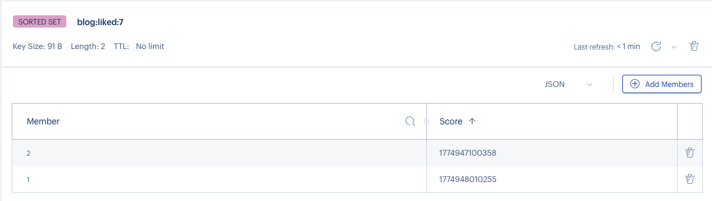
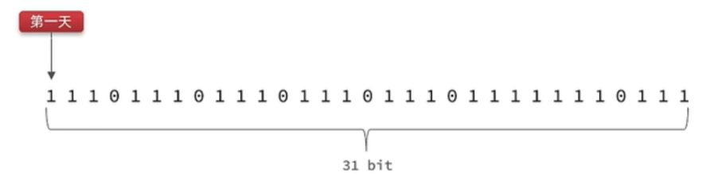

## 8.Redis实战篇

### 8.1 达人探店

### 8.2 点赞功能

#### 需求

1. 同一个用户只能点赞一次，再次点击则取消点赞
2. 如果当前用户已经点赞，则点赞按钮高亮显示（前端已实现，判断字段Blog类的isLike属性）
3. 博客内需要显示前TOP5的点赞用户，以点赞的时间排序

**Redis数据类型选择**

|              | **List**               | **Set**      | **SortedSet**   |
| ------------ | ---------------------- | ------------ | --------------- |
| **排序方式** | 按添加顺序排序         | 无法排序     | 根据score值排序 |
| **唯一性**   | 不唯一                 | 唯一         | 唯一            |
| **查找方式** | 按索引查找  或首尾查找 | 根据元素查找 | 根据元素查找    |

为了实现需求3，可以支持排序且适用于查找多的场景，故选择**SortedSet**作为数据类型，点赞时间作为score排序，member为点赞的用户id



#### 核心流程

**点赞取消流程**

1. 用户发起点赞请求 /blog/like/{id}。
2. Controller 接收博客 id，转给 BlogService。
3. Service 从 UserHolder 获取当前用户。
4. 查询当前用户是否已在 ZSet 中。
   1. 如果未点赞： 数据库 liked + 1； Redis ZSet 新增 userId -> 时间戳。
   2. 如果已点赞： 数据库 liked - 1； Redis ZSet 删除该 userId。
5. 返回操作结果。

**查询博客详情/列表**

1. 查询博客数据。
2. 查询博客作者信息并填充 name、icon。
3. 若用户已登录，去 Redis ZSet 判断当前用户是否点赞。
   1. 填充 isLike 字段。
4. 返回博客数据。

**查询点赞用户列表**

1. 根据 blogId 找到 ZSet。
2. 取前点赞时间前 N 个点赞用户 id。
3. 根据用户 id 集合查询用户信息并转成 UserDTO 列表返回。

#### **模块结构设计**

```
src/main/java/com/zwz5
├── controller
│   └── BlogController.java
├── service
│   ├── IBlogService.java
│   └── impl
│       └── BlogServiceImpl.java
├── mapper
│   └── BlogMapper.java
├── pojo
│   ├── dto
│   │   └── UserDTO.java
│   └── entity
│       ├── Blog.java
│       └── User.java
├── common
│   ├── result
│   │   └── Result.java
│   └── utils
│       └── UserHolder.java
└── constants
    ├── RedisConstants.java
    └── SystemConstants.java
```

#### **关键接口设计**

```java
public interface IBlogService extends IService<Blog> {
    Result likeBlog(Long id);
    Result queryBlogLikes(Long id);
    Result queryBlogById(Long id);
    Result queryHotBlog(Integer current);
}
```

#### **业务代码实现**

`BlogServiceImpl`同一个用户只能点赞一次，再次点击则取消点赞

```java
@Override
public Result likeBlog(Long id) {
    // 点赞方案
    // 1.获取当前用户
    UserDTO user = UserHolder.getUser();
    if (user == null) {
        // 为空则说明没有登录，直接返回
        return Result.fail("未登录");
    }
    // 2.判断用户是否点赞
    String key = BLOG_LIKED_KEY + id;
    Double score = stringRedisTemplate.opsForZSet().score(key, user.getId().toString());
    if (score == null) {
        // 2.1 如果没有点赞缓存，则可以点赞，并在数据库中自增
        boolean isSuccess = update().setSql("liked = liked + 1").eq("id", id).update();
        if (isSuccess) {
            // 将点赞时间作为排序score
            stringRedisTemplate.opsForZSet().add(key, user.getId().toString(), System.currentTimeMillis());
        }
    } else {
        // 2.2 如果已经被点赞过，则取消点赞
        boolean isSuccess = update().setSql("liked = liked - 1").eq("id", id).update();
        if (isSuccess) {
            // 删除缓存
            stringRedisTemplate.opsForZSet().remove(key, user.getId().toString());
        }

    }
    return Result.ok();
}
```

如果当前用户已经点赞，则点赞按钮高亮显示

```java
  /**
   * 补充博客作者相关信息，和是否被当前用户点赞信息
   *
   * @param blog 博客对象
   */
  private void fillBlogUser(Blog blog) {
      User user = userService.getById(blog.getUserId());
      UserDTO me = UserHolder.getUser();
      // 是否被点赞
      if (me != null) {
          String key = BLOG_LIKED_KEY + blog.getId();
          Double score = stringRedisTemplate.opsForZSet().score(key, me.getId().toString());
          blog.setIsLike(score != null);
      }
      if (user != null) {
          blog.setName(user.getNickName());
          blog.setIcon(user.getIcon());
      }
  }
```

博客内需要显示前TOP5的点赞用户，以点赞的时间排序

```java
@Override
public Result queryBlogLikes(Long id) {
    // 1.查询TOP5点赞的人，按时间排序
    String key = BLOG_LIKED_KEY + id;
    Set<String> topRange = stringRedisTemplate.opsForZSet().range(key, 0, SystemConstants.BOLG_LIKES_MAX_SIZE);
    if (topRange == null || topRange.isEmpty()) {
        // 1.1 无人点赞则返回空集合
        return Result.ok(Collections.emptyList());
    }
    List<Long> userIds = topRange.stream().map(Long::valueOf).toList();
    // 2.查询点赞的用户相关信息
    List<UserDTO> userDTOList = userService.listByIds(userIds)
            .stream()
            .map(user -> {
                UserDTO dto = new UserDTO();
                BeanUtils.copyProperties(user, dto);
                return dto;
            })
            .toList();
    return Result.ok(userDTOList);
}
```

#### 待改进的点

queryBlogLikes() 查出用户后，返回顺序不一定和 Redis 一致。 你先从 ZSet 拿到 userIds，再到userService.listByIds(userIds)。 这类 IN (...) 查询通常不保证结果顺序和传入 id 顺序一致，所以即使 Redis 那边顺序对了，最终返回给前端的用户列表顺序也可能乱掉。 也就是说，“按点赞时间排序”这个能力在结果层面并不可靠。

### 8.3 关注功能

#### 需求

1. 用户可以关注或取消关注其他用户，不能关注自己。
2. 用户详情页需要判断当前登录用户是否已关注目标用户，用于前端按钮状态展示。
3. 用户之间需要展示共同关注列表，也就是当前用户和目标用户都关注的人。
4. 关注关系后续还会服务于 Feed 流：用户发布博客时，推送给自己的粉丝收件箱。

**Redis数据类型选择**

共同关注本质是求两个用户关注列表的交集：

| 数据结构 | 是否唯一 | 是否适合求交集 | 适用性 |
| -------- | -------- | -------------- | ------ |
| List | 不唯一 | 不适合 | 关注关系需要去重，且交集计算成本高 |
| Set | 唯一 | 支持 `SINTER` | 适合保存用户关注的人，并快速计算共同关注 |
| SortedSet | 唯一且可排序 | 支持交集但更复杂 | 适合需要按关注时间排序的扩展场景 |

当前实现选择 **Set**：key 为 `follows:{userId}`，member 为被关注用户 id。数据库 `tb_follow` 作为最终数据源，Redis Set 用于共同关注交集计算。

#### 核心流程

**关注/取关流程**

1. 用户发起 `PUT /follow/{id}/{isFollow}`。
2. Controller 接收目标用户 id 和关注动作，转给 `FollowService`。
3. Service 从 `UserHolder` 获取当前登录用户。
4. 校验目标用户：不能为空、操作参数不能为空、不能关注自己、目标用户必须存在。
5. 如果 `isFollow=true`：
   1. 查询是否已经关注。
   2. 未关注则写入 `tb_follow`。
   3. DB 写入成功后，将目标用户 id 加入 Redis Set：`follows:{userId}`。
6. 如果 `isFollow=false`：
   1. 查询是否已经关注。
   2. 已关注则删除 `tb_follow` 中的关注关系。
   3. DB 删除成功后，从 Redis Set 移除目标用户 id。
7. 返回 `Result.ok()` 或业务失败原因。

**查询是否关注**

1. 用户发起 `GET /follow/or/not/{id}`。
2. Service 获取当前用户 id。
3. 查询 `tb_follow` 是否存在当前用户到目标用户的关系。
4. 返回 `true/false`。

**查询共同关注**

1. 用户发起 `GET /follow/common/{id}`。
2. 构造两个 Redis Set key：`follows:{当前用户id}`、`follows:{目标用户id}`。
3. 使用 Redis `SINTER` 求交集，得到共同关注的用户 id 集合。
4. 根据 id 批量查询用户表，转换为 `UserDTO` 返回。

#### **模块结构设计**

```text
src/main/java/com/zwz5
├── controller
│   └── FollowController.java
├── service
│   ├── IFollowService.java
│   └── impl
│       └── FollowServiceImpl.java
├── mapper
│   └── FollowMapper.java
├── pojo
│   ├── dto
│   │   └── UserDTO.java
│   └── entity
│       ├── Follow.java
│       └── User.java
├── common
│   ├── result
│   │   └── Result.java
│   └── utils
│       └── UserHolder.java
└── config
    └── MvcConfig.java
```

#### **关键接口设计**

`FollowController`

```java
@PutMapping("/{id}/{isFollow}")
public Result follow(@PathVariable("id") Long followUserId,
                     @PathVariable("isFollow") Boolean isFollow) {
    return followService.follow(followUserId, isFollow);
}

@GetMapping("/or/not/{id}")
public Result isFollow(@PathVariable("id") Long followUserId) {
    return followService.isFollow(followUserId);
}

@GetMapping("/common/{id}")
public Result ifollowCommons(@PathVariable("id") Long followUserId) {
    return followService.followCommons(followUserId);
}
```

`IFollowService`

```java
public interface IFollowService extends IService<Follow> {
    Result follow(Long followUserId, Boolean isFollow);
    Result isFollow(Long followUserId);
    Result followCommons(Long followUserId);
}
```

#### **业务代码实现**

关注和取关的核心是：先改数据库，再同步 Redis Set。数据库保存完整关注关系，Redis 只保存当前用户关注的目标用户 id，便于做共同关注交集。

```java
@Override
public Result follow(Long followUserId, Boolean isFollow) {
    UserDTO user = UserHolder.getUser();
    Long userId = user.getId();
    Result validateResult = validateFollowTarget(userId, followUserId, isFollow);
    if (validateResult != null) {
        return validateResult;
    }

    String key = "follows:" + userId;
    if (isFollow) {
        if (hasFollowed(userId, followUserId)) {
            return Result.fail("重复关注！");
        }
        Follow follow = new Follow();
        follow.setUserId(userId);
        follow.setFollowUserId(followUserId);
        try {
            boolean save = save(follow);
            if (save) {
                stringRedisTemplate.opsForSet().add(key, followUserId.toString());
            }
        } catch (DuplicateKeyException e) {
            return Result.fail("重复关注！");
        }
    } else {
        if (!hasFollowed(userId, followUserId)) {
            return Result.fail("未关注用户！");
        }
        boolean remove = remove(new QueryWrapper<Follow>()
                .eq("user_id", userId)
                .eq("follow_user_id", followUserId));
        if (remove) {
            stringRedisTemplate.opsForSet().remove(key, followUserId.toString());
        }
    }
    return Result.ok();
}
```

查询关注状态直接查数据库，保证结果以最终数据源为准：

```java
@Override
public Result isFollow(Long followUserId) {
    Long userId = UserHolder.getUser().getId();
    boolean isFollow = hasFollowed(userId, followUserId);
    return Result.ok(isFollow);
}

private boolean hasFollowed(Long userId, Long followUserId) {
    return lambdaQuery()
            .eq(Follow::getUserId, userId)
            .eq(Follow::getFollowUserId, followUserId)
            .count() > 0;
}
```

共同关注通过 Redis Set 交集完成：

```java
@Override
public Result followCommons(Long followUserId) {
    Long userId = UserHolder.getUser().getId();
    String key = "follows:" + userId;
    String key2 = "follows:" + followUserId;
    Set<String> intersect = stringRedisTemplate.opsForSet().intersect(key, key2);

    if (intersect == null || intersect.isEmpty()) {
        return Result.ok(Collections.emptyList());
    }

    List<Long> ids = intersect.stream().map(Long::valueOf).collect(Collectors.toList());
    List<UserDTO> userDTOList = userService.listByIds(ids)
            .stream()
            .map(user -> {
                UserDTO dto = new UserDTO();
                BeanUtils.copyProperties(user, dto);
                return dto;
            }).toList();

    return Result.ok(userDTOList);
}
```

#### 待改进的点

1. Redis key `"follows:" + userId` 目前硬编码在 `FollowServiceImpl` 中，建议抽到 `RedisConstants`，统一管理 key 前缀。
2. 代码捕获了 `DuplicateKeyException`，但当前 `tb_follow` 建表 SQL 只有主键索引，没有 `(user_id, follow_user_id)` 联合唯一索引；并发重复关注时数据库兜底并不可靠，建议补唯一索引。
3. `isFollow()` 每次查数据库，准确但频繁访问用户详情页时压力更大；可以优先查 Redis Set，未命中或缓存未初始化时再回源数据库。
4. DB 成功后 Redis 同步失败会导致共同关注数据短暂不一致；可以通过重试、补偿任务或缓存重建策略修复。
5. 共同关注返回顺序来自 Set 交集和 `listByIds`，天然不保证顺序；如果前端需要稳定排序，需要按昵称、id 或关注时间显式排序。

### 8.4 关注Feed流

#### 需求

1. 用户发布探店笔记后，关注该用户的粉丝可以在“关注”页看到这篇笔记。
2. 关注页按发布时间倒序展示，越新的笔记越靠前。
3. 支持滚动分页，避免传统分页在数据不断新增时出现重复或漏查。

**Feed流模式选择**

| 模式 | 写入成本 | 读取成本 | 适用场景 |
| ---- | -------- | -------- | -------- |
| 拉模式 | 低，发布时只写博客表 | 高，查询时要聚合所有关注用户的博客 | 关注人数少、读频低 |
| 推模式 | 高，发布时推送给所有粉丝 | 低，查询时直接读自己的收件箱 | 读频高、普通用户粉丝量可控 |
| 推拉结合 | 中等 | 中等 | 大 V 单独走拉模式，普通用户走推模式 |

当前实现采用 **推模式**：博客保存成功后，查询作者的粉丝列表，把博客 id 写入每个粉丝的 Redis ZSet 收件箱。key 为 `feed:{userId}`，member 为博客 id，score 为推送时间戳。

#### 核心流程

**发布博客并推送 Feed**

1. 用户发起 `POST /blog` 发布探店笔记。
2. `BlogServiceImpl#saveBlog` 从 `UserHolder` 获取当前用户 id，并设置到 `Blog.userId`。
3. 保存博客到 `tb_blog`。
4. 查询 `tb_follow`，找到所有关注当前作者的粉丝：`follow_user_id = 作者id`。
5. 遍历粉丝列表，将博客 id 写入每个粉丝的 Redis ZSet：`feed:{粉丝id}`。
6. 返回新博客 id。

**查询关注 Feed 流**

1. 用户发起 `GET /blog/of/follow?lastId={max}&offset={offset}`。
2. Controller 将参数传给 `queryBlogOfFollow(max, offset)`。
3. Service 根据当前用户 id 生成收件箱 key：`feed:{userId}`。
4. 使用 `reverseRangeByScoreWithScores(key, 0, max, offset, 2)` 按 score 倒序取一页数据。
5. 遍历结果，收集博客 id，同时计算本页最小时间戳 `minTime` 和下一次滚动分页的 `offset`。
6. 根据博客 id 批量查询数据库，并用 `ORDER BY FIELD` 尽量保持 Redis 中的顺序。
7. 补充博客作者信息和当前用户点赞状态。
8. 返回 `ScrollResult`：`list`、`minTime`、`offset`。

#### **模块结构设计**

```text
src/main/java/com/zwz5
├── controller
│   └── BlogController.java
├── service
│   ├── IBlogService.java
│   ├── IFollowService.java
│   └── impl
│       └── BlogServiceImpl.java
├── pojo
│   ├── entity
│   │   ├── Blog.java
│   │   └── Follow.java
│   └── dto
│       └── UserDTO.java
├── common
│   ├── result
│   │   ├── Result.java
│   │   └── ScrollResult.java
│   └── utils
│       └── UserHolder.java
└── constants
    └── RedisConstants.java
```

#### **关键接口设计**

`BlogController`

```java
@PostMapping
public Result saveBlog(@RequestBody Blog blog) {
    return blogService.saveBlog(blog);
}

@GetMapping("/of/follow")
public Result queryBlogOfFollow(
        @RequestParam("lastId") Long max,
        @RequestParam(value = "offset", defaultValue = "0") Integer offset) {
    return blogService.queryBlogOfFollow(max, offset);
}
```

`IBlogService`

```java
public interface IBlogService extends IService<Blog> {
    Result saveBlog(Blog blog);
    Result queryBlogOfFollow(Long max, Integer offset);
}
```

#### **业务代码实现**

发布博客时推送给粉丝收件箱：

```java
@Override
public Result saveBlog(Blog blog) {
    UserDTO user = UserHolder.getUser();
    Long userId = user.getId();
    blog.setUserId(userId);

    boolean save = save(blog);
    if (!save) {
        return Result.fail("新增笔记失败!");
    }

    List<Follow> follows = followService.lambdaQuery()
            .eq(Follow::getFollowUserId, userId)
            .list();

    for (Follow follow : follows) {
        String key = FEED_KEY + follow.getUserId();
        stringRedisTemplate.opsForZSet()
                .add(key, blog.getId().toString(), System.currentTimeMillis());
    }
    return Result.ok(blog.getId());
}
```

查询关注 Feed 使用 ZSet 的 score 滚动分页：

```java
@Override
public Result queryBlogOfFollow(Long max, Integer offset) {
    Long userId = UserHolder.getUser().getId();
    String key = FEED_KEY + userId;

    Set<ZSetOperations.TypedTuple<String>> typedTuples =
            stringRedisTemplate.opsForZSet()
                    .reverseRangeByScoreWithScores(key, 0, max, offset, 2);
    if (typedTuples == null || typedTuples.isEmpty()) {
        return Result.ok(Collections.emptyList());
    }

    List<Long> blogIds = new ArrayList<>(typedTuples.size());
    int offset_next = 0;
    Long minTime = max;
    for (ZSetOperations.TypedTuple<String> typedTuple : typedTuples) {
        Long blogId = Long.valueOf(Objects.requireNonNull(typedTuple.getValue()));
        blogIds.add(blogId);
        long score = Objects.requireNonNull(typedTuple.getScore()).longValue();
        if (score < minTime) {
            minTime = score;
            offset_next = 1;
        } else if (score == minTime) {
            offset_next++;
        }
    }

    String idStr = blogIds.stream().map(String::valueOf).collect(Collectors.joining(","));
    List<Blog> blogs = query()
            .in("id", blogIds)
            .last("ORDER BY FIELD(id," + idStr + ")")
            .list();
    blogs.forEach(this::fillBlogUser);

    ScrollResult r = new ScrollResult();
    r.setList(blogs);
    r.setOffset(offset_next);
    r.setMinTime(minTime);
    return Result.ok(r);
}
```

#### 待改进的点

1. 当前代码中 `queryBlogOfFollow()` 的 `idStr` 使用 `Collectors.joining(",")` 才能生成 `1,2,3` 这种 SQL 片段；如果写成 `Collectors.joining()`，`ORDER BY FIELD` 无法正确按 Redis 顺序保序。
2. 推模式在普通用户场景读性能好，但作者粉丝量很大时发布成本高；后续可以对大 V 使用推拉结合。
3. `saveBlog()` 先写 DB 再写 Redis，中间失败会导致粉丝收件箱缺数据；可以引入消息队列、事务消息或补偿任务。
4. 当前收件箱没有清理策略，长期运行会导致 `feed:{userId}` 越来越大；可以按数量或时间裁剪。
5. 查询收件箱为空时返回的是空 List，不是完整 `ScrollResult`，前端如果强依赖 `minTime/offset` 需要统一返回结构。

### 8.5 附近商户

#### 需求

1. 根据商铺类型分页查询商铺列表。
2. 如果前端没有传入坐标，只按类型走普通数据库分页。
3. 如果前端传入经纬度 `x/y`，需要查询附近一定范围内的同类型商铺，并按距离由近到远返回。
4. 返回商铺信息时需要带上距离字段 `distance`，便于前端展示“距离我多远”。

**Redis数据类型选择**

附近商户属于典型地理位置搜索，Redis 提供 GEO 能力，底层基于 SortedSet 存储经纬度编码后的 score。

| 方案 | 特点 | 适用性 |
| ---- | ---- | ------ |
| MySQL 按经纬度计算 | 实现简单，但大数据量下计算和排序压力大 | 小数据量可用 |
| Redis GEO | 支持按经纬度、半径、距离排序查询 | 适合附近商户检索 |

当前实现将店铺按类型分组写入 Redis GEO：key 为 `shop:geo:{typeId}`，member 为店铺 id，坐标为店铺经纬度。

#### 核心流程

**GEO 数据预热**

1. 测试工具 `LoadShopDataTest#shouldLoadShopGeoData` 查询全部店铺。
2. 按 `typeId` 分组。
3. 每组写入一个 Redis GEO key：`shop:geo:{typeId}`。
4. member 为店铺 id，坐标为 `Shop.x`、`Shop.y`。

**按类型查询商铺**

1. 用户发起 `GET /shop/of/type?typeId={typeId}&current={current}&x={x}&y={y}`。
2. 如果 `x/y` 为空，直接按 `type_id` 查询 MySQL 分页。
3. 如果 `x/y` 不为空，计算分页区间：`from = (current - 1) * pageSize`，`end = current * pageSize`。
4. 使用 Redis GEO 在 `shop:geo:{typeId}` 中按坐标查询 5km 内商铺，并携带距离，限制返回到 `end` 条。
5. 跳过前 `from` 条，得到当前页店铺 id 和距离映射。
6. 根据店铺 id 回查 MySQL，并按 Redis 返回顺序保序。
7. 将距离写入 `Shop.distance`，返回商铺列表。

#### **模块结构设计**

```text
src/main/java/com/zwz5
├── controller
│   └── ShopController.java
├── service
│   ├── IShopService.java
│   └── impl
│       └── ShopServiceImpl.java
├── mapper
│   └── ShopMapper.java
├── pojo
│   └── entity
│       └── Shop.java
├── common
│   └── result
│       └── Result.java
└── constants
    ├── RedisConstants.java
    └── SystemConstants.java
```

#### **关键接口设计**

`ShopController`

```java
@GetMapping("/of/type")
public Result queryShopByType(
        @RequestParam("typeId") Integer typeId,
        @RequestParam(value = "current", defaultValue = "1") Integer current,
        @RequestParam(value = "x", required = false) Double x,
        @RequestParam(value = "y", required = false) Double y) {
    return shopService.queryShopByType(typeId, current, x, y);
}
```

`IShopService`

```java
public interface IShopService extends IService<Shop> {
    Result queryShopByType(Integer typeId, Integer current, Double x, Double y);
}
```

#### **业务代码实现**

没有坐标时退回普通分页：

```java
if (x == null || y == null) {
    Page<Shop> page = lambdaQuery()
            .eq(Shop::getTypeId, typeId)
            .page(new Page<>(current, SystemConstants.DEFAULT_PAGE_SIZE));
    return Result.ok(page.getRecords());
}
```

有坐标时走 Redis GEO 查询。下面片段保留核心逻辑，并把 MySQL 回查保序处写成建议修正版：

```java
int from = (current - 1) * SystemConstants.DEFAULT_PAGE_SIZE;
int end = current * SystemConstants.DEFAULT_PAGE_SIZE;
String key = SHOP_GEO_KEY + typeId;

GeoResults<RedisGeoCommands.GeoLocation<String>> results =
        stringRedisTemplate.opsForGeo().search(
                key,
                GeoReference.fromCoordinate(x, y),
                new Distance(5000),
                RedisGeoCommands.GeoSearchCommandArgs
                        .newGeoSearchArgs()
                        .includeDistance()
                        .limit(end));

if (results == null || results.getContent().size() <= from) {
    return Result.ok(Collections.emptyList());
}

List<Long> ids = new ArrayList<>();
Map<String, Distance> distanceMap = new HashMap<>();
results.getContent().stream().skip(from).forEach(result -> {
    String shopIdStr = result.getContent().getName();
    ids.add(Long.valueOf(shopIdStr));
    distanceMap.put(shopIdStr, result.getDistance());
});

String idStr = ids.stream().map(String::valueOf).collect(Collectors.joining(","));
List<Shop> shops = query()
        .in("id", ids)
        .last("ORDER BY FIELD(id," + idStr + ")")
        .list();
for (Shop shop : shops) {
    shop.setDistance(distanceMap.get(shop.getId().toString()).getValue());
}
return Result.ok(shops);
```

GEO 数据预热：

```java
@Test
void shouldLoadShopGeoData() {
    List<Shop> list = shopService.list();
    Map<Long, List<Shop>> map = list.stream()
            .collect(Collectors.groupingBy(Shop::getTypeId));

    for (Map.Entry<Long, List<Shop>> entry : map.entrySet()) {
        String key = SHOP_GEO_KEY + entry.getKey();
        List<RedisGeoCommands.GeoLocation<String>> locations = new ArrayList<>();
        for (Shop shop : entry.getValue()) {
            locations.add(new RedisGeoCommands.GeoLocation<>(
                    shop.getId().toString(),
                    new Point(shop.getX(), shop.getY())
            ));
        }
        stringRedisTemplate.opsForGeo().add(key, locations);
    }
}
```

#### 待改进的点

1. 当前 `ShopServiceImpl#queryShopByType()` 里 `idStr` 使用的是 `Collectors.joining()`，会生成没有逗号的 id 串，导致 `ORDER BY FIELD(id,...)` 保序错误；应改为 `Collectors.joining(",")`。
2. Redis GEO 数据依赖测试方法手动预热，新增或修改店铺坐标后不会自动同步；建议在店铺新增/更新时同步 `shop:geo:{typeId}`，或提供明确的初始化脚本。
3. 查询半径固定为 5000 米，建议抽成常量或配置项，便于按城市密度调整。
4. GEO 查询只按距离排序，没有结合销量、评分、营业状态等业务排序；真实推荐场景可做综合排序。
5. 只传 `x` 或只传 `y` 时当前逻辑会退回普通分页，参数错误不明显；可以做参数校验并返回明确错误。

### 8.6 用户签到

#### 需求

1. 用户每天可以签到一次，记录当月每天是否签到。
2. 需要统计当前用户从今天开始向前连续签到的天数。
3. 签到数据按用户、月份隔离，便于按月统计和清理。

**Redis数据类型选择**

签到只有两种状态：当天签到了或没签到。一个月最多 31 天，用 Bitmap 可以用极小空间保存每天状态。

| 方案 | 存储方式 | 特点 |
| ---- | -------- | ---- |
| String/Hash | 每天一条记录或一个字段 | 直观，但 key/字段数量更多 |
| Set | 保存已签到日期 | 能判断是否签到，但连续签到统计不如位运算方便 |
| Bitmap | 每天对应一个 bit | 空间小，适合按天记录和连续签到统计 |

当前实现选择 **Bitmap**：key 为 `sign:{userId}:yyyyMM`，offset 为 `dayOfMonth - 1`。例如 5 月 3 日签到，就把当月 key 的第 2 位设置为 1。



#### 核心流程

**用户签到**

1. 用户发起 `POST /user/sign`。
2. Controller 调用 `userService.sign()`。
3. Service 从 `UserHolder` 获取当前用户 id。
4. 根据当前年月拼接 Redis key：`sign:{userId}:yyyyMM`。
5. 获取今天是本月第几天，计算 offset：`dayOfMonth - 1`。
6. 使用 `SETBIT key offset 1` 记录当天已签到。
7. 返回 `Result.ok()`。

**统计连续签到天数**

1. 用户发起 `GET /user/sign/count`。
2. Service 构造当前用户当月签到 key。
3. 使用 `BITFIELD key GET u{dayOfMonth} 0` 读取本月 1 号到今天的签到位图，并转成一个无符号整数。
4. 从整数最低位开始判断：最低位代表今天。
5. 如果最低位是 1，连续签到天数加 1，然后右移一位继续判断昨天。
6. 遇到 0 立即停止，返回连续签到天数。

#### **模块结构设计**

```text
src/main/java/com/zwz5
├── controller
│   └── UserController.java
├── service
│   ├── IUserService.java
│   └── impl
│       └── UserServiceImpl.java
├── pojo
│   └── dto
│       └── UserDTO.java
├── common
│   ├── result
│   │   └── Result.java
│   └── utils
│       └── UserHolder.java
└── constants
    └── RedisConstants.java
```

#### **关键接口设计**

`UserController`

```java
@PostMapping("/sign")
public Result sign() {
    return userService.sign();
}

@GetMapping("/sign/count")
public Result signCount() {
    return userService.signCount();
}
```

`IUserService`

```java
public interface IUserService extends IService<User> {
    Result sign();
    Result signCount();
}
```

#### **业务代码实现**

签到：

```java
@Override
public Result sign() {
    UserDTO user = UserHolder.getUser();
    Long userId = user.getId();

    LocalDateTime now = LocalDateTime.now();
    String keySuffix = now.format(DateTimeFormatter.ofPattern(":yyyyMM"));
    String key = RedisConstants.USER_SIGN_KEY + userId + keySuffix;

    int dayOfMonth = now.getDayOfMonth();
    stringRedisTemplate.opsForValue().setBit(key, dayOfMonth - 1, true);
    return Result.ok();
}
```

连续签到统计：

```java
@Override
public Result signCount() {
    UserDTO user = UserHolder.getUser();
    Long userId = user.getId();

    LocalDateTime now = LocalDateTime.now();
    String keySuffix = now.format(DateTimeFormatter.ofPattern(":yyyyMM"));
    String key = RedisConstants.USER_SIGN_KEY + userId + keySuffix;
    int dayOfMonth = now.getDayOfMonth();

    List<Long> result = stringRedisTemplate.opsForValue()
            .bitField(key, BitFieldSubCommands.create()
                    .get(BitFieldSubCommands.BitFieldType.unsigned(dayOfMonth))
                    .valueAt(0));
    if (result == null || result.isEmpty()) {
        return Result.ok(0);
    }
    Long num = result.get(0);
    if (num == null || num == 0) {
        return Result.ok(0);
    }

    int count = 0;
    for (int i = 0; i < 31; i++) {
        if ((num & 1) != 0) {
            count++;
        } else {
            break;
        }
        num >>>= 1;
    }
    return Result.ok(count);
}
```

#### 待改进的点

1. 当前签到 key 没有设置过期时间，长期运行会保留所有历史月份数据；可以按业务需要设置较长 TTL，或定期归档/清理。
2. `signCount()` 使用服务器当前时间统计，只支持“本月连续签到”；如果要查历史月份，需要把年月作为参数传入。
3. `sign()` 重复签到会重复 `SETBIT true`，结果幂等但不会提示“今日已签到”；如果前端需要明确状态，可以先 `GETBIT` 判断。
4. 连续签到循环固定最多 31 次，可以改成 `dayOfMonth`，语义更准确。
5. 当前只统计连续天数，没有返回当月签到日历；如果前端要展示月历，可以读取 Bitmap 后解析每一天的签到状态。

### 8.7 UV统计

UV（Unique Visitor）表示独立访客数，同一个用户多次访问只计一次。普通去重可以用 Set 保存用户 id，但访问量很大时 Set 会保存所有元素，内存成本较高。Redis 的 **HyperLogLog** 适合做大规模基数统计：它不保存完整明细，只用固定的小内存估算不重复元素数量，标准误差约 0.81%。

需要注意：这里正确名称是 `HyperLogLog`，常用命令是 `PFADD`、`PFCOUNT`、`PFMERGE`。

#### HyperLogLog特点

| 特点 | 说明 |
| ---- | ---- |
| 空间占用小 | 每个 HyperLogLog key 最大约 12KB，适合百万、千万级 UV 估算 |
| 自动去重 | 同一个用户 id 多次加入，只会影响一次基数统计 |
| 结果是估算值 | 不是精确统计，适合 UV、DAU 这类允许轻微误差的指标 |
| 不能取明细 | 只能统计数量，不能列出访问过的用户 id，也不能删除单个用户 |
| 支持合并 | 可以用 `PFMERGE` 合并多个 key，例如按天合并成周/月 UV |

#### 适用场景

1. 首页、店铺页、活动页 UV 统计。
2. 每日活跃用户 DAU 的近似统计。
3. 多天 UV 合并统计，例如周 UV、月 UV。
4. 不需要查看具体用户明细，只关心去重数量的场景。

如果需要精确去重、查看明细、判断某个用户是否访问过，Set 或 Bitmap 更合适；如果只要大规模近似计数，HyperLogLog 更省内存。

#### Key设计

可以按业务维度和日期拆 key：

```text
uv:shop:20260503        # 2026-05-03 店铺访问 UV
uv:blog:20260503        # 2026-05-03 博客访问 UV
uv:activity:1001:20260503 # 某活动每天 UV
```

访问时写入用户唯一标识，常见 member 可以是 `userId`、登录 token 对应用户 id，或者未登录场景下的设备指纹/客户端 id。

#### 测试类实现

当前项目通过 `HyperLogLogTest#testUVInsert` 模拟写入 100 万个独立用户 id。为了减少 Redis 网络交互，代码每 1000 个 id 批量写入一次。

```java
@SpringBootTest
public class HyperLogLogTest {

    @Resource
    private StringRedisTemplate stringRedisTemplate;

    @Test
    void testUVInsert() {
        String[] shops = new String[1000];
        int index = 0;
        for (int i = 0; i < 1000000; i++) {
            shops[index] = "id:" + i;
            index++;
            if (index % 1000 == 0) {
                index = 0;
                stringRedisTemplate.opsForHyperLogLog()
                        .add("uv:shop:20260503", shops);
            }
        }
    }

    @Test
    void testUVCount() {
        Long count = stringRedisTemplate.opsForHyperLogLog()
                .size("uv:shop:20260503");
        System.out.println(count);
    }
}
```

对应 Redis 命令可以理解为：

```bash
PFADD uv:shop:20260503 id:1 id:2 id:3
PFCOUNT uv:shop:20260503
```

#### 和业务接口结合的思路

当前项目还没有把 UV 统计接入正式 Controller。后续可以在店铺详情、博客详情等高频访问接口中增加埋点：

```java
String key = "uv:shop:" + LocalDate.now().format(DateTimeFormatter.BASIC_ISO_DATE);
String userId = UserHolder.getUser().getId().toString();
stringRedisTemplate.opsForHyperLogLog().add(key, userId);
```

如果是未登录用户，可以用设备 id、匿名访客 id 或网关生成的 visitorId 作为 member。统计时通过 `size(key)` 获取当日 UV。

#### 待改进的点

1. 当前只是测试类验证，没有接入业务访问链路；如果要真实统计 UV，需要在店铺详情、博客详情或网关层统一埋点。
2. HyperLogLog 是近似统计，不能用于强一致、精确计费、抽奖资格等场景。
4. HyperLogLog 不能获取用户明细，也不能删除单个用户；如果有审计或明细分析需求，需要额外落日志或使用 Set/数据库。
5. 长期保留每日 UV key 会持续占用 Redis 内存，建议设置 TTL 或定期汇总到 MySQL/ClickHouse 等分析库。

