## 9.Redis分布式缓存篇

### 9.1 Redis持久化

Redis 是内存数据库，读写主要发生在内存中。如果只依赖内存，进程退出或机器宕机后数据就会丢失。持久化的目的就是把内存数据落盘，Redis 重启时可以从磁盘恢复数据。

持久化主要有两类：

- **RDB**：按时间点生成数据快照，记录某一刻的完整数据。
- **AOF**：追加记录写命令，重启时重放命令恢复数据。

实际生产中经常两者结合：RDB 适合做冷备、全量恢复、主从全量同步；AOF 适合降低故障时的数据丢失窗口。持久化不是高可用本身，它只能帮助单机重启恢复；故障切换仍需要主从、哨兵或集群。

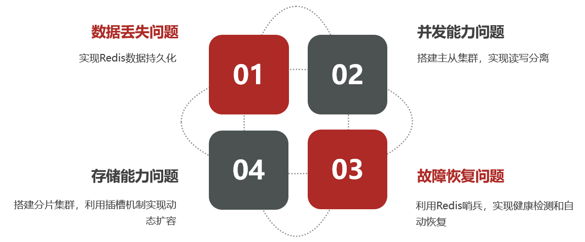

#### 9.1.1 RDB

RDB 全称 Redis Database Backup file，也叫 Redis 快照。它会把 Redis 某一时刻的内存数据生成一个二进制快照文件，默认文件名通常是 `dump.rdb`。Redis 重启时如果发现 RDB 文件，就会加载它恢复数据。

**触发方式**

1. `save`：同步生成 RDB，由主线程执行，期间 Redis 无法处理其他命令，生产环境一般不直接使用。
2. `bgsave`：后台生成 RDB，主进程 `fork` 子进程，由子进程写快照文件，主进程继续处理请求。
3. Redis 正常关闭：停机时会尝试生成一次 RDB。
4. 配置触发：满足 `save` 规则时自动执行 `bgsave`。

常见配置：

```properties
# 900 秒内至少 1 个 key 被修改，触发 bgsave
save 900 1
# 300 秒内至少 10 个 key 被修改，触发 bgsave
save 300 10
# 60 秒内至少 10000 个 key 被修改，触发 bgsave
save 60 10000

# 禁用 RDB 自动快照
# save ""

# RDB 文件名和目录
dbfilename dump.rdb
dir ./

# 是否压缩 RDB，节省磁盘但消耗 CPU
rdbcompression yes

# 是否开启校验，提升文件可靠性但会有少量性能开销
rdbchecksum yes

# bgsave 失败时是否停止写入，避免继续产生无法持久化的数据
stop-writes-on-bgsave-error yes
```

**bgsave 核心原理**

1. Redis 主进程执行 `fork`，创建子进程。
2. 子进程继承主进程当时的内存视图，开始把数据写入临时 RDB 文件。
3. 主进程继续处理客户端请求。
4. 如果主进程修改了某块内存页，会触发写时复制（Copy-On-Write），复制出一份新数据给主进程修改，子进程继续读取旧数据生成快照。
5. 子进程写完后，用新的 RDB 文件替换旧文件。

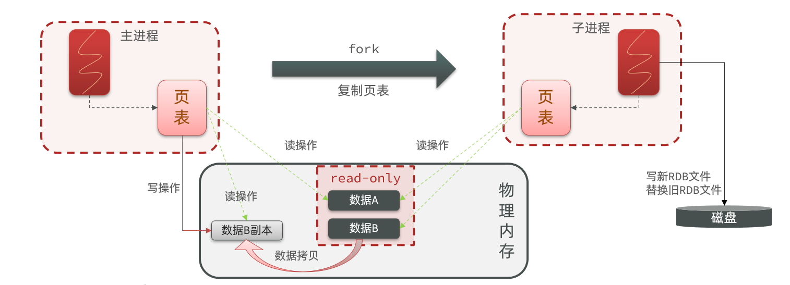

**优点**

- 文件紧凑，是二进制快照，适合备份、复制、灾难恢复。
- 恢复速度通常比纯 AOF 重放快。
- 对正常写入影响较小，主要开销集中在 `fork`、磁盘 IO、压缩阶段。

**缺点**

- 两次快照之间的数据可能丢失，例如 5 分钟生成一次 RDB，宕机时最多可能丢 5 分钟数据。
- `fork` 大进程有开销，实例内存越大，暂停和 Copy-On-Write 成本越明显。
- 快照生成期间如果写入很多，会增加额外内存占用。

**适用场景**

- 可接受分钟级数据丢失的缓存数据。
- 定期备份、快速恢复、主从全量同步。
- 配合 AOF 使用，提供更完整的恢复能力。

#### 9.1.2 AOF

AOF 全称 Append Only File。它不是保存某一刻的数据快照，而是把 Redis 执行过的写命令追加到日志文件中。Redis 重启时会重新执行这些写命令，从而恢复数据。

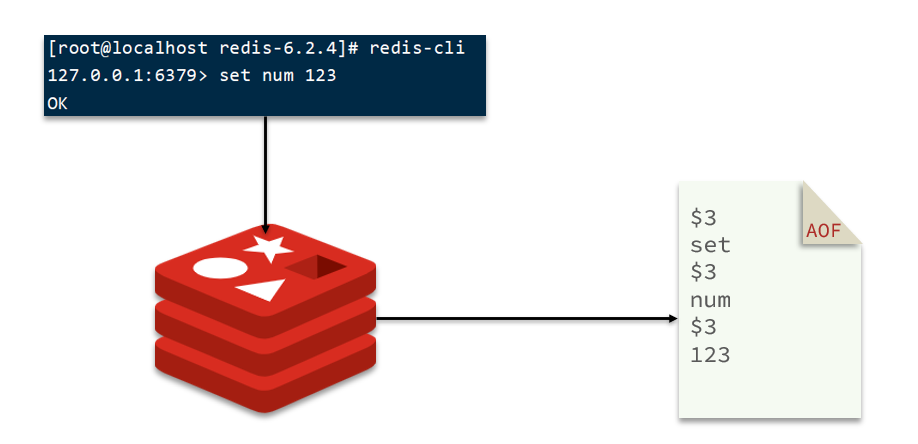

**基本配置**

```properties
# 开启 AOF，默认通常为 no
appendonly yes

# AOF 文件名
appendfilename "appendonly.aof"
```

**写入与刷盘策略**

Redis 执行写命令后，会先把命令追加到 AOF 缓冲区，再根据 `appendfsync` 策略刷盘。

| 策略 | 含义 | 优点 | 缺点 |
| ---- | ---- | ---- | ---- |
| `always` | 每条写命令都刷盘 | 数据安全性最高 | 性能最差，磁盘压力大 |
| `everysec` | 每秒刷盘一次，默认推荐 | 性能和安全性平衡 | 宕机最多丢约 1 秒数据 |
| `no` | 由操作系统决定何时刷盘 | 性能最好 | 数据丢失窗口不可控 |

常见配置：

```properties
appendfsync everysec

# AOF 重写期间是否跳过 fsync，降低 IO 竞争，但会扩大重写期间的数据丢失窗口
no-appendfsync-on-rewrite no
```

**AOF重写**

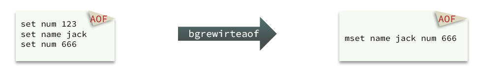

AOF 会持续追加写命令，文件会越来越大，而且很多历史命令已经没有意义。例如：

```redis
set num 123
set num 666
```

最终只需要恢复 `num=666`，第一条命令可以被压缩掉。AOF 重写就是根据当前内存数据生成一份更小的 AOF 文件，用最少命令恢复出相同数据。

手动触发：

```bash
bgrewriteaof
```

自动触发配置：

```properties
# 当前 AOF 文件比上次重写后的体积增长超过 100% 时，满足重写条件
auto-aof-rewrite-percentage 100

# AOF 文件至少达到 64MB 才考虑自动重写
auto-aof-rewrite-min-size 64mb
```

**AOF重写流程简化理解**

1. Redis `fork` 子进程。
2. 子进程根据当前内存数据生成新的 AOF 基础文件。
3. 主进程继续处理请求，新写命令继续进入当前 AOF，并记录到重写缓冲区或新的增量文件。
4. 子进程完成后，Redis 追加重写期间的新命令，并切换到新的 AOF 文件。

**优点**

- 数据丢失窗口小，`everysec` 策略通常最多丢 1 秒。
- 文件是命令日志，可读性比 RDB 好，必要时可以人工分析或修复。
- 适合对数据安全要求更高的场景。

**缺点**

- 文件通常比 RDB 大。
- 恢复时需要重放命令，极端情况下比 RDB 慢。
- 持续追加和重写会带来额外磁盘 IO。

**Redis 7 的 AOF 变化**

Redis 7 对 AOF 做了多文件化管理，不再只是一个简单的 `appendonly.aof` 文件。开启 AOF 后，通常会在 `appenddirname` 目录下维护：

- **base AOF**：基础文件，可能是 AOF 格式，也可能是 RDB 格式。
- **incremental AOF**：增量文件，记录基础文件之后的新写命令。
- **manifest 文件**：清单文件，记录当前有效的 base 与 incremental 文件。

好处是 AOF 重写和文件切换更清晰，避免一个大文件反复重写，也便于 Redis 管理重写期间产生的新命令。

相关配置示例：

```properties
appendonly yes
appendfilename "appendonly.aof"
appenddirname "appendonlydir"
```

#### 9.1.3 混合持久化

混合持久化可以理解为 AOF 重写时的一种优化：新的 AOF 基础文件前半部分用 RDB 格式保存当前全量数据，后半部分再追加 AOF 命令。这样恢复时先快速加载 RDB 部分，再重放少量 AOF 命令。

开启配置：

```properties
# Redis 4.0+ 支持，通常默认开启
aof-use-rdb-preamble yes
```

**工作方式**

1. 开启 AOF 和混合持久化。
2. 触发 AOF 重写。
3. 子进程生成新的 base 文件时，不再把当前数据全部转成 Redis 命令，而是先写一段 RDB 格式的数据。
4. 重写期间新产生的写命令记录为 AOF 增量。
5. Redis 重启恢复时，先加载 RDB 格式的基础数据，再加载 AOF 增量命令。

**优点**

- 兼顾 RDB 恢复快和 AOF 数据丢失少的优点。
- 重写后的基础文件更紧凑，加载速度比纯 AOF 更好。
- 适合生产中同时开启 AOF 的场景。

**缺点**

- 文件可读性下降，前半部分是 RDB 二进制格式，不再是纯文本命令。
- 老版本 Redis 可能无法识别混合格式文件，跨版本迁移时要确认兼容性。
- 仍然不能替代备份、高可用和灾备，只是单机恢复能力增强。

**RDB、AOF、混合持久化对比**

| 方案 | 记录内容 | 恢复速度 | 数据安全性 | 文件体积 | 典型用途 |
| ---- | -------- | -------- | ---------- | -------- | -------- |
| RDB | 某一时刻的数据快照 | 快 | 较低，可能丢快照间隔内数据 | 小 | 备份、全量同步、冷恢复 |
| AOF | 写命令日志 | 较慢 | 高，`everysec` 通常最多丢约 1 秒 | 大 | 更高安全性的数据恢复 |
| 混合持久化 | RDB 全量 + AOF 增量 | 较快 | 高 | 介于两者之间 | 生产推荐组合之一 |

**实践建议**

1. 纯缓存、可重建数据：可以只开 RDB，甚至根据业务关闭持久化。
2. 重要业务数据：建议开启 AOF，使用 `appendfsync everysec`，并保留 RDB 作为备份。
3. Redis 4.0+ 且开启 AOF：建议开启混合持久化，提高恢复速度。
4. Redis 实例内存不要过大，否则 RDB、AOF 重写和主从全量同步的 `fork` 成本都会上升。
5. 持久化文件要配合备份策略、磁盘监控、恢复演练，否则只“开启配置”并不等于可靠。

### 9.2 Redis主从

单机 Redis 有两个明显问题：一是并发能力和内存容量受单机限制，二是单点故障会影响可用性。主从复制通过一个 master 搭配多个 replica，把 master 的数据同步到 replica，实现读写分离和故障恢复基础。

需要先明确：Redis 主从复制默认是**异步复制**。master 写入成功后不会等待所有 replica 确认，因此主从可以提升读能力和可用性基础，但不能天然保证强一致。

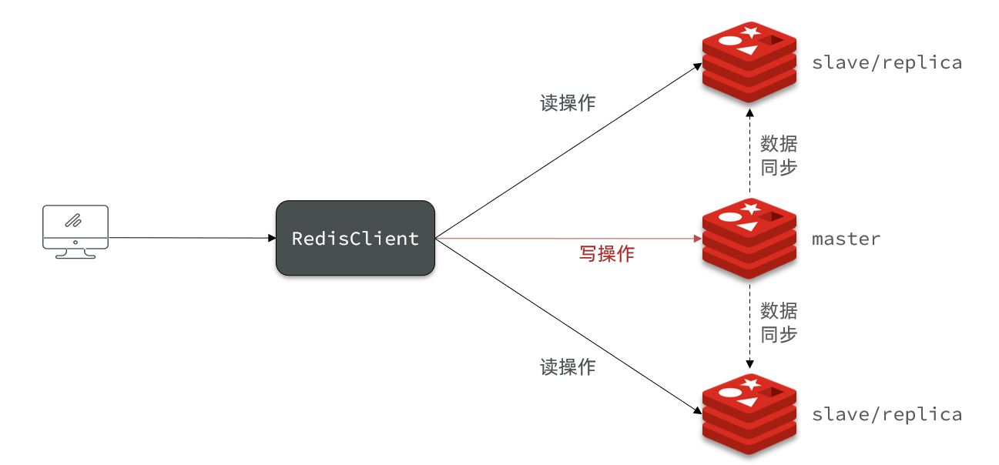

常见结构：

```text
client write  -> redis-6380 master
client read   -> redis-6381 replica
client read   -> redis-6382 replica
```

#### 9.2.1 搭建主从结构

当前项目的 `/Users/zhaowenzhuo/Workspace/heimadianping-app/docker-compose.yml` 已经定义了 3 个 Redis 容器：

```yaml
services:
  redis-6380:
    image: redis:6.2.6
    command: ["redis-server", "/usr/local/etc/redis/redis.conf"]
    volumes:
      - ./redis/6380-data:/data
      - ./redis/6380.conf:/usr/local/etc/redis/redis.conf:ro
    ports:
      - "6380:6380"

  redis-6381:
    image: redis:6.2.6
    command: ["redis-server", "/usr/local/etc/redis/redis.conf"]
    volumes:
      - ./redis/6381-data:/data
      - ./redis/6381.conf:/usr/local/etc/redis/redis.conf:ro
    ports:
      - "6381:6381"

  redis-6382:
    image: redis:6.2.6
    command: ["redis-server", "/usr/local/etc/redis/redis.conf"]
    volumes:
      - ./redis/6382-data:/data
      - ./redis/6382.conf:/usr/local/etc/redis/redis.conf:ro
    ports:
      - "6382:6382"
```

三份配置中端口分别是 `6380`、`6381`、`6382`，并且都设置了 `requirepass 123456`。当前配置文件没有固定 `replicaof`，因此可以用两种方式搭建一主两从。

**方式一：配置文件固定主从关系**

在 `redis/6381.conf`、`redis/6382.conf` 中增加：

```properties
# Redis 5+ 推荐使用 replicaof，旧版本命令名是 slaveof
replicaof redis-6380 6380

# master 开启 requirepass 后，从节点连接 master 必须配置 masterauth
masterauth 123456

# 从节点默认只读，避免业务误写从库
replica-read-only yes
```

这里的 `redis-6380` 是 docker-compose service name，容器之间可以通过服务名访问。如果不在 Docker 网络内运行，而是在宿主机直接访问，则要根据实际网络改成 `127.0.0.1 6380` 或对应 IP。

启动：

```bash
cd /Users/zhaowenzhuo/Workspace/heimadianping-app
docker compose up -d redis-6380 redis-6381 redis-6382
```

**方式二：运行时命令挂载主从关系**

不改配置文件时，可以启动后执行：

```bash
# 进入从节点 6381
redis-cli -h 127.0.0.1 -p 6381 -a 123456
CONFIG SET masterauth 123456
REPLICAOF 127.0.0.1 6380

# 进入从节点 6382
redis-cli -h 127.0.0.1 -p 6382 -a 123456
CONFIG SET masterauth 123456
REPLICAOF 127.0.0.1 6380
```

如果在容器内部执行，master 地址可以用 `redis-6380 6380`；如果从宿主机执行，要用宿主机能访问到的地址和端口。运行时命令适合临时验证，重启后是否保留取决于是否执行 `CONFIG REWRITE` 以及配置文件是否可写。当前 compose 把配置挂载为只读，学习环境更建议直接改配置文件。

**验证主从状态**

在 master 上查看：

```bash
redis-cli -p 6380 -a 123456 INFO replication
```

重点看：

```text
role:master
connected_slaves:2
slave0:ip=...,port=6381,state=online,...
slave1:ip=...,port=6382,state=online,...
```

在 replica 上查看：

```bash
redis-cli -p 6381 -a 123456 INFO replication
```

重点看：

```text
role:slave
master_host:...
master_port:6380
master_link_status:up
slave_read_only:1
```

也可以使用：

```bash
redis-cli -p 6380 -a 123456 ROLE
redis-cli -p 6381 -a 123456 ROLE
```

#### 9.2.2 主从同步原理

Redis 主从同步主要分为两类：全量同步和增量同步。核心判断依据是 `replid` 和 `offset`。

**核心概念**

| 概念 | 说明 |
| ---- | ---- |
| `Replication Id` / `replid` | 数据集标识。master 有自己的 replid，replica 完成同步后会继承 master 的 replid。 |
| `offset` | 复制偏移量。master 写命令越多，offset 越大；replica 会记录自己同步到的 offset。 |
| `PSYNC` | replica 向 master 请求同步时使用的协议命令，携带 replid 和 offset。 |
| `replication backlog` | master 维护的复制积压缓冲区，保存最近一段写命令，用于断线后的增量同步。 |

**全量同步**

第一次建立主从关系，或者 replica 落后太多无法增量同步时，会触发全量同步。

流程：

1. replica 向 master 发送 `PSYNC ? -1`，表示自己没有可用的 replid 和 offset。
2. master 判断无法增量同步，返回 `FULLRESYNC replid offset`。
3. master 执行 `bgsave` 生成 RDB 快照。
4. master 将 RDB 文件发送给 replica。
5. replica 清空本地旧数据，加载 master 发来的 RDB。
6. master 在生成和发送 RDB 期间，继续把新写命令记录到复制缓冲区。
7. RDB 加载完成后，master 再把这期间的增量命令发给 replica。
8. replica 持续执行 master 发来的写命令，进入在线同步状态。

特点：数据完整，但成本高。它会消耗 master 的 `fork`、内存 Copy-On-Write、磁盘 IO 或网络 IO，也会让 replica 清空并重载数据。

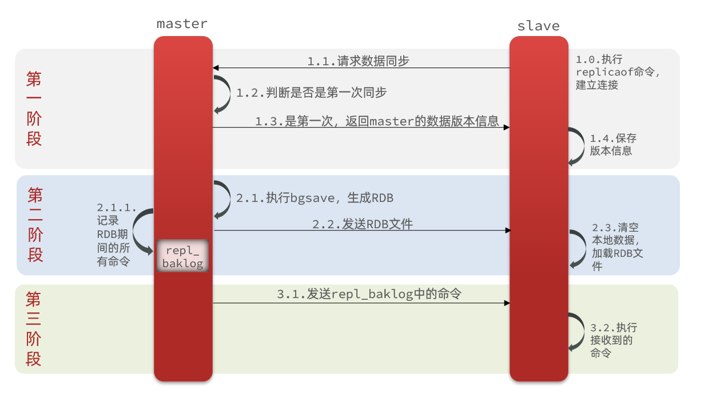

**增量同步 / 部分同步**

如果 replica 短暂断线后恢复，并且它缺失的写命令还在 master 的 `replication backlog` 中，就可以做增量同步。

流程：

1. replica 重连 master，发送自己的 `replid` 和已同步 `offset`。
2. master 判断 replid 一致，并且 offset 之后的数据仍在 backlog 中。
3. master 返回 `CONTINUE`。
4. master 从 backlog 中取出 replica 缺失的命令，发送给 replica。
5. replica 执行这些命令，追上 master 当前 offset。

特点：成本低，只同步缺失命令，不需要重新传输全量 RDB。

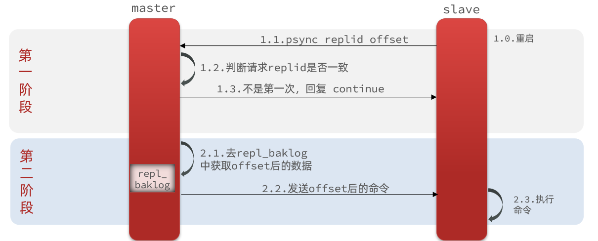

**什么时候会全量同步**

1. replica 第一次连接 master。
2. replica 的 replid 与 master 不一致。
3. replica 断线太久，所需 offset 已被 backlog 覆盖。
4. master 重启后 replid 变化，无法继续基于旧数据集增量同步。

**什么时候会增量同步**

1. replica 曾经和该 master 同步过。
2. replid 一致。
3. replica 落后的 offset 还保存在 master 的 backlog 中。

#### 9.2.3 replication backlog

`replication backlog` 是 master 维护的一块固定大小的环形缓冲区，用来保存最近传播给 replica 的写命令。

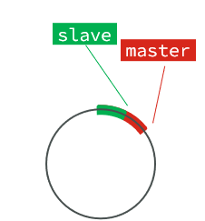

可以理解为：

```text
master offset: 1000 -> 1001 -> 1002 -> ...
backlog: 保存最近 N 字节的写命令
replica offset: 980
差值 981~1002 就是 replica 需要补的命令
```

它是环形数组：写到末尾后会从头继续写，新数据会覆盖旧数据。只要 replica 断线期间缺失的命令还没被覆盖，就能增量同步；如果已经被覆盖，只能全量同步。

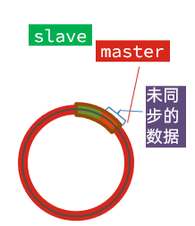

配置项：

```properties
# 默认通常较小，生产需要按写入量和可接受断线时长调整
repl-backlog-size 64mb

# master 没有 replica 连接多久后释放 backlog；0 表示不释放
repl-backlog-ttl 3600
```

`repl-backlog-size` 估算思路：

```text
backlog 大小 >= master 每秒写入复制流量 * 允许 replica 断线秒数 * 安全系数
```

例如 master 写入复制流量约 2MB/s，希望 replica 断线 60 秒内恢复还能增量同步，则至少需要：

```text
2MB/s * 60s = 120MB
```

再考虑突发流量，可以配置为 `256mb` 或更高。backlog 太小会频繁触发全量同步；太大则占用更多 master 内存，需要结合实例内存评估。

#### 9.2.4 主从同步优化

主从同步优化的目标是：减少全量同步次数，降低全量同步成本，避免 replica 因跟不上 master 被断开。

**1. 控制单实例内存，避免全量同步过重**

全量同步依赖 RDB。实例内存越大，`fork`、Copy-On-Write、RDB 传输和 replica 加载成本越高。实践中要避免单个 Redis 实例过大，可以通过拆实例、分片集群、合理淘汰策略降低单节点压力。

**2. 设置合理的 replication backlog**

```properties
repl-backlog-size 64mb
repl-backlog-ttl 3600
```

写入量越大、网络越不稳定、希望 replica 断线后增量恢复的时间越长，`repl-backlog-size` 就应该越大。这个配置是避免“短暂网络抖动后被迫全量同步”的关键。

**3. 开启无磁盘复制，降低 master 磁盘 IO**

默认全量同步时，master 可能先把 RDB 写到磁盘，再发送给 replica。磁盘较慢时，会拖慢同步并增加 IO 压力。可以开启 diskless replication：

```properties
repl-diskless-sync yes
repl-diskless-sync-delay 5
```

含义：

- `repl-diskless-sync yes`：master 子进程直接把 RDB 通过 socket 发给 replica，不先落磁盘。
- `repl-diskless-sync-delay 5`：等待 5 秒再开始传输，给多个 replica 同时到达的机会，一次性并发同步，避免刚开始传输就又来一个 replica 导致重复全量同步。

适用场景：磁盘慢、网络较快、全量同步对磁盘 IO 影响明显。注意它仍会消耗网络带宽和子进程资源，不是没有成本。

**4. 设置合理的 replica 输出缓冲区**

master 会给每个 replica 维护输出缓冲区。如果 replica 网络慢或处理慢，缓冲区积压过大，超过限制后 master 会断开该 replica，之后可能触发重同步。

常见配置：

```properties
client-output-buffer-limit replica 256mb 64mb 60
```

含义：

- 硬限制 `256mb`：缓冲区超过 256MB 立即断开 replica。
- 软限制 `64mb 60`：缓冲区连续 60 秒超过 64MB，则断开 replica。

如果业务存在大流量写入、网络跨机房、replica 较慢，可以适当调大；但不能无限放大，否则 master 内存会被慢 replica 拖垮。

**5. 避免大 Key 和突发大写入**

大 Key 会让复制链路出现尖峰：

- 一个大 Value 更新会生成很大的复制命令。
- 全量同步时 RDB 更大，网络传输和加载更慢。
- replica 输出缓冲区更容易暴涨，触发断开。
- 删除大 Key 也可能造成阻塞，间接拉大主从延迟。

优化建议：拆分大 Key，限制单个 Value 大小，大集合分片存储，删除大 Key 使用 `UNLINK`，批量写入做限速。

**6. 控制 replica 数量，必要时使用链式复制**

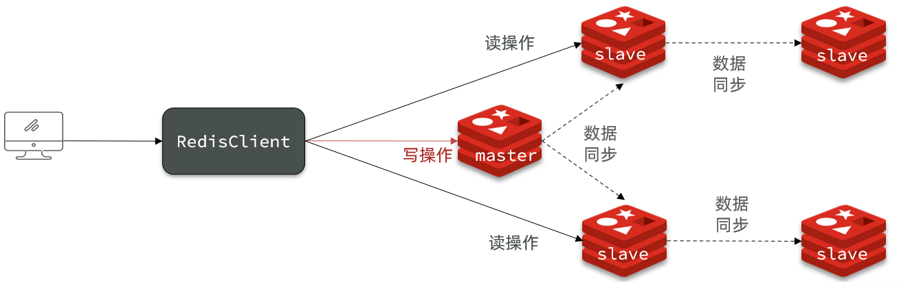

一个 master 直连太多 replica，会增加复制连接、输出缓冲区和全量同步压力。replica 较多时可以采用链式结构：

```text
master -> replica-1 -> replica-1-1
       -> replica-2 -> replica-2-1
```

这样能减少 master 直接承担的复制压力，但链式越长，末端 replica 延迟越高，需要按读延迟要求取舍。

**7. 开启主库写入保护，降低数据丢失窗口**

Redis 复制是异步的。可以配置 master 至少连接多少个延迟可接受的 replica，否则拒绝写入：

```properties
min-replicas-to-write 1
min-replicas-max-lag 10
```

含义：至少有 1 个 replica 延迟不超过 10 秒，master 才继续接受写入。这不是强一致，只是降低 master 孤岛写入导致的数据丢失风险。

**8. 监控主从延迟和同步状态**

常看命令：

```bash
INFO replication
ROLE
```

重点指标：

- `master_link_status`：从节点与主节点连接是否正常。
- `master_repl_offset`、`slave_repl_offset`：主从 offset 差距。
- `master_sync_in_progress`：是否正在全量同步。
- `connected_slaves`：在线 replica 数量。
- `repl_backlog_active`、`repl_backlog_size`、`repl_backlog_first_byte_offset`：backlog 状态。

**小结**

- 全量同步：传 RDB，全量加载，成本高，常见于首次同步或 backlog 不足。
- 增量同步：传缺失命令，成本低，依赖 replid、offset 和 replication backlog。
- 主从优化重点：减少全量同步、放大 backlog、控制单节点内存、开启无磁盘复制、调好 replica 输出缓冲区、避免大 Key。

### 9.3 Redis Sentinel

Redis Sentinel 是 Redis 官方提供的高可用机制。它不是用来分片扩容的，而是用来监控主从集群，并在 master 故障时自动选举新的 master，通知客户端更新连接信息。

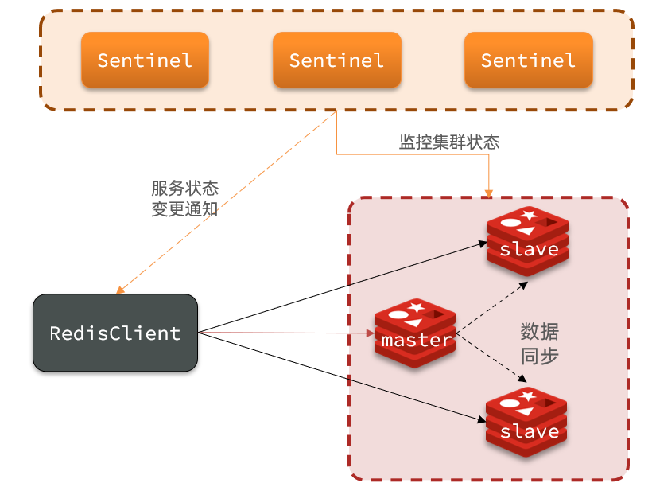

Sentinel 的核心作用：

- **监控**：持续检查 master、replica、其他 Sentinel 是否存活。
- **故障转移**：master 客观下线后，从 replica 中选出一个提升为新 master。
- **通知/服务发现**：客户端通过 Sentinel 查询当前 master 地址，故障切换后客户端能感知新 master。

需要注意：Sentinel 解决的是高可用和自动故障恢复，不解决数据分片，也不保证强一致。Redis 主从复制仍是异步的，master 故障时可能丢失少量尚未同步到 replica 的写入。

#### 9.3.1 哨兵原理

Sentinel 本身也建议集群部署，通常至少 3 个节点，避免单个 Sentinel 误判或故障导致无法完成选举。

典型结构：

```text
Sentinel-26380 / Sentinel-26381 / Sentinel-26382
                 monitor
                   |
             redis-6380 master
              /             \
redis-6381 replica     redis-6382 replica
```

Sentinel 会定期做几类事情：

1. 向 Redis 节点发送 `PING`，判断节点是否存活。
2. 向 master 发送 `INFO replication`，发现 replica 列表。
3. Sentinel 之间互相发现、交换状态和投票信息。
4. master 故障时发起 leader 选举，由某个 Sentinel 负责执行故障转移。

常用命令：

```bash
# 查看 mymaster 当前 master 地址
redis-cli -p 26380 SENTINEL get-master-addr-by-name mymaster

# 查看 Sentinel 记录的 master 信息
redis-cli -p 26380 SENTINEL master mymaster

# 查看 mymaster 的 replica 列表
redis-cli -p 26380 SENTINEL replicas mymaster

# 查看其他 Sentinel
redis-cli -p 26380 SENTINEL sentinels mymaster
```

#### 9.3.2 集群搭建

当前项目的 `/Users/zhaowenzhuo/Workspace/heimadianping-app/docker-compose.yml` 已经包含 3 个 Redis 数据节点和 3 个 Sentinel 节点，并使用固定 Docker 网络。

集群结构：

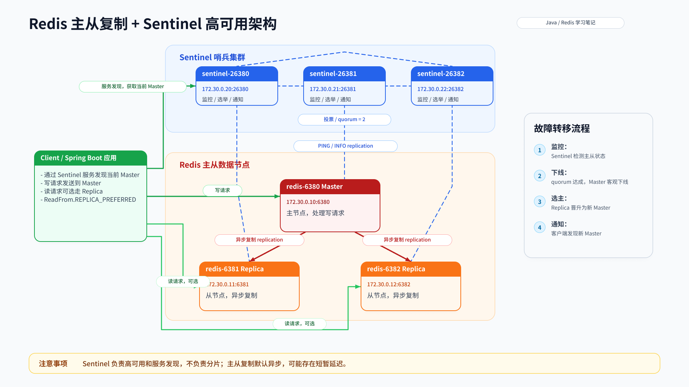

Redis 与 Sentinel 节点规划：

```text
redis-6380     172.30.0.10:6380    master
redis-6381     172.30.0.11:6381    replica
redis-6382     172.30.0.12:6382    replica
sentinel-26380 172.30.0.20:26380   sentinel
sentinel-26381 172.30.0.21:26381   sentinel
sentinel-26382 172.30.0.22:26382   sentinel
```

`docker-compose.yml` 中的核心配置可以理解为：每个 Redis/Sentinel 都挂载独立配置和数据目录，Sentinel 通过固定 Docker IP 监控当前 master。

```yaml
services:
  redis-6380:
    image: redis:6.2.6
    networks:
      redis-sentinel-net:
        ipv4_address: 172.30.0.10
    ports:
      - "6380:6380"

  redis-6381:
    image: redis:6.2.6
    networks:
      redis-sentinel-net:
        ipv4_address: 172.30.0.11
    ports:
      - "6381:6381"

  redis-6382:
    image: redis:6.2.6
    networks:
      redis-sentinel-net:
        ipv4_address: 172.30.0.12
    ports:
      - "6382:6382"

  sentinel-26380:
    image: redis:6.2.6
    command: ["sh", "-c", "test -f /data/sentinel.conf || cp /usr/local/etc/redis/sentinel-template.conf /data/sentinel.conf; redis-sentinel /data/sentinel.conf"]
    networks:
      redis-sentinel-net:
        ipv4_address: 172.30.0.20
    ports:
      - "26380:26380"
```

启动前要先保证 Redis 主从关系已经建立：`6380` 是 master，`6381`、`6382` 是 replica。Sentinel 只监控并故障转移，它不会凭空把三个独立 Redis 自动变成主从。

启动：

```bash
cd /Users/zhaowenzhuo/Workspace/heimadianping-app
docker compose up -d redis-6380 redis-6381 redis-6382 sentinel-26380 sentinel-26381 sentinel-26382
```

Sentinel 模板配置重点如下，参数说明直接写在注释里：

```properties
# Sentinel 监听端口，不是 Redis 数据端口；26381、26382 配置同理换端口。
port 26380

# 允许 Docker Compose 网络内访问 Sentinel。
bind 0.0.0.0

# 学习环境关闭保护模式；生产不要直接暴露 Sentinel 端口，应放在内网并配合防火墙/ACL。
protected-mode no

# Sentinel 会把运行时发现的 master、replica、epoch、其他 Sentinel 等状态写回这里。
dir /data

# 当前环境使用固定 Docker IP，避免 hostname 解析导致投票或客户端地址不一致。
sentinel resolve-hostnames no
sentinel announce-hostnames no

# 监控名为 mymaster 的 master：172.30.0.10:6380。
# 最后的 2 是 quorum，表示至少 2 个 Sentinel 同意后，master 才会被判定为客观下线。
sentinel monitor mymaster 172.30.0.10 6380 2

# Redis 数据节点配置了 requirepass 123456，Sentinel 访问主从节点也必须带密码。
sentinel auth-pass mymaster 123456

# 5 秒没有有效响应，则该 Sentinel 把节点标记为主观下线；生产应结合网络抖动适当调大。
sentinel down-after-milliseconds mymaster 5000

# 故障转移后，一次只允许 1 个 replica 向新 master 同步，降低新 master 压力。
sentinel parallel-syncs mymaster 1

# 故障转移超时时间，也会影响下一次 failover 尝试间隔。
sentinel failover-timeout mymaster 60000
```

验证：

```bash
redis-cli -p 26380 SENTINEL get-master-addr-by-name mymaster
redis-cli -p 26380 SENTINEL replicas mymaster
redis-cli -p 26380 SENTINEL sentinels mymaster
```

模拟 master 故障：

```bash
docker compose stop redis-6380
redis-cli -p 26380 SENTINEL get-master-addr-by-name mymaster
```

等待几秒后，返回地址应变为 `6381` 或 `6382` 中的一个。旧 master 恢复后，Sentinel 会把它改造成新 master 的 replica。

#### 9.3.3 集群监控原理

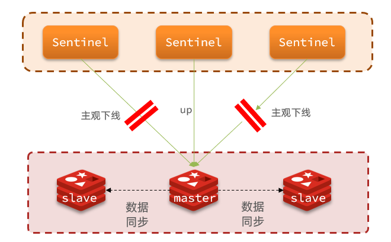

Sentinel 判断下线分两步：主观下线和客观下线。

**主观下线 SDown**

某个 Sentinel 在 `down-after-milliseconds` 时间内没有收到目标实例有效响应，就会把该实例标记为主观下线。主观下线只是单个 Sentinel 的判断，可能是网络抖动、该 Sentinel 自己故障或目标节点真的故障。

**客观下线 ODown**

当足够多 Sentinel 都认为 master 主观下线，并且数量达到 `quorum`，Sentinel 才会把 master 标记为客观下线。只有 master 客观下线后，才会进入故障转移流程。

注意两组概念：

- `quorum`：判断 master 客观下线需要多少 Sentinel 同意。例如 `monitor ... 2` 表示至少 2 个 Sentinel 认为 master 下线。
- Sentinel leader 选举：真正执行故障转移的 Sentinel 还需要获得多数 Sentinel 授权。3 个 Sentinel 至少要 2 票，5 个至少要 3 票。

因此生产中 Sentinel 数量通常用奇数个，至少 3 个，并部署在不同机器或可用区，避免单点和脑裂风险。

#### 9.3.4 故障转移原理

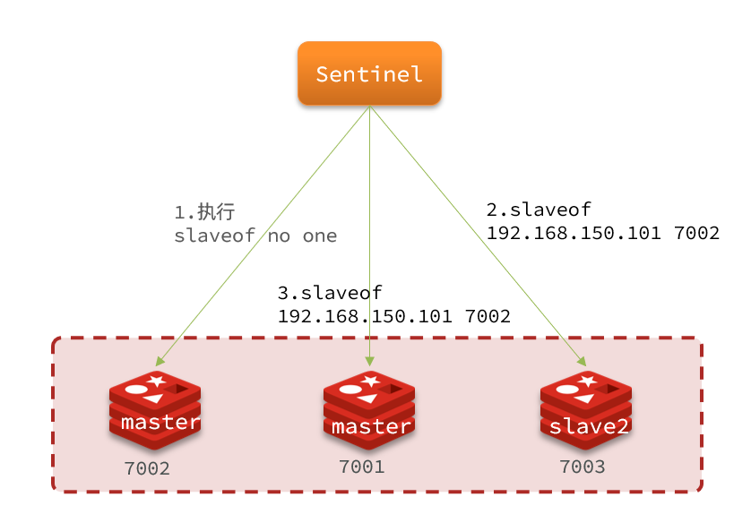

当 master 被判定为客观下线后，Sentinel 会从 replica 中选一个提升为新 master。

**新 master 选择规则**

1. 先过滤不健康的 replica，例如与 master 断联太久、状态异常的节点。
2. 看 `replica-priority`，值越小优先级越高；值为 `0` 表示永不被提升为 master。
3. 如果优先级相同，看复制偏移量 `offset`，offset 越大说明数据越新。
4. 如果 offset 也相同，看 Redis run id，通常字典序更小的优先。

**故障转移流程**

1. Sentinel leader 选出一个最合适的 replica。
2. 向它发送 `SLAVEOF NO ONE` / `REPLICAOF NO ONE`，让它晋升为 master。
3. 向其他 replica 发送 `REPLICAOF 新masterIP 新masterPort`，让它们复制新 master。
4. 更新 Sentinel 内部状态和 `sentinel.conf`。
5. 旧 master 恢复后，Sentinel 会把它改为新 master 的 replica。
6. 客户端通过 Sentinel 重新发现 master，连接切到新 master。

**常见场景问题与处理**

1. **误判频繁故障转移**：`down-after-milliseconds` 设置过小，网络轻微抖动就主观下线。处理：适当调大，例如生产常用 10s、30s 或结合网络质量评估。
2. **无法客观下线**：Sentinel 数量不足、互相不可达，达不到 quorum。处理：至少 3 个 Sentinel，确认 Sentinel 之间网络互通。
3. **故障转移后客户端连不上 Redis**：Sentinel 返回的是 Docker 内网 IP，宿主机客户端访问不到。处理：客户端放到同一 Docker 网络，或像 demo 一样在 Lettuce 做地址映射。
4. **Sentinel 认证失败**：Redis 配了 `requirepass`，但 Sentinel 没有 `sentinel auth-pass`。处理：给监控的 master name 配置正确密码。
5. **旧 master 恢复后角色异常**：Sentinel 会重写配置，如果挂载的是只读模板或旧 `/data/sentinel.conf` 状态过期，可能和预期不一致。处理：Sentinel 实际运行配置应可写；重建学习环境时可清理 `sentinel-2638x-data` 后重启。
6. **切换后仍可能丢数据**：主从复制异步，旧 master 上未同步到 replica 的写入会丢。处理：使用 `min-replicas-to-write`、合理监控主从延迟，必要时业务侧做幂等和补偿。

#### 9.3.5 RedisTemplate集成

在 Sentinel 架构下，应用不应该写死 Redis master 地址。客户端应连接 Sentinel，通过 master name 获取当前 master；故障转移后，Lettuce 会感知拓扑变化并更新连接。

可参考 `/Users/zhaowenzhuo/Workspace/heimadianping-app/demo/sentinel-demo`。

**application.yaml 关键配置**

```yaml
spring:
  redis:
    # Redis 数据节点密码，对应三台 Redis 的 requirepass，不是 Sentinel 自身密码
    password: 123456
    lettuce:
      pool:
        max-active: 8
        max-idle: 8
        min-idle: 0
        max-wait: 100ms
    sentinel:
      master: mymaster
      nodes:
        - 127.0.0.1:26380
        - 127.0.0.1:26381
        - 127.0.0.1:26382
```

要点：

- `sentinel.master` 必须和 Sentinel 配置里的 `sentinel monitor mymaster ...` 名称一致。
- `sentinel.nodes` 配 Sentinel 地址，不是 Redis 数据节点地址。
- `spring.redis.password` 是 Redis 数据节点密码；如果 Sentinel 自身也设置密码，还需要额外配置 Sentinel 认证。

**Docker 地址映射问题**

本机 IDEA 连接 Sentinel 时，Sentinel 可能返回 Docker 内网地址，例如 `172.30.0.10:6380`。宿主机应用不一定能直接连这个地址，所以 demo 增加了映射：

```yaml
app:
  redis:
    address-mappings:
      - from: 172.30.0.10:6380
        to: 127.0.0.1:6380
      - from: 172.30.0.11:6381
        to: 127.0.0.1:6381
      - from: 172.30.0.12:6382
        to: 127.0.0.1:6382
```

如果 Spring Boot 也运行在同一个 Docker 网络中，就不需要映射，可以直接使用 Docker 内网地址。

**RedisConfig 重点**

`RedisTemplate` 序列化配置只保留重点：

```java
@Bean
public RedisTemplate<String, Object> redisTemplate(RedisConnectionFactory connectionFactory) {
    RedisTemplate<String, Object> template = new RedisTemplate<>();
    template.setConnectionFactory(connectionFactory);
    template.setKeySerializer(RedisSerializer.string());
    template.setHashKeySerializer(RedisSerializer.string());
    template.setValueSerializer(new GenericJackson2JsonRedisSerializer());
    template.setHashValueSerializer(new GenericJackson2JsonRedisSerializer());
    return template;
}
```

Lettuce 地址映射与读写分离：

```java
@Bean
public ClientResources redisClientResources(RedisAddressMappingProperties properties) {
    Map<HostAndPort, HostAndPort> mappings = properties.getAddressMappings().stream()
            .collect(Collectors.toMap(
                    mapping -> HostAndPort.parseCompat(mapping.getFrom()),
                    mapping -> HostAndPort.parseCompat(mapping.getTo()),
                    (left, right) -> right
            ));

    return DefaultClientResources.builder()
            .socketAddressResolver(MappingSocketAddressResolver.create(
                    DnsResolvers.UNRESOLVED,
                    hostAndPort -> mappings.getOrDefault(hostAndPort, hostAndPort)))
            .build();
}

@Bean
public LettuceClientConfigurationBuilderCustomizer clientConfigurationBuilderCustomizer(ClientResources resources) {
    return builder -> builder
            .clientResources(resources)
            // 写请求仍到 master；读请求优先 replica，replica 不可用时回退 master
            .readFrom(ReadFrom.REPLICA_PREFERRED);
}
```

`ReadFrom` 常见策略：

| 策略 | 含义 |
| ---- | ---- |
| `MASTER` | 只从 master 读，强依赖主节点，读写都集中。 |
| `MASTER_PREFERRED` | 优先 master，master 不可用时读 replica。 |
| `REPLICA` | 只读 replica，replica 不可用则读失败。 |
| `REPLICA_PREFERRED` | 优先读 replica，replica 不可用时回退 master，常用于读写分离。 |

**集成时常见问题**

1. **master name 写错**：应用配置的 `mymaster` 必须和 Sentinel 监控名一致。
2. **把 Redis 节点写到 sentinel.nodes**：`sentinel.nodes` 填 Sentinel 地址，例如 `26380`，不是 `6380`。
3. **密码混淆**：Redis 数据节点密码、Sentinel 自身密码、ACL 用户密码是不同概念；当前 demo 只配置 Redis 数据节点密码。
4. **读到旧数据**：`REPLICA_PREFERRED` 会读从库，主从异步复制存在延迟。强一致读应走 master，或关键读写链路避免读从库。
5. **本机访问 Docker 内网 IP 失败**：使用 demo 的 `address-mappings`，或让应用进入同一 Docker 网络。
6. **故障转移期间短暂异常**：客户端重新发现拓扑需要时间，业务调用要有超时、重试、幂等保护。

### 9.4 Redis Cluster

主从和哨兵解决的是读扩展与高可用，但没有解决两个问题：

- **海量数据存储**：单个 Redis 实例内存有限。
- **高并发写入**：主从结构里写请求仍集中到一个 master。

Redis Cluster 通过分片把数据分散到多个 master，每个 master 负责一部分 hash slot，从而同时解决容量扩展和写入扩展问题。它也内置主从和故障转移能力，因此 Cluster 模式下通常不再搭配 Sentinel。

#### 9.4.1 分片集群介绍

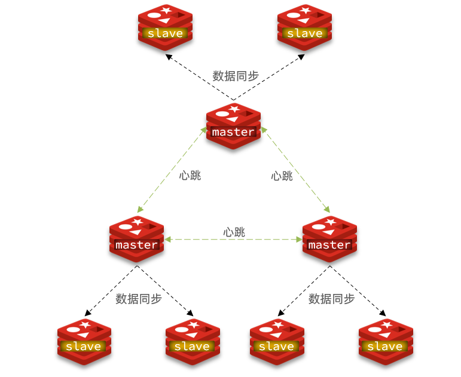

Redis Cluster 的核心特征：

- 集群里有多个 master，每个 master 负责一部分数据。
- 每个 master 可以配置 replica，实现分片级高可用。
- 集群共有 `0~16383` 共 16384 个 hash slot，数据按 slot 分布。
- 节点之间通过 **cluster bus** 通信，通过 **Gossip 协议**交换拓扑和故障状态。
- 客户端可以连接任意节点；如果 key 不在当前节点负责的 slot 上，会收到 `MOVED` 或 `ASK` 重定向。

为什么 Redis Cluster 选择 slot，而不是直接 `hash(key) % 节点数`：

1. **方便扩缩容**：移动一段 slot 即可迁移部分数据，不需要因为节点数变化重新映射所有 key。
2. **方便故障转移**：master 故障后，replica 接管的是该 master 的 slot 范围。
3. **方便客户端缓存路由**：客户端只需要维护 `slot -> 节点` 的映射表，最多 16384 个槽位。
4. **迁移粒度可控**：slot 是比节点更细的迁移单位，reshard 时可以按 slot 逐步迁移。

为什么是 16384 个 slot：

- slot 数量足够多，能比较均匀地分散 key。
- 16384 不算太大，节点间传播 slot 位图的成本可控。
- 扩缩容时迁移粒度比“按节点迁移”细，又不会让元数据过大。

当前项目的集群适合做 3 主 3 从：

```text
redis-7001 master    redis-7002 master    redis-7003 master
     |                    |                    |
redis-7004 replica   redis-7005 replica   redis-7006 replica
```

节点规划来自 `/Users/zhaowenzhuo/Workspace/heimadianping-app/docker-compose.yml`：

```text
redis-7001  172.30.0.31:7001  bus:17001
redis-7002  172.30.0.32:7002  bus:17002
redis-7003  172.30.0.33:7003  bus:17003
redis-7004  172.30.0.34:7004  bus:17004
redis-7005  172.30.0.35:7005  bus:17005
redis-7006  172.30.0.36:7006  bus:17006
```

注意：Cluster 节点除了业务端口，还需要 cluster bus 端口，默认是业务端口 + 10000。因此当前 compose 同时暴露 `7001~7006` 和 `17001~17006`。

#### 9.4.2 集群搭建

`docker-compose.yml` 中每个 cluster 节点只保留重点即可：

```yaml
redis-7001:
  image: redis:7.2
  command: ["redis-server", "/usr/local/etc/redis/redis.conf"]
  networks:
    redis-sentinel-net:
      ipv4_address: 172.30.0.31
  volumes:
    - ./redis/7001-data:/data
    - ./redis/7001.conf:/usr/local/etc/redis/redis.conf:ro
  ports:
    - "7001:7001"
    - "17001:17001"
```

`redis/7001.conf` 这类配置文件重点如下，其他端口节点同理修改端口和 IP：

```properties
# Redis 对外服务端口
port 7001
bind 0.0.0.0
protected-mode no

dir /data

# 开启 Redis Cluster
cluster-enabled yes

# 集群节点元信息文件，Redis 自动维护，不要手动编辑
cluster-config-file nodes.conf

# 节点超时时间：超过该时间未响应，可能被标记为 PFAIL
cluster-node-timeout 5000

# 集群中任意 slot 不可用时，整个集群是否停止对外服务；默认 yes，更严格
# 学习环境一般保留默认，生产要结合业务可用性和一致性取舍
# cluster-require-full-coverage yes

# 容器内部通信使用固定 Docker IP
cluster-announce-ip 172.30.0.31

# Redis 7+ 支持优先向宿主机客户端通告 hostname，便于本机访问集群重定向地址
cluster-announce-hostname localhost
cluster-preferred-endpoint-type hostname

# 通告业务端口和 cluster bus 端口
cluster-announce-port 7001
cluster-announce-bus-port 17001

appendonly yes
```

启动 6 个节点：

```bash
cd /Users/zhaowenzhuo/Workspace/heimadianping-app
docker compose up -d redis-7001 redis-7002 redis-7003 redis-7004 redis-7005 redis-7006
```

创建 3 主 3 从集群：

```bash
redis-cli --cluster create \
  127.0.0.1:7001 127.0.0.1:7002 127.0.0.1:7003 \
  127.0.0.1:7004 127.0.0.1:7005 127.0.0.1:7006 \
  --cluster-replicas 1
```

含义：前 6 个节点参与建群，`--cluster-replicas 1` 表示每个 master 分配 1 个 replica。执行过程中会展示主从分配和 slot 分配，需要输入 `yes` 确认。

常用验证命令：

```bash
# -c 表示 cluster 模式，客户端会自动跟随 MOVED 重定向
redis-cli -c -p 7001 cluster nodes
redis-cli -c -p 7001 cluster info
redis-cli -c -p 7001 cluster slots

# redis-cli 集群工具视角的检查
redis-cli --cluster check 127.0.0.1:7001
redis-cli --cluster info 127.0.0.1:7001

# 对所有节点执行同一个命令，例如查看角色
redis-cli --cluster call 127.0.0.1:7001 role
```

`cluster info` 重点看：

```text
cluster_state:ok              # 集群是否可用
cluster_slots_assigned:16384  # 是否所有 slot 都已分配
cluster_slots_ok:16384        # 正常 slot 数
cluster_known_nodes:6         # 已知节点数量
cluster_size:3                # master 分片数量
```

如果需要重建学习环境，先停止容器并清理各节点 data 目录里的 `nodes.conf` 和旧数据，否则节点会保留旧集群元信息，导致创建集群失败。

#### 9.4.3 哈希槽 slot

Redis Cluster 不直接按节点保存 key，而是按 hash slot 保存 key。整个集群固定有 16384 个 slot：`0~16383`。

计算规则：

```text
slot = CRC16(key 的有效部分) % 16384
```

key 的有效部分有两种情况：

1. key 不包含 `{}`：整个 key 参与计算。
2. key 包含 `{}` 且 `{}` 内有内容：只用 `{}` 内的内容计算。

例子：

```text
user:1:name      使用整个 key 计算 slot
user:1:order     使用整个 key 计算 slot，可能与 user:1:name 不同 slot
user:{1}:name    使用 1 计算 slot
user:{1}:order   使用 1 计算 slot，和 user:{1}:name 一定同 slot
```

`{}` 里的内容叫 **hash tag**。它的作用是让一组相关 key 落到同一个 slot，解决多 key 操作限制。

**查看 key 属于哪个 slot**

```bash
redis-cli -c -p 7001 cluster keyslot user:1:name
redis-cli -c -p 7001 cluster keyslot user:{1}:name
redis-cli -c -p 7001 cluster keyslot user:{1}:order
```

`user:{1}:name` 和 `user:{1}:order` 的结果应该一致，因为它们都用 `{1}` 计算 slot。

**查看 master 分配了哪些 slot**

```bash
redis-cli -c -p 7001 cluster nodes
```

输出类似：

```text
07c37... 127.0.0.1:7001@17001 myself,master - 0 0 1 connected 0-5460
2a2b1... 127.0.0.1:7002@17002 master - 0 0 2 connected 5461-10922
3c3d2... 127.0.0.1:7003@17003 master - 0 0 3 connected 10923-16383
9f9e8... 127.0.0.1:7004@17004 slave 07c37... 0 0 4 connected
```

如何读这段输出：

```text
节点ID  地址@bus端口  flags  masterID  ping/pong/epoch  link-state  slot范围
```

重点看：

- `master` 行末尾的 `0-5460`、`5461-10922`、`10923-16383` 就是 slot 分配。
- `slave` 行会带它复制的 master node id。
- `myself` 表示当前连接的这个节点。
- `fail`、`fail?`、`handshake` 等 flags 表示故障或握手状态。

也可以用更结构化的命令看 slot：

```bash
redis-cli -c -p 7001 cluster slots
```

`cluster slots` 会按 slot 范围返回 master 和 replica 地址，更适合客户端构建 slot 路由表。

**写入与重定向演示**

```bash
# 不加 -c 时，如果 key 不属于当前节点，可能看到 MOVED
redis-cli -p 7001 set user:1:name zhangsan

# 加 -c 后，redis-cli 会自动跟随重定向
redis-cli -c -p 7001 set user:1:name zhangsan
redis-cli -c -p 7002 get user:1:name
```

如果 key 不在当前节点负责的 slot 上，普通客户端会收到：

```text
MOVED 1234 127.0.0.1:7002
```

支持 Cluster 的客户端会自动更新 slot 缓存并重试；不支持的客户端需要手动连接到正确节点。

#### 9.4.4 集群伸缩

Redis Cluster 扩容不是简单启动一个新节点就结束。新节点加入后，如果没有分配 slot，它不会承载数据。

**常用集群管理命令**

```bash
redis-cli --cluster help
redis-cli --cluster check 127.0.0.1:7001
redis-cli --cluster info 127.0.0.1:7001
redis-cli --cluster add-node <new-host:new-port> <existing-host:existing-port>
redis-cli --cluster reshard <existing-host:existing-port>
redis-cli --cluster rebalance <existing-host:existing-port>
redis-cli --cluster del-node <existing-host:existing-port> <node-id>
```

**添加新 master 的流程**

1. 启动新 Redis 节点，并开启 `cluster-enabled yes`。
2. 使用 `redis-cli --cluster add-node` 把新节点加入集群。
3. 新节点刚加入时没有 slot，`cluster nodes` 中能看到它是 master，但没有 slot 范围。
4. 使用 `redis-cli --cluster reshard` 把部分 slot 迁移给新节点。
5. 客户端根据 `MOVED/ASK` 重定向更新路由。

示例：

```bash
# 假设新增 redis-7007
redis-cli --cluster add-node 127.0.0.1:7007 127.0.0.1:7001

# 查看 7007 已加入，但 slot 为空
redis-cli -c -p 7001 cluster nodes

# 重新分配部分 slot 到新节点
redis-cli --cluster reshard 127.0.0.1:7001
```

`reshard` 交互时会问几个问题：

```text
How many slots do you want to move?     # 要迁移多少个 slot
What is the receiving node ID?          # 接收 slot 的目标节点 ID
Source node #1:                         # 从哪些源节点迁出，填 all 或具体 node id
Do you want to proceed?                 # 确认迁移
```

如何找到目标节点 ID：

```bash
redis-cli -c -p 7001 cluster nodes
```

**添加 replica 的流程**

```bash
# 将 7008 加入集群，并作为某个 master 的 replica
redis-cli --cluster add-node 127.0.0.1:7008 127.0.0.1:7001 \
  --cluster-slave --cluster-master-id <master-node-id>
```

如果已经加入为普通 master，也可以在该节点上执行：

```bash
redis-cli -c -p 7008 cluster replicate <master-node-id>
```

**删除节点的注意点**

- 删除 replica：可以直接 `del-node`。
- 删除 master：必须先把它负责的 slot 迁走，否则不能删除。
- 删除节点前要确认客户端不再收到该节点的重定向地址。

**MOVED 和 ASK 的区别**

| 类型 | 出现场景 | 含义 | 客户端处理 |
| ---- | -------- | ---- | ---------- |
| `MOVED` | slot 已经稳定迁移到新节点 | 永久重定向 | 更新本地 slot 缓存，以后直接访问新节点 |
| `ASK` | slot 正在迁移中 | 临时重定向 | 只对当前请求执行 `ASKING` 后访问目标节点，不永久更新 slot 缓存 |

为什么迁移中需要 `ASK`：迁移过程中，一个 slot 的部分 key 可能已在新节点，部分 key 仍在旧节点。此时不能让客户端永久更新路由，只能针对当前请求临时访问目标节点。

伸缩时要避免业务高峰操作。reshard 会移动 key，可能带来网络、CPU、内存和延迟波动。

#### 9.4.5 Gossip、cluster bus 与故障转移

Redis Cluster 自带高可用能力，不依赖 Sentinel。

**cluster bus 是什么**

每个 Redis Cluster 节点有两个端口：

```text
client port: 7001   # 客户端读写命令
bus port:    17001  # 节点间通信，默认 client port + 10000
```

cluster bus 使用二进制协议，专门用于节点之间通信，不给业务客户端使用。它负责传播：

- 节点握手和加入集群。
- PING / PONG 心跳。
- slot 归属信息。
- 节点故障状态。
- 配置纪元 config epoch。
- 故障转移投票。

为什么不用普通 Redis 命令端口完成这些事：

1. 节点间通信频繁，专用 bus 可以减少业务命令干扰。
2. 二进制协议更紧凑，适合携带节点状态和 slot 位图。
3. 集群状态传播需要独立于客户端请求，即使业务请求很忙，节点间也要保持心跳。

**Gossip 协议解决什么问题**

Redis Cluster 没有中心化协调节点，也没有 Sentinel 那种额外监控集群。每个节点都维护一份自己看到的集群状态，并通过 Gossip 逐步传播。

Gossip 的设计目标：

- 去中心化：没有单点协调者。
- 扩展性：节点不需要每次都向所有节点广播完整状态。
- 最终一致：拓扑变化、故障状态会逐渐传播到全体节点。
- 降低通信量：每次 PING/PONG 只携带部分节点摘要，而不是全量同步所有状态。

简化流程：

1. 每个节点定期选择其他节点发送 `PING`。
2. 收到 `PING` 的节点回复 `PONG`。
3. `PING/PONG` 中会携带一部分其他节点的状态摘要，例如节点 ID、IP、端口、flags、ping/pong 时间、config epoch。
4. 收到消息的节点合并这些信息，更新自己的集群视图。
5. 如果发现某节点长时间无响应，先标记 `PFAIL`。
6. 多个 master 都报告某节点疑似下线后，状态升级为 `FAIL` 并传播。

**为什么选择 Gossip**

- 如果每次状态变化都全量广播给所有节点，节点数多时通信开销会变大。
- 如果依赖中心节点，中心节点故障会影响集群控制面。
- Gossip 允许节点状态短暂不一致，但 Redis Cluster 的 slot 路由和故障转移可以接受这种最终一致模型。

**故障状态传播**

| 状态 | 含义 |
| ---- | ---- |
| `PFAIL` | 某个节点主观认为另一个节点疑似下线，类似 Sentinel 的主观下线。 |
| `FAIL` | 足够多 master 节点确认后，故障状态在集群中传播，类似客观下线。 |

`cluster-node-timeout` 控制节点失联多久后进入疑似故障判断。当前项目配置为：

```properties
cluster-node-timeout 5000
```

设置过小容易因网络抖动误判；设置过大则故障恢复变慢。

**master 故障转移流程**

1. 某个 master 不可达，被其他 master 标记为 `PFAIL`。
2. 多个 master 通过 Gossip 传播并确认，状态升级为 `FAIL`。
3. 故障 master 的 replica 判断自己具备晋升资格，发起选举。
4. 其他 master 根据 config epoch 投票。
5. 得票成功的 replica 晋升为新 master。
6. 新 master 接管原 master 的 slot。
7. 旧 master 恢复后通常会成为新 master 的 replica。

影响 replica 晋升的常见因素：

- replica 与 master 的复制偏移量，数据越新越有优势。
- replica 和 master 断联时间是否过长。
- `cluster-replica-validity-factor`，控制 replica 太久没同步时是否还能参与故障转移。
- `cluster-migration-barrier`，控制 replica 自动迁移时至少要给原 master 保留多少个 replica。

模拟故障：

```bash
docker compose stop redis-7002
redis-cli -c -p 7001 cluster nodes
redis-cli -c -p 7001 cluster info
```

如果 `7002` 是 master，它的 replica 会在超时后晋升。恢复旧节点后再观察角色变化：

```bash
docker compose start redis-7002
redis-cli -c -p 7001 cluster nodes
```

手动故障转移可在某个 replica 上执行：

```bash
redis-cli -c -p 7005 cluster failover
```

`cluster failover` 常见模式：

| 模式 | 说明 |
| ---- | ---- |
| 默认 | 尽量保证 offset 一致后再切换，适合计划内维护。 |
| `FORCE` | 跳过部分一致性确认，master 不可达时可用。 |
| `TAKEOVER` | 直接接管，不考虑 master 状态和多数投票，风险最高。 |

#### 9.4.6 RedisTemplate集成

Spring Data Redis 底层 Lettuce 支持 Redis Cluster。和 Sentinel 不同，Cluster 配置的是多个集群节点地址，不需要 `sentinel.master`。

`application.yaml` 重点：

```yaml
spring:
  redis:
    password:
    lettuce:
      pool:
        max-active: 8
        max-idle: 8
        min-idle: 0
        max-wait: 100ms
    cluster:
      nodes:
        - localhost:7001
        - localhost:7002
        - localhost:7003
        - localhost:7004
        - localhost:7005
        - localhost:7006
      # 可选：最大重定向次数，避免拓扑异常时无限重试
      max-redirects: 3
```

要点：

- `cluster.nodes` 只需要配置部分或全部节点，Lettuce 会通过节点发现获取完整拓扑。
- 当前学习环境未设置 Redis Cluster 密码，所以 `password` 为空。
- 当前 `700*.conf` 使用 `cluster-announce-hostname localhost`，宿主机 Java 客户端收到重定向时能访问 `localhost:700x`。
- 如果应用运行在 Docker 网络内，应改用 Docker IP 或服务名，并调整 announce 配置。
- 如果集群发生 reshard 或故障转移，客户端需要及时刷新 topology；Lettuce 支持自适应刷新，生产可显式配置。

`RedisTemplate` 序列化配置和普通模式一致，只保留重点：

```java
@Bean
public RedisTemplate<String, Object> redisTemplate(RedisConnectionFactory connectionFactory) {
    RedisTemplate<String, Object> template = new RedisTemplate<>();
    template.setConnectionFactory(connectionFactory);
    template.setKeySerializer(RedisSerializer.string());
    template.setHashKeySerializer(RedisSerializer.string());
    template.setValueSerializer(new GenericJackson2JsonRedisSerializer());
    template.setHashValueSerializer(new GenericJackson2JsonRedisSerializer());
    return template;
}
```

如果希望读写分离，可以使用 Lettuce 的 `ReadFrom`：

```java
@Bean
public LettuceClientConfigurationBuilderCustomizer clientConfigurationBuilderCustomizer() {
    return builder -> builder.readFrom(ReadFrom.REPLICA_PREFERRED);
}
```

注意：读 replica 会有复制延迟。强一致读、刚写完马上读的链路，应读 master 或做业务侧一致性处理。

#### 9.4.7 常见问题

**1. CROSSSLOT 错误**

多 key 命令要求所有 key 在同一个 slot，例如：

```bash
mget user:1:name user:1:order
```

如果两个 key 不同 slot，会报：

```text
CROSSSLOT Keys in request don't hash to the same slot
```

解决：使用 hash tag：

```bash
mget user:{1}:name user:{1}:order
```

hash tag 不要滥用。如果大量 key 都用同一个 tag，会导致它们集中到同一个 slot，破坏分片均衡。

**2. Lua 脚本限制**

Cluster 下 Lua 脚本访问的多个 key 必须在同一个 slot。秒杀、库存、订单去重这类 Lua 逻辑如果涉及多个 key，要统一 hash tag：

```text
seckill:{voucherId}:stock
seckill:{voucherId}:order
```

**3. 事务限制**

Redis 事务不支持跨 slot 操作。需要事务的多个 key 必须同 slot，或者在业务层拆分流程、使用数据库事务/消息最终一致性兜底。

**4. MOVED 重定向过多**

客户端 slot 缓存过期、集群刚 reshard、announce 地址不可达，都可能导致频繁 MOVED。处理：使用支持 Cluster 的客户端；检查 `cluster-announce-hostname/ip/port`；确保客户端能访问重定向地址；开启客户端拓扑刷新。

**5. ASK 重定向处理错误**

ASK 只代表当前请求临时去目标节点，不代表 slot 已永久迁移。客户端必须先向目标节点发送 `ASKING`，再执行原命令。自己手写客户端时容易漏掉这一步，生产应使用成熟 Cluster 客户端。

**6. 集群创建失败**

常见原因：节点已有旧 `nodes.conf`、旧数据未清理、端口或 bus 端口不通。处理：学习环境重建前清理 `700x-data`，确认 `700x` 和 `1700x` 端口都映射并可达。

**7. slot 未覆盖导致集群不可用**

如果有 slot 没分配，或某个 master 及其 replica 都不可用，默认 `cluster-require-full-coverage yes` 会让集群不可用。处理：保证 16384 个 slot 全覆盖，每个 master 至少一个 replica，并监控 `cluster_state:ok`。

**8. 大 Key 迁移风险**

reshard 迁移 slot 时，如果 slot 中有大 Key，会导致迁移慢、阻塞或网络抖动。处理：避免大 Key，迁移前扫描评估，低峰期 reshard，必要时拆分数据结构。

**9. 热点 Key 不能靠 Cluster 自动解决**

Cluster 解决的是数据分布和写入分片，但单个热点 key 仍然只在一个 slot、一个 master 上。处理：本地缓存、读写分离、热点拆分、逻辑分片、异步聚合。

**10. 批量操作性能下降**

Cluster 下批量 key 可能分散到多个节点，客户端需要拆分请求并合并结果。处理：同业务聚合 key 使用 hash tag；批处理按 slot 分组；避免跨 slot 大事务。

